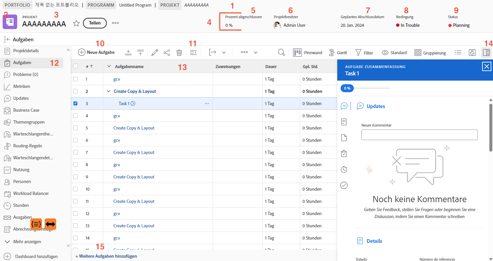

# Navigieren der Projektseite

In diesem Video erfahren Sie:

* Wie Sie die Details des Projekts anzeigen können
* Welche Informationen in der Aufgabenliste angezeigt werden
* Wo Sie Dokumente hochladen können
* Wie Sie den Aktualisierungsverlauf anzeigen können

>[!VIDEO](https://video.tv.adobe.com/v/335085/?quality=12&learn=on)

## Wichtige Teile der Projektseite

Die Projektseite ist mit vielen Funktionen ausgestattet, die Ihnen bei der Verwaltung Ihrer Arbeit helfen. Wenden Sie sich an Ihre Systemadmins, wenn Sie eine Option benötigen, die in Ihrer [!DNL Workfront]-Instanz nicht sichtbar ist. Hier sind einige der wichtigsten Funktionen der Projektseite, die Sie sich merken sollten.

1. **Breadcrumb-Pfad:** Navigieren Sie durch die Programm- und Portfoliohierarchie hinter dem Projekt.
2. **Objekttyp:** Die Anzeige des Objekttyps auf der Anmeldeseite hilft Ihnen zu erkennen, was Sie in [!DNL Workfront] sehen. Der Begriff „Projekt“ kann von Ihren [!DNL Workfront] Systemadmins angepasst werden.
3. **Projektname:** Der Name des Projekts, das Sie gerade sehen. Klicken Sie auf den Namen, um ihn zu bearbeiten.
4. **Projektkopfzeile:** Standardinformationen, die auf allen Projektseiten verfügbar sind.
5. **[!UICONTROL Prozent abgeschlossen]:** Diese Angabe wird automatisch auf Grundlage der im Projekt abgeschlossenen Aufgaben aktualisiert.
6. **[!UICONTROL Projekteigentümer]:** In den meisten Unternehmen ist dies die Person, die das Projekt verwaltet. Diese Person ist für die Verwaltung des Projekts in [!DNL Workfront] und sicherstellen, dass sie abgeschlossen ist.
7. **[!UICONTROL Geplanter Fertigstellungstermin]:** Der geplante Fertigstellungstermin des Projekts wird von dieser Person über die Projektzeitleiste festgelegt.
8. **[!UICONTROL Zustand]:** Der [!UICONTROL Zustand] ist eine visuelle Darstellung des Projektfortschritts. [!DNL Workfront] kann den [!UICONTROL Zustand] automatisch auf Grundlage des Fortschrittsstatus der Aufgaben im Projekt konfigurieren. Der [!UICONTROL Zustand] kann auch manuell über die Projektdetails eingestellt werden.
9. **[!UICONTROL Status]:** Die [!UICONTROL Status] gibt an, wo sich das Projekt im Prozess befindet: Ist das Projekt noch in Planung, ist das laufende Projekt oder ist das Projekt abgeschlossen.
10. **[!UICONTROL Neue Aufgabe]:** Klicken Sie auf , um eine Aufgabe im Projekt zu erstellen. Die Aufgabe wird am Ende der Liste generiert.
11. **[!UICONTROL Exportieren]:** Exportieren Sie die Aufgabenliste oder ausgewählte Aufgaben in eine PDF-, Tabellenkalkulations- oder tabulatorgetrennte Datei.
12. **Menü des linken Bedienfelds**: Über das linke Bedienfeld können Sie zu verschiedenen Projektinformationen navigieren. Klicken Sie oben auf das Symbol Aufgabe , um das Bedienfeld zu reduzieren, wenn Sie etwas mehr Platz auf dem Bildschirm benötigen. Ziehen Sie die Symbole per Drag-and-Drop so, dass Ihnen die Reihenfolge ein effizientes Arbeiten ermöglicht. Die Ihnen angezeigten Optionen werden von Ihren [!DNL Workfront] Systemadmins festgelegt.
13. **Aufgabenliste:** Die Aufgabenliste zeigt alle Aufgaben an, aus denen sich Ihr Projektplan zusammensetzt. Die für jede Aufgabe angezeigten Informationen werden durch die ausgewählte Ansicht bestimmt.
14. **Zusammenfassungsfeld:** Das Zusammenfassungsfeld bietet einen schnellen Überblick über Informationen zur ausgewählten Aufgabe. Klicken Sie auf das Symbol für das Sammelfenster, um es zu öffnen oder zu schließen.
15. **Weitere Aufgaben hinzufügen** Klicken Sie hier , um mithilfe der Inline-Bearbeitung am unteren Rand der Aufgabenliste eine weitere Aufgabe hinzuzufügen.

## Empfohlene Tutorials zu diesem Thema

* [Grundlegendes zur Projekterstellung](https://experienceleague.adobe.com/en/docs/workfront-learn/tutorials-workfront/manage-work/projects/understand-basic-project-creation)
* [Vier Möglichkeiten zum Erstellen eines Projekts](https://experienceleague.adobe.com/en/docs/workfront-learn/tutorials-workfront/manage-work/projects/understand-other-ways-to-create-projects)
* [Füllen Sie die Projektdetails aus](https://experienceleague.adobe.com/en/docs/workfront-learn/tutorials-workfront/manage-work/projects/fill-in-the-project-details)

