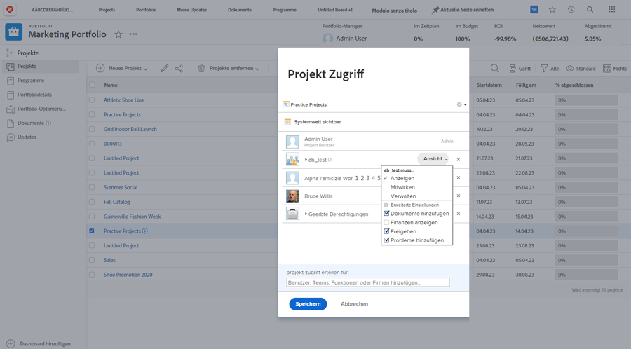

# Projekt freigeben

Die Sichtbarkeit der Projektbeteiligten und Mitwirkenden ist ein wichtiger Bestandteil der Projektverwaltung.

Stellen Sie sicher, dass jeder die benötigten Informationen sehen kann, indem Sie das Projekt freigeben. In Workfront erfolgt dies mit dem [!UICONTROL Freigeben] -Option. Sie können dies über das jeweilige Projekt oder über die [!UICONTROL Mehr] in der Kopfzeile.

Oder Sie können mehrere Projekte gleichzeitig über die Liste der Projekte auf der [!UICONTROL Projekte] Seite durch Auswahl der Projekte und Klicken auf [!UICONTROL Freigeben] Schaltfläche.

Durch die Freigabe des Projekts können alle Beteiligten die Projektinformationen bei Bedarf anzeigen.

<!---
Learn More Icon
Share permissions on objects
Share a project
--->
