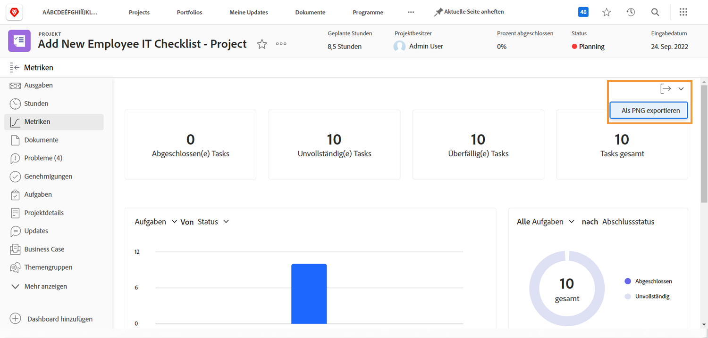

# Verfolgen des Arbeitsfortschritts mit Projektmetriken

In diesem Video lernen Sie Folgendes:

* Zugreifen auf die Diagramme der Projektmetriken
* Anpassen der Informationen in den Diagrammen

>[!VIDEO](https://video.tv.adobe.com/v/336667/?quality=12&learn=on)

Sie können das gesamte Dashboard der Projektmetriken mit der Schaltfläche [!UICONTROL Export] als PNG-Datei exportieren. Dies macht es einfacher, die Daten per E-Mail oder in Präsentationen mit anderen zu teilen.

<!---
Overview of project metrics
--->
