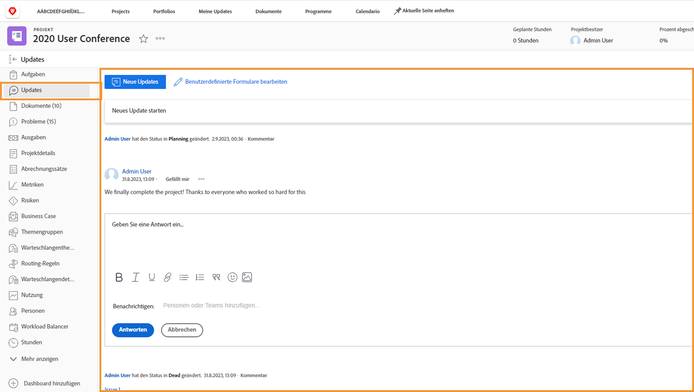

# Projektkommunikation verstehen

Wie gesagt, 90 Prozent der Projektleitung ist Kommunikation. Kommunikation mit dem Projektteam, Ihren Managern und Projektbeteiligten.

Aber wenn Projektteams E-Mails, Instant Messaging, Meetings und Kurznotizen für Projektkommunikation verwenden, werden Informationen verstreut ... oder schlimmer, vergessen. Kommunikation über die Projektarbeit am Projekt selbst in [!DNL Workfront] Verwendung von Updates.

Da Projektteams an Zuweisungen arbeiten, können sie Aktualisierungen vornehmen von [!DNL Workfront] [!UICONTROL Startseite] auf die ihnen zugewiesenen Aufgaben.

Aktualisierungen von Aufgaben, Problemen und Dokumenten werden auf Projektebene aktualisiert [!UICONTROL Updates] -Tab, damit Informationen schnell und einfach angezeigt werden können.

Dann können Sie auf Aktualisierungen antworten, indem Sie einfach auf die Schaltfläche klicken. Dadurch bleiben alle Gespräche an einem Ort, sodass Sie später darauf zurückkommen können.

<!---
learn more urls
Communicate about work in Home
Subscribe to items in Workfront
Update work
--->
