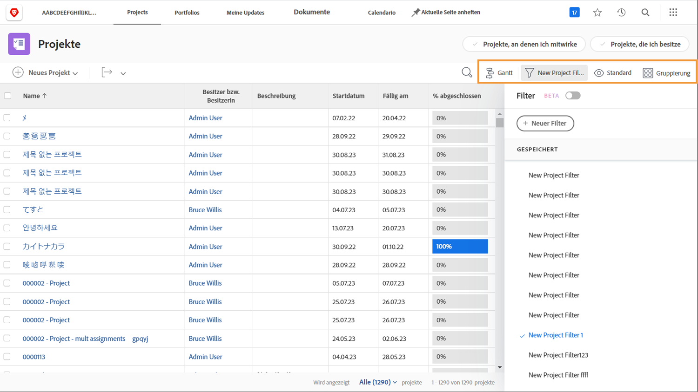
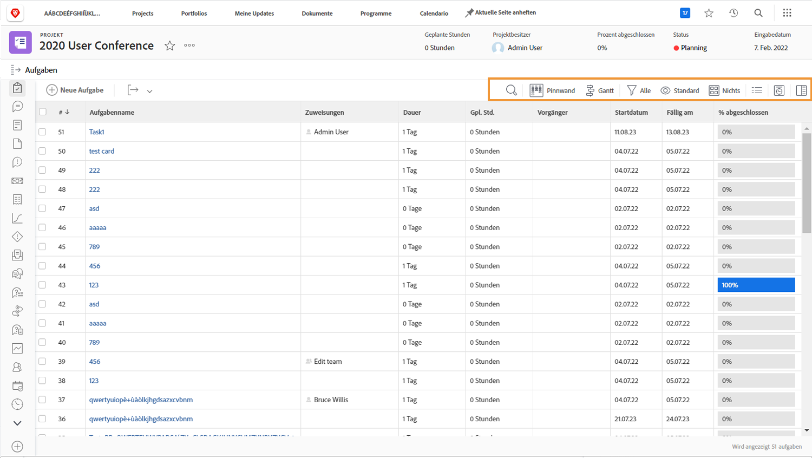

# Anzeigen der Projektinformationen

Egal ob Sie die Hauptseite der [!UICONTROL Projekte] oder ein einzelnes Projekt betrachten, passen Sie Ihre Liste mit [!UICONTROL Filtern], [!UICONTROL Ansichten] und [!UICONTROL Gruppierungen] so an, dass die gewünschten Informationen angezeigt werden.

Auf der Seite [!UICONTROL Projekte] können Sie sich einen Überblick über den Fortgang aller Ihrer Projekte verschaffen.

Verwenden Sie die [!UICONTROL Filter], um die Liste nach bestimmten Kriterien einzugrenzen. Wählen Sie anschließend eine [!UICONTROL Ansicht] aus, um die Spalten mit Informationen anzuzeigen, die für Ihre Projekte relevant sind. Wählen Sie abschließend eine [!UICONTROL Gruppierung] aus, mit der Sie Projekte so organisieren können, dass es für Sie sinnvoll ist.

Wenn Sie auf der Seite mit dem Abschnitt [!UICONTROL Aufgaben] eines Projekts sind, verwenden Sie [!UICONTROL Filter], [!UICONTROL Ansichten] und [!UICONTROL Gruppierungen] erneut, um Sie dabei zu unterstützen, die Durchführung der Arbeiten zu überwachen. Da Sie sich Aufgaben anstelle von Projekten ansehen, haben Sie nämlich eine ganz andere Auswahl.

Viele [!DNL Workfront]-Kundinnen und -Kunden erstellen benutzerdefinierte Ansichten, die benutzerdefinierte Formulardaten und andere für die durchgeführte Arbeit relevante Felder verfügbar machen.

## Erfahren Sie, wie Sie benutzerdefinierte Filter, Ansichten und Gruppierungen erstellen

[Einen einfachen Filter erstellen](https://experienceleague.adobe.com/docs/workfront-learn/tutorials-workfront/reporting/basic-reporting/create-a-basic-filter.html?lang=de)

[Erstellen einer einfachen Ansicht](https://experienceleague.adobe.com/docs/workfront-learn/tutorials-workfront/reporting/basic-reporting/create-a-basic-view.html?lang=de)

[Eine einfache Gruppierung erstellen](https://experienceleague.adobe.com/docs/workfront-learn/tutorials-workfront/reporting/basic-reporting/create-a-basic-grouping.html?lang=de)
