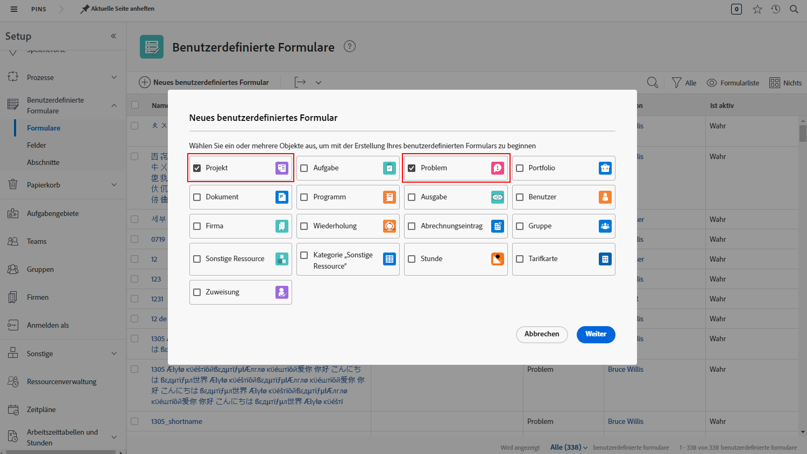
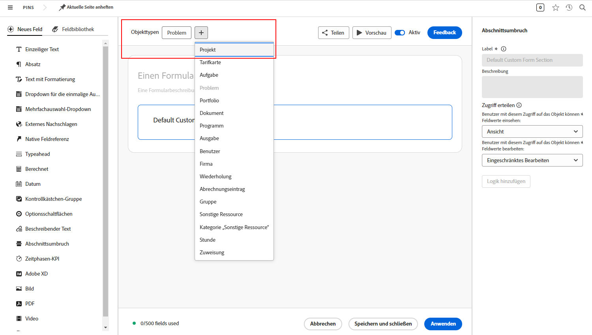

# Antworten auf häufig gestellte Fragen zu Anfrage-Warteschlangen

**Warum kann ich eine Anfrage-Warteschlange sehen, mein Benutzerin bzw. mein Benutzer jedoch nicht?**

Stellen Sie sicher, dass die Person auf der Registerkarte [!UICONTROL Warteschlangendetails] Ihrer Warteschlange bzw. Ihres Projekts die Kriterien des Feldes „Wer kann Anfragen zu dieser Warteschlange hinzufügen?“ erfüllt.

Sehen Sie sich dieses Video an, um weitere Informationen zu erhalten:

>[!VIDEO](https://video.tv.adobe.com/v/3434156/?quality=12&learn=on)

**Ich habe Benutzenden Zugriff auf die Warteschlange gewährt, aber jetzt können sie auch das Projekt für die Anfrage-Warteschlange sehen. Warum?**

In der Liste &quot;Wer kann dieser Warteschlange Anforderungen hinzufügen?&quot; Wenn Sie &quot;Personen mit Zugriff auf dieses Projekt&quot;auswählen, können alle Personen, denen Sie Anzeigerechte gewähren, um die Anforderungswarteschlange zu verwenden, auch die Anforderungswarteschlange in einer Projektliste anzeigen. Um dies zu vermeiden, verwenden Sie die Option &quot;Personen in der Firma dieses Projekts&quot;oder die Option &quot;Personen in der Gruppe dieses Projekts&quot;.

**Kann ich eine Anfrage in ein Projekt umwandeln?**

Ja. Sie können je nach Bedarf Probleme in Aufgaben oder Projekte umwandeln.

Diese Tutorials zeigen Ihnen Folgendes:

* [Konvertieren eines Problems/einer Anfrage in ein Projekt](/help/manage-work/issues-requests/create-a-project-from-a-request.md)

* [Umwandeln eines Problems oder einer Anfrage in eine Aufgabe](/help/manage-work/issues-requests/convert-issues-to-other-work-items.md)

**Wo finde ich eine Anfrage-Warteschlange, um Bearbeitungen vorzunehmen?**

Sie können das Feld [!UICONTROL Suchen] in der Navigationsleiste verwenden, oder Sie finden die Anfrage-Warteschlange im Bereich [!UICONTROL Projekte] aufgelistet.

Wenn Sie eine Anforderung aus der Anforderungswarteschlange öffnen, können Sie im Bereich &quot;Breadcrumbs&quot;auf den Projektnamen klicken.

**Kann ich die Informationen von einem benutzerdefinierten Anfrageformular in ein benutzerdefiniertes Projektformular übertragen?**

Ja. Wenn Sie ein benutzerdefiniertes Formular erstellen, wählen Sie sowohl [!UICONTROL Projekt] als auch [!UICONTROL Problem] als die Objekttypen aus. Sie können auch ein benutzerdefiniertes Projekt-Formular bearbeiten, um den Objekttyp &quot;Problem&quot;einzuschließen und umgekehrt.

Hängen Sie das benutzerdefinierte Formular an die Anfrage an. Wenn Sie die Anfrage in ein Projekt umwandeln, wird das benutzerdefinierte Formular automatisch an das neue Projekt angehängt und die in Feldern enthaltenen Werte werden sowohl in der Anfrage als auch in den benutzerdefinierten Formularen des Projekts angezeigt.

**Ich sehe mir einen Projekt- oder Aufgabenbericht an. Wie finde ich heraus, von welcher Anfrage dieses Objekt stammt?**

Sie können auf Felder in den Feldquellen **[!UICONTROL Konvertiertes Problem]** und **[!UICONTROL Konvertiertes Problem – Urheber]** zugreifen, um diese Informationen zu Ihren Projekt- und Aufgabenberichten hinzuzufügen.

Sehen Sie sich dieses Video an, um weitere Informationen zu erhalten:

>[!VIDEO](https://video.tv.adobe.com/v/3434176/?quality=12&learn=on)

**Wie lässt es sich am besten nach Anfrage-Warteschlangen in einem Bericht filtern?**

Wenn Ihr Projektfilter **Warteschlange>>Ist öffentlich>>Gleich>>Keine** enthält, zeigt Ihr Bericht nur Projekte an, die **KEINE** Anfrage-Warteschlangen sind.

Wenn Ihr Projektfilter **Warteschlange >>Ist öffentlich>>Nicht gleich>>Keine** enthält, zeigt Ihr Bericht zeigt nur Projekte an, die Anfrage-Warteschlangen **SIND**.

Sehen Sie sich dieses Video an, um weitere Informationen zu erhalten:

>[!VIDEO](https://video.tv.adobe.com/v/3434329/?quality=12&learn=on)

**Ist es empfehlenswert, einen benutzerdefinierten Status der Anforderungswarteschlange zu erstellen?**

Einige Kunden erstellen einen benutzerdefinierten Status der Anforderungswarteschlange, der mit &quot;Aktuell&quot;übereinstimmt. Sie können dann einen Bericht ausführen, der alle Anforderungswarteschlangen anzeigt, oder Anforderungswarteschlangen einfach aus einem Bericht ausschließen. Dies hat zwar den Vorteil, benutzerfreundlicher zu sein als die Verwendung von **Warteschlange>>Ist öffentlich>>Nicht gleich>>Keine**, hat aber den Nachteil, dass Benutzer, die Anfragewarteschlangen erstellen, die Verwendung vergessen, da der aktuelle Status ebenso funktioniert und im Großteil des Trainings-Materials angezeigt wird. Aus diesem Grund entscheiden sich viele Kunden dafür, den benutzerdefinierten Status der Anforderungswarteschlange nicht zu verwenden.

Wenn Sie jedoch bereits den Status &quot;Anforderungswarteschlange&quot;in Ihrem Unternehmen verwenden und nur sicherstellen möchten, dass dieser ordnungsgemäß verwendet wird (oder Fälle korrigieren, in denen er nicht vorhanden ist), können Sie den Bericht &quot;**Aktive Anforderungswarteschlangen**&quot;erstellen, der im Video oben beschrieben wird, und den Filter für &quot;**Projekt>>Status entspricht>>Gleich>>Aktuell**&quot;in &quot;**Projekt>>Status>>Gleich&quot;>&quot;ändern. Aktuell**. Dadurch werden alle aktiven Anforderungswarteschlangen angezeigt, die den aktuellen Status anstelle des gewünschten Status der Anforderungswarteschlange verwenden. Wählen Sie alle angezeigten Projekte aus und führen Sie eine Massenbearbeitung durch, um die Status in die Anforderungswarteschlange zu ändern.

## Empfohlene Tutorials zu diesem Thema

* [Grundlegendes zu Anfragewarteschlangen](/help/manage-work/request-queues/understand-request-queues.md)
* [Erstellen einer Anfrage-Warteschlange](/help/manage-work/request-queues/create-a-request-queue.md)
* [Grundlegendes zu den Einstellungen für einen Anfragefluss](/help/manage-work/request-queues/understand-settings-for-a-flow-request.md)
* [Erstellen eines Anfrageflusses](/help/manage-work/request-queues/create-a-request-flow.md)
* [Erstellen einer Feedback-Anfrage-Warteschlange für Systemadmins](/help/manage-work/request-queues/create-a-system-admin-feedback-request-queue.md)
