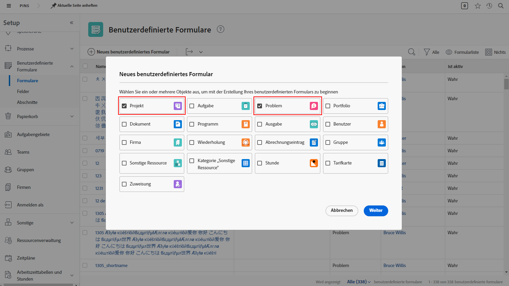
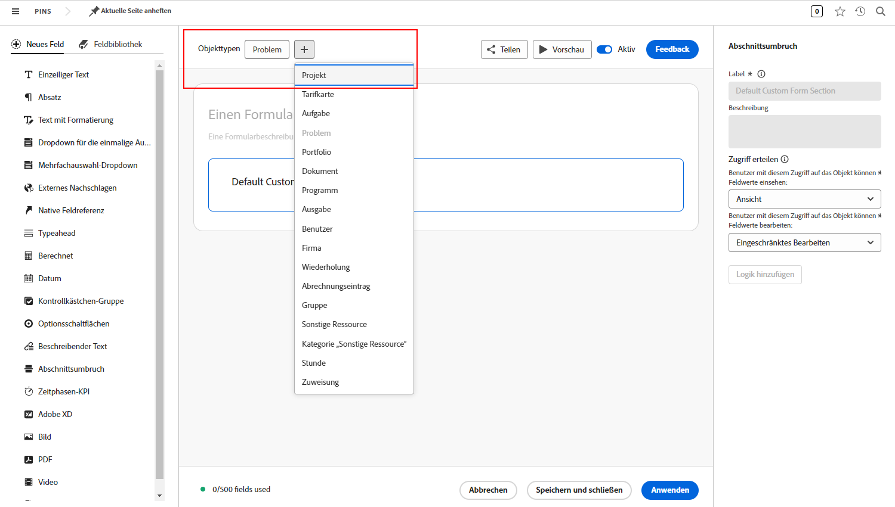

# Antworten auf häufig gestellte Fragen zu Anfrage-Warteschlangen

**Warum kann ich eine Anfrage-Warteschlange sehen, mein Benutzerin bzw. mein Benutzer jedoch nicht?**

Stellen Sie sicher, dass die Person auf der Registerkarte [!UICONTROL Warteschlangendetails] Ihrer Warteschlange bzw. Ihres Projekts die Kriterien des Feldes „Wer kann Anfragen zu dieser Warteschlange hinzufügen?“ erfüllt.

Sehen Sie sich dieses Video an, um weitere Informationen zu erhalten:

>[!VIDEO](https://video.tv.adobe.com/v/3434165/?captions=ger&quality=12&learn=on&enablevpops=1)

**Ich habe Benutzenden Zugriff auf die Warteschlange gewährt, aber jetzt können sie auch das Projekt für die Anfrage-Warteschlange sehen. Warum?**

Wenn Sie in der Liste „Wer kann dieser Warteschlange Anfragen hinzufügen?“ die Option „Benutzer mit Ansichtszugriff auf dieses Projekt“ auswählen, können alle Personen, denen Sie Ansichtszugriff gewähren, um die Anfrage-Warteschlange zu verwenden, auch die Anfrage-Warteschlange in einer Projektliste sehen. Um dies zu vermeiden, verwenden Sie die Option „Personen im Unternehmen dieses Projekts“ oder die Option „Personen in der Gruppe dieses Projekts“.

**Kann ich eine Anfrage in ein Projekt umwandeln?**

Ja. Sie können je nach Bedarf Probleme in Aufgaben oder Projekte umwandeln.

Diese Tutorials zeigen Ihnen Folgendes:

* [Konvertieren eines Problems oder einer Anfrage in ein Projekt](/help/manage-work/issues-requests/create-a-project-from-a-request.md)

* [Konvertieren eines Problems oder einer Anfrage in eine Aufgabe](/help/manage-work/issues-requests/convert-issues-to-other-work-items.md)

**Wo finde ich eine Anfrage-Warteschlange, um Bearbeitungen vorzunehmen?**

Sie können das Feld [!UICONTROL Suchen] in der Navigationsleiste verwenden, oder Sie finden die Anfrage-Warteschlange im Bereich [!UICONTROL Projekte] aufgelistet.

Wenn Sie eine Anfrage aus der Anfrage-Warteschlange öffnen, können Sie im Bereich „Breadcrumbs“ auf den Projektnamen klicken.

**Kann ich die Informationen von einem benutzerdefinierten Anfrageformular in ein benutzerdefiniertes Projektformular übertragen?**

Ja. Wenn Sie ein benutzerdefiniertes Formular erstellen, wählen Sie sowohl [!UICONTROL Projekt] als auch [!UICONTROL Problem] als die Objekttypen aus. Sie können auch ein benutzerdefiniertes Projekt-Formular bearbeiten, um den Objekt-Typ „Problem“ einzuschließen und umgekehrt.

Hängen Sie das benutzerdefinierte Formular an die Anfrage an. Wenn Sie die Anfrage in ein Projekt umwandeln, wird das benutzerdefinierte Formular automatisch an das neue Projekt angehängt und die in Feldern enthaltenen Werte werden sowohl in der Anfrage als auch in den benutzerdefinierten Formularen des Projekts angezeigt.

**Ich sehe mir einen Projekt- oder Aufgabenbericht an. Wie finde ich heraus, von welcher Anfrage dieses Objekt stammt?**

Sie können auf Felder in den Feldquellen **[!UICONTROL Konvertiertes Problem]** und **[!UICONTROL Konvertiertes Problem – Urheber]** zugreifen, um diese Informationen zu Ihren Projekt- und Aufgabenberichten hinzuzufügen.

Sehen Sie sich dieses Video an, um weitere Informationen zu erhalten:

>[!VIDEO](https://video.tv.adobe.com/v/3434185/?captions=ger&quality=12&learn=on&enablevpops=1)

**Wie lässt es sich am besten nach Anfrage-Warteschlangen in einem Bericht filtern?**

Wenn Ihr Projektfilter **Warteschlange>>Ist öffentlich>>Gleich>>Keine** enthält, zeigt Ihr Bericht nur Projekte an, die **KEINE** Anfrage-Warteschlangen sind.

Wenn Ihr Projektfilter **Warteschlange >>Ist öffentlich>>Nicht gleich>>Keine** enthält, zeigt Ihr Bericht zeigt nur Projekte an, die Anfrage-Warteschlangen **SIND**.

Sehen Sie sich dieses Video an, um weitere Informationen zu erhalten:

>[!VIDEO](https://video.tv.adobe.com/v/3434339/?captions=ger&quality=12&learn=on&enablevpops=1)

**Ist es empfehlenswert, einen benutzerdefinierten Status der Anfrage-Warteschlange zu erstellen?**

Einige Kundinnen und Kunden erstellen einen benutzerdefinierten Status der Anfrage-Warteschlange, der mit „Aktuell“ übereinstimmt. Sie können dann einen Bericht ausführen, der alle Anfrage-Warteschlangen anzeigt, oder Anfrage-Warteschlangen einfach aus einem Bericht ausschließen. Dies hat zwar den Vorteil, benutzerfreundlicher zu sein als die Verwendung von **Warteschlange>>Ist öffentlich>>Nicht gleich>>Keine**. Gleichzeitig hat es aber den Nachteil, dass Benutzende, die Anfrage-Warteschlangen erstellen, die Verwendung möglicherweise vergessen, da der aktuelle Status ebenso funktioniert und im Großteil des Trainings-Materials angezeigt wird. Aus diesem Grund entscheiden sich viele Kundinnen und Kunden dazu, den benutzerdefinierten Status der Anfrage-Warteschlange nicht zu verwenden.

Wenn Sie jedoch in Ihrem Unternehmen bereits den Status „Anfrage-Warteschlange“ verwenden und nur sicherstellen möchten, dass dieser ordnungsgemäß verwendet wird (oder Fälle korrigieren möchten, in denen dies nicht so ist), können Sie den Bericht **Aktive Anfrage-Warteschlangen** erstellen, der im Video oben beschrieben wird, und den Filter für **Projekt>>Status entspricht>>Gleich>>Aktuell** in **Projekt>>Status>>Gleich>>Aktuell** ändern. Dadurch werden alle aktiven Anfrage-Warteschlangen angezeigt, die den Status „Aktuell“ anstelle des von Ihnen gewünschten Status der Anfrage-Warteschlange verwenden. Wählen Sie alle angezeigten Projekte aus und führen Sie eine Massenbearbeitung durch, um die Status in „Anfrage-Warteschlangen“ zu ändern.

## Empfohlene Tutorials zu diesem Thema

* [Anfrage-Warteschlangen in Workfront erkunden](/help/manage-work/request-queues/understand-request-queues.md)
* [Erstellen einer Anfrage-Warteschlange in Workfront](/help/manage-work/request-queues/create-a-request-queue.md)
* [Konfigurieren der Einstellungen für den Anfragefluss](/help/manage-work/request-queues/understand-settings-for-a-flow-request.md)
* [Erstellen eines Anfrageflusses in Workfront](/help/manage-work/request-queues/create-a-request-flow.md)
* [Erstellen einer Feedback-Anfrage-Warteschlange für Systemadmins](/help/manage-work/request-queues/create-a-system-admin-feedback-request-queue.md)
