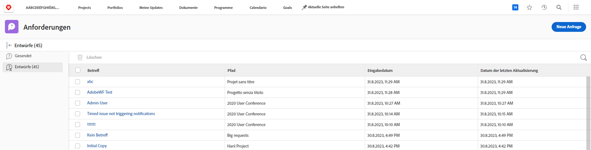

# Grundlegendes zu Anfragewarteschlangen

In diesem Video lernen Sie Folgendes:

* Übermitteln einer Anfrage über eine [!DNL  Workfront]-Anfrage-Warteschlange
* Struktur von Anfragewarteschlangen

>[!VIDEO](https://video.tv.adobe.com/v/335220/?quality=12&learn=on)

## Automatische Speicherung von Anfrageentwürfen

Wenn Sie mit dem Ausfüllen eines Anfrageformulars beginnen, speichert [!DNL Workfront] automatisch einen Entwurf, nachdem Sie das Feld [!UICONTROL Betreff] ausgefüllt haben. Das bedeutet, dass Sie keine Daten verlieren, wenn Sie den Bereich [!UICONTROL Anfragen] verlassen müssen, um etwas anderes zu tun, oder wenn Sie mitten in Ihrer Anfrage eine Pause einlegen müssen, um weitere Informationen zu sammeln.

Am oberen Rand des Fensters wird angezeigt, dass der Entwurf gespeichert wurde. [!DNL Workfront] speichert einen Entwurf Ihrer Anfrage, auch wenn die erforderlichen Felder noch nicht ausgefüllt sind.

Wenn Sie bereit sind, die Anfrage abzusenden, finden Sie sie auf der Registerkarte [!UICONTROL Entwürfe]. Klicken Sie auf den Namen, um sie zu öffnen und das Formular fertig auszufüllen. Klicken Sie anschließend auf [!UICONTROL Anfrage absenden], wenn Sie fertig sind.

## Sie sind dran

Nehmen wir uns eine Minute Zeit, um die Informationen, die Sie gerade erhalten haben, noch einmal durchzugehen.

**Frage:** Wie erstellt man eine Anfrage in Workfront? Führen Sie die Schritte in der richtigen Reihenfolge auf.

* Die gewünschte Anfrageart auswählen
* Auf „Anfrage absenden“ klicken
* Die Informationen im Formular ausfüllen
* Auf „Neue Anfrage“ klicken
* Zum Anfragebereich navigieren

**Antwort:** Zum Anfragebereich navigieren > auf „Neue Anfrage“ klicken > die gewünschte Anfrageart auswählen > die Informationen im Formular ausfüllen > auf „Anfrage absenden“ klicken

**Frage:** Eine Anfrage ist eigentlich ein …

**Antwort:** Problem

<!---
You can also access request drafts from the [!UICONTROL Select a Request Type] menu at the top of the window. Select an option from the [!UICONTROL Recent Drafts] section, or start a new request by picking a queue from the [!UICONTROL New Requests] section. Fill everything out like normal, then submit the request.

<!---
image
--->

<!---
Let's take a minute to review the information you were just presented.

How do you make a request in Workfront? List the steps in order.
Choose the request type you need to make
Click Submit request
Fill out the information on the form
Click "New Request"
Navigate to the request area

Answer: Navigate to the request area>Click New Request>Choose the request type you need to make>Fill out the information on the form>Click Submit request

A request is really an......

Answer: Issue
--->
