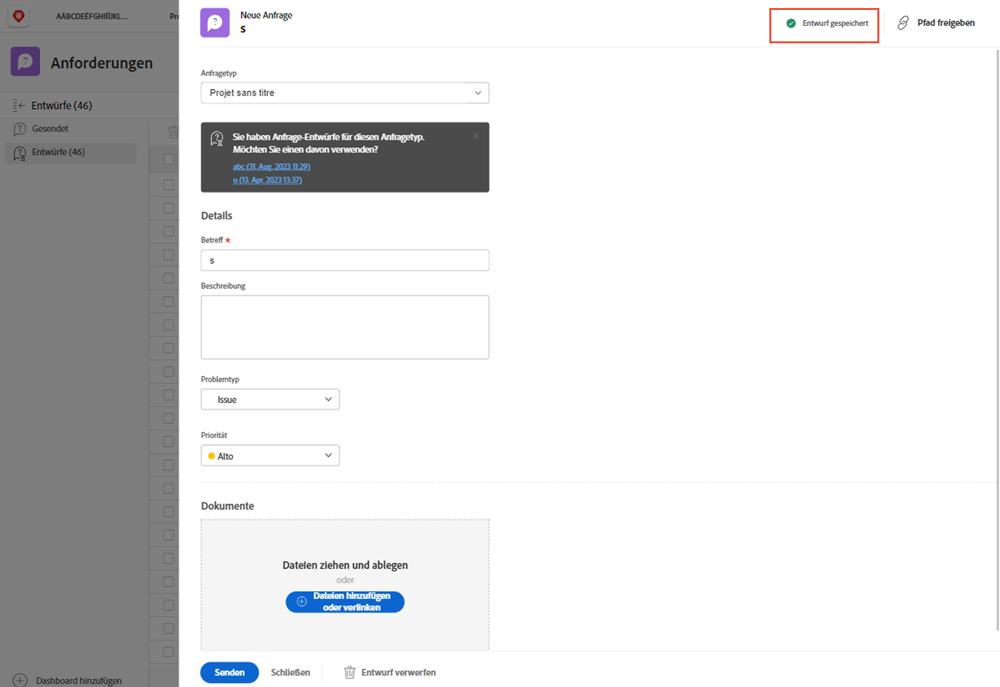

# Anforderungswarteschlangen verstehen

In diesem Video erfahren Sie:

* Senden einer Anfrage über eine [!DNL  Workfront] Anforderungswarteschlange
* Struktur von Anforderungswarteschlangen

>[!VIDEO](https://video.tv.adobe.com/v/335220/?quality=12&learn=on)

## Automatische Speicherung von Anfrageentwürfen

Wenn Sie mit dem Ausfüllen eines Anfrageformulars beginnen, [!DNL Workfront] speichert einen Entwurf automatisch, nachdem Sie die [!UICONTROL Betreff] -Feld. Das bedeutet, dass Sie keine Daten verlieren, wenn Sie von der [!UICONTROL Anforderungen] -Bereich verwenden, um etwas Anderes zu tun, oder wenn Sie mitten in Ihrer Anfrage anhalten müssen, um weitere Informationen zu sammeln.

Oben im Fenster wird ein Hinweis angezeigt, dass der Entwurf gespeichert wurde. [!DNL Workfront] speichert einen Entwurf Ihrer Anfrage, auch wenn die erforderlichen Felder noch nicht ausgefüllt sind.

Wenn Sie bereit sind, die Anfrage zu senden, suchen Sie sie im [!UICONTROL Entwürfe] Registerkarte. Klicken Sie auf den Namen, um ihn zu öffnen und das Formular auszufüllen. Klicken Sie anschließend auf [!UICONTROL Anfrage absenden] wenn Sie fertig sind.

## Ihre Wendung

Lassen Sie uns kurz die Informationen überprüfen, die Ihnen gerade präsentiert wurden.

**Frage:** Wie stellt man eine Anforderung in Workfront? Führen Sie die Schritte in der richtigen Reihenfolge auf.

* Wählen Sie den gewünschten Anfragetyp aus
* Klicken Sie auf Anfrage senden
* Füllen Sie die Informationen auf dem Formular aus
* Klicken Sie auf &quot;Neue Anforderung&quot;
* Navigieren zum Anforderungsbereich

**Antwort:** Navigieren Sie zum Anforderungsbereich > Klicken Sie auf Neue Anforderung > Wählen Sie den Anfragetyp aus, den Sie erstellen müssen > Füllen Sie die Informationen im Formular aus > Klicken Sie auf Anfrage senden .

**Frage:** Eine Anfrage ist wirklich eine ...

**Antwort:** Problem

<!---
You can also access request drafts from the [!UICONTROL Select a Request Type] menu at the top of the window. Select an option from the [!UICONTROL Recent Drafts] section, or start a new request by picking a queue from the [!UICONTROL New Requests] section. Fill everything out like normal, then submit the request.

<!---
image
--->

<!---
Let's take a minute to review the information you were just presented.

How do you make a request in Workfront? List the steps in order.
Choose the request type you need to make
Click Submit request
Fill out the information on the form
Click "New Request"
Navigate to the request area

Answer: Navigate to the request area>Click New Request>Choose the request type you need to make>Fill out the information on the form>Click Submit request

A request is really an......

Answer: Issue
--->
