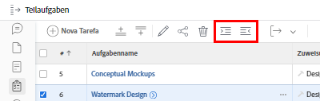
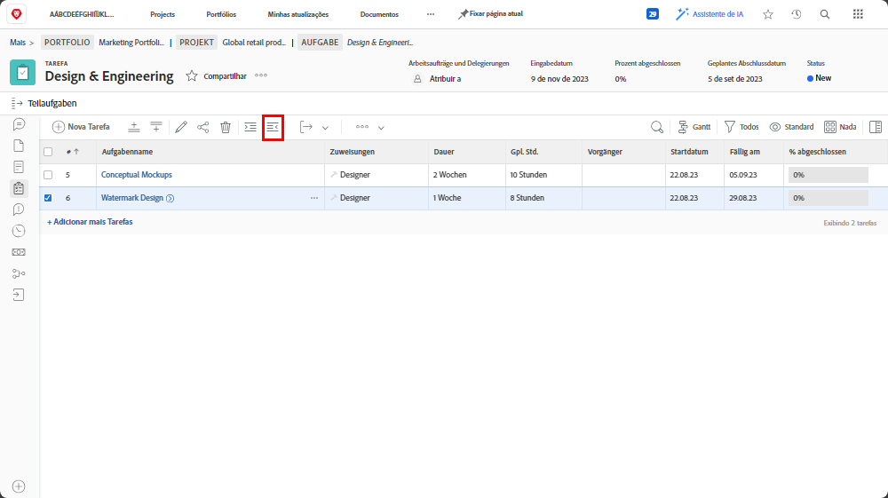

# Grundlegendes zu über- und untergeordneten Aufgaben

In diesem Video lernen Sie Folgendes:

* Strukturieren von Aufgaben in einem [!DNL Workfront]-Projekt

>[!VIDEO](https://video.tv.adobe.com/v/335087/?quality=12&learn=on)

## Ändern einer Aufgabe in eine Unteraufgabe und Rückgängigmachen dieser Änderung

Die Schaltflächen **Einrückung** und **Ausrückung** werden verwendet, um eine Aufgabe in eine Unteraufgabe oder von einer Unteraufgabe in eine Nicht-Unteraufgabe zu ändern.

Wählen Sie „[!UICONTROL Watermark Design]“ aus, und klicken Sie auf die Schaltfläche **Einrückung**. „[!UICONTROL Watermark Design]“ wird zu einer Unteraufgabe unter „[!UICONTROL Conceptual Mockups]“, was zu einer übergeordneten Aufgabe wird.

Wählen Sie „[!UICONTROL Watermark Design]“ aus, wenn es sich um eine Unteraufgabe handelt, und klicken Sie auf die Schaltfläche **Ausrückung**. „[!UICONTROL Watermark Design]“ wird zu einer Standardaufgabe auf der gleichen Ebene wie „[!UICONTROL Conceptual Mockups]“.

