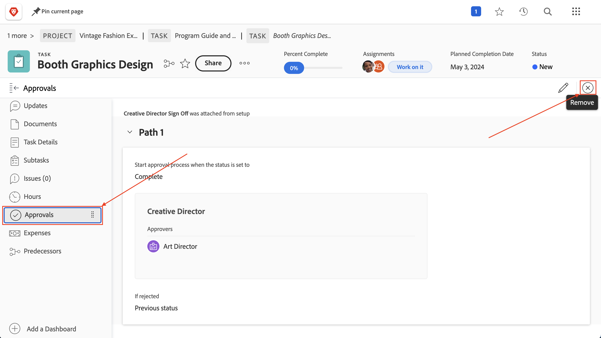

# Abschließen von Genehmigungen

Die Genehmigung von Aufgaben und Problemen ist Teil vieler Projekte. Ungelöste Genehmigungen verhindern jedoch, dass Sie den Projektstatus auf „Abgeschlossen“ setzen können.

Im Folgenden erfahren Sie, wie Sie sie finden und damit umgehen.

Wählen Sie in Ihrem Projekt im Abschnitt [!UICONTROL Aufgabe] eine [!UICONTROL Ansicht] aus, die die Spalte [!UICONTROL Status] enthält, beispielsweise die Ansicht [!UICONTROL Status]. Ein kurzer Blick in diese Spalte zeigt, ob es eine unvollständige Genehmigung für eine Aufgabe gibt. Diese hat hinter dem Namen des Status den Zusatz „[!UICONTROL – Ausstehende Genehmigung]“.

Wenn Sie eine Aufgabe finden, die noch auf die Genehmigung wartet, haben Sie zwei Möglichkeiten:

## Vervollständigen der Genehmigung

Dies kann bedeuten, dass Sie die zugewiesene Person an die ausstehende Genehmigung erinnern. Sie können sehen, wer als genehmigende Person zugewiesen ist, indem Sie die Aufgabe öffnen und im Bereich „Genehmigungen“ auf das Menü mit den drei Punkten klicken.

In einem Feld wird die zugewiesene genehmigende Person angezeigt.

## Entfernen der Genehmigung

Wenn die Genehmigung nicht erforderlich ist, können Sie sie entfernen. Rufen Sie zu diesem Zweck zunächst die Genehmigung zurück. Klicken Sie im Bereich für Genehmigungen auf die Schaltfläche [!UICONTROL Rückruf]. Dadurch wird der Status wieder in den vorherigen Status geändert und Sie können den Genehmigungsprozess entfernen.

Klicken Sie jetzt links auf die Registerkarte [!UICONTROL Genehmigungen] und dann oben rechts auf die Schaltfläche [!UICONTROL Entfernen].

## Umgang mit Problemgenehmigungen

Wenn Ihre Organisation Anfragen verwendet, um Probleme, Änderungsaufträge oder andere Ereignisse während des Projekts zu verfolgen, führen Sie die gleichen Schritte im Abschnitt [!UICONTROL Anfragen] Ihres Projekts aus.
