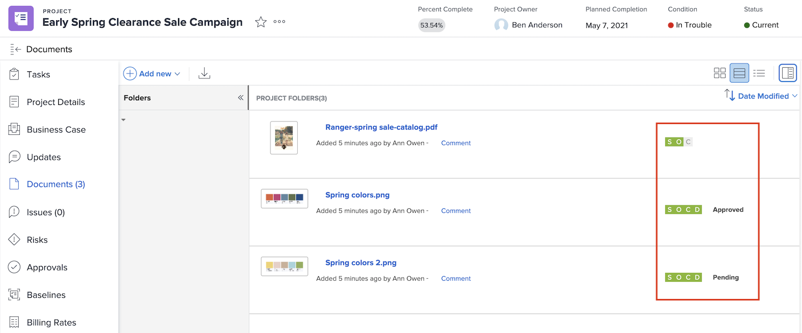

# Hochladen von Assets

Bevor Sie ein [!DNL Workfront]-Projekt abschließen, vergewissern Sie sich, dass alle relevanten Dateien im Abschnitt [!UICONTROL Dokumente] angehängt sind. Laden Sie diese gemäß den Richtlinien Ihres Unternehmens als Dokument oder Korrekturabzug hoch.

Möglicherweise müssen Sie das Dokument oder den Korrekturabzug als Version einer vorhandenen Datei hochladen.

Wenn Ihr Unternehmen Korrekturabzug-Genehmigungen verwendet, vergewissern Sie sich mit einem kurzen Blick auf die Fortschrittssymbole, dass alle davon abgeschlossen sind.

Wenn Ihr Unternehmen Dokumentgenehmigungen verwendet, wählen Sie jedes Element in der Liste aus und überprüfen Sie jeweils die Dokumentdetails, um festzustellen, ob die Genehmigungen abgeschlossen sind.

<!---
learn more urls
Create proofs
Add new documents to Workfront
--->
