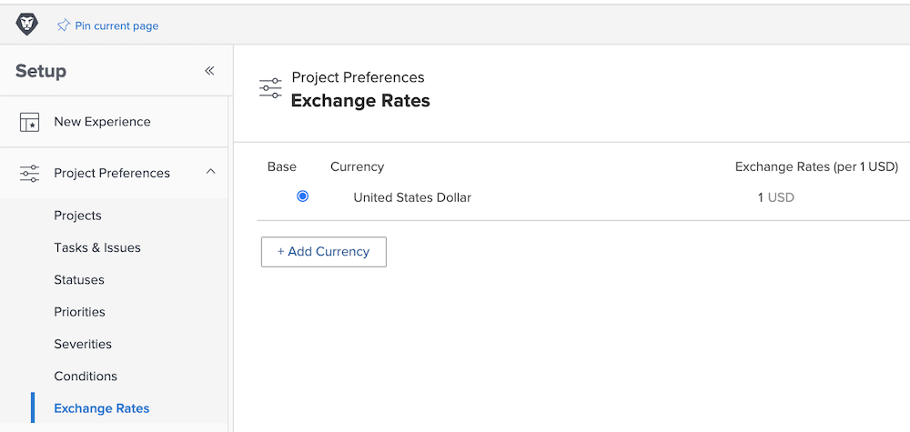

# Einrichten von Wechselkursen

[!DNL Workfront] unterstützt verschiedene Währungen für Kundenorganisationen, die multinationale Unternehmen sind. Wechselkurse können in Projekten und Berichten verwendet werden, um Finanzinformationen in verschiedenen Währungen aus aller Welt darzustellen.

Die Wechselkurse werden von den Systemadmins verwaltet. Weitere Währungen können nach Bedarf für Ihr Unternehmen eingerichtet werden.

Die Standardwährung von Workfront ist der amerikanische Dollar. Dies ist die Währung, in der Finanzinformationen standardmäßig berechnet werden. Dieser Standard kann global sowie für einzelne Projekte geändert werden.

## Einrichten von Währungen und Wechselkursen

**Wählen Sie [!UICONTROL Setup] im Hauptmenü.**

1. Erweitern Sie die **[!UICONTROL Projektvoreinstellungen]** in der linken Menüleiste.
1. Klicken Sie auf **[!UICONTROL Wechselkurse]**.
1. Klicken Sie dann auf die Schaltfläche **[!UICONTROL Währung hinzufügen]**.
1. Wählen Sie die Landeswährung aus der Dropdown-Liste aus.
1. Geben Sie den gewünschten Wechselkurs für die Währung ein.
1. Wenn eine andere Währung als der US-Dollar die Basiswährung (Standardwährung) des [!DNL Workfront]-Systems sein soll, klicken Sie auf die Schaltfläche neben dem Währungsnamen.
1. Klicken Sie auf **[!UICONTROL Speichern]**, nachdem Sie alle Währungen hinzugefügt haben.

>[!NOTE]
>
>Workfront aktualisiert oder verfolgt die aktuellen Marktwerte für Wechselkurse nicht. Aktualisierungen müssen, falls nötig, manuell vorgenommen werden.
