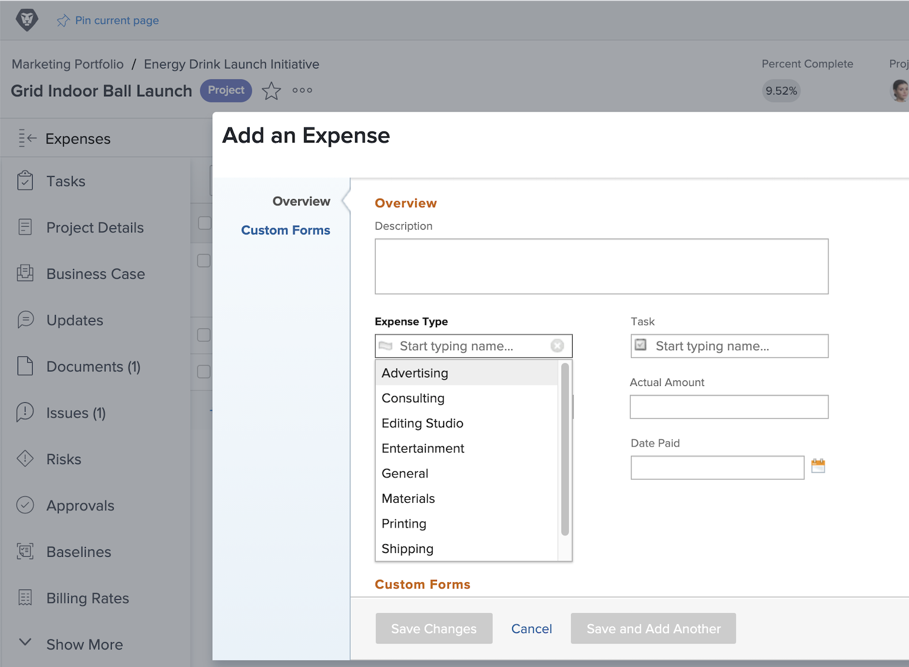

# Einrichten von Ausgabentypen

Bei Ausgaben in [!DNL Workfront] handelt es sich um sonstige Kosten im Zusammenhang mit Projekten und anderen Arbeiten. Bei den Ausgaben kann es sich beispielsweise um Reisekosten für einen Kundenbesuch oder um den Kauf von Zubehör für ein Foto-Shooting handeln. Diese Ausgaben sollten im Rahmen des Projekts protokolliert werden, damit geplante Kosten und tatsächliche Kosten für jedes Projekt berechnet und gemeldet werden können.

[!DNL Workfront] hat vorgefertigte Ausgabentypen, die bei der Eingabe von Ausgaben verwendet werden können. Die Standardeinstellungen können nicht gelöscht oder geändert werden, es können jedoch neue hinzugefügt werden.

* Werbung
* Beratung
* Bewirtung
* Allgemein
* Materialien
* Drucken
* Lieferung
* Reise

Systemadmins können die für ihr Unternehmen benötigten Ausgabentypen hinzufügen. Diese zusätzlichen Ausgabentypen können geändert, ausgeblendet oder gelöscht werden, um die in Ihrem Unternehmen benötigten Finanzberichte zu unterstützen.

Projekt-Managerinnen und -Manager, Führungskräfte und andere können in [!DNL Workfront] für Aufgaben, Projekte, Programme oder Portfolios Ausgabenberichte erstellen und die einzelnen Ausgaben auf Wunsch nach Typ gruppieren. Projektfinanzierungen lassen sich durch Ausgabetypen wesentlich besser verwalten.

## Erstellen eines Ausgabentyps

**Wählen Sie [!UICONTROL Einrichtung] im Hauptmenü**

1. Klicken Sie auf **[!UICONTROL Ausgabentypen]** im Menü des linken Bedienfelds.
1. Klicken Sie auf die Schaltfläche **[!UICONTROL Neuer Ausgabentyp]**.
1. Benennen Sie den Ausgabentyp.
1. Fügen Sie bei Bedarf eine Beschreibung hinzu.
1. Klicken Sie auf die Schaltfläche **[!UICONTROL Speichern]**.

![Ein Bild zum Erstellen eines neuen [!UICONTROL Ausgabentyps]](assets/setting-up-finances-6.png)

## Verwendung von Ausgabentypen

Die Ausgabenoptionen werden in der Dropdown-Liste zu **[!UICONTROL Ausgabentypen]** angezeigt, wenn Benutzende Ausgaben für ein Projekt oder eine Aufgabe in [!DNL Workfront] erstellen.

