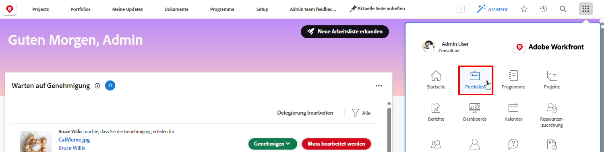
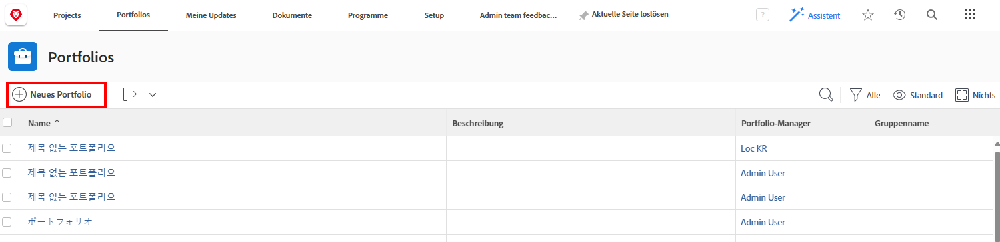
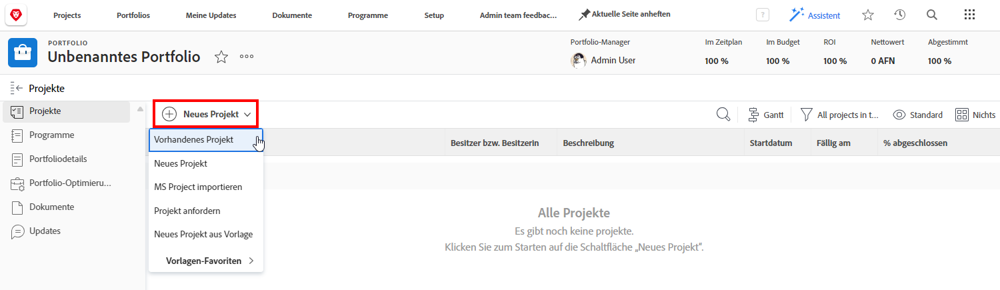
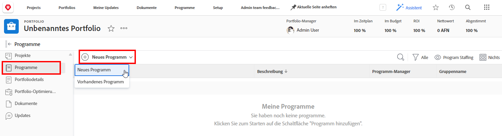

# Portfolios verstehen

Führungskräfte haben oft die schwierige Aufgabe, zu ermitteln, welche Projekte am besten dafür geeignet wären, die Ziele des Unternehmens zu erreichen. Das bedeutet, ein aktuelles oder potenzielles Projekt anhand von Kriterien zu beurteilen, die für diese Ziele wichtig sind. Diese Kriterien können Dinge wie die Anzahl der benötigten Ressourcen, die Höhe der Kosten im Vergleich zu den Einnahmen des Projekts und/oder die Anzahl der mit dem Projekt verbundenen Risiken umfassen. Mit diesen Informationen können Führungskräfte entscheiden, welche Projekte durchgeführt werden sollten und wann.

Das Konzipieren und Planen von Projekten ist keine allzu schwierige Aufgabe – es ist ein Prozess, der für die meisten Führungskräfte Gewohnheit ist. Die wirkliche Herausforderung liegt darin, Projekte miteinander zu vergleichen. Eine lange und detaillierte Projektliste durchzugehen, ist zeitaufwendig. An dieser Stelle können Portfolios in Workfront helfen.

## Was ist ein Portfolio?

Ein Portfolio ist eine Sammlung von Projekten, die sich im Hinblick auf benötigte Ressourcen, Budget, Zeitplan und Priorität gleichen. Beispielsweise könnte eine Marketing-Agentur ein Portfolio verwenden, um alle Projekte für einen bestimmten Kunden zu gruppieren.

Navigieren Sie vom [!UICONTROL Hauptmenü] aus zum Abschnitt **[!UICONTROL Portfolios]** und klicken Sie dann auf den Namen eines Portfolios, um es zu öffnen.

Sie können die Schaltfläche **[!UICONTROL Neues Projekt]** verwenden, um ein vorhandenes Projekt einfach zum Portfolio hinzuzufügen. Oder Sie können ein neues Projekt direkt im Portfolio erstellen.

![Ein Bild des Dropdown-Menüs für die Schaltfläche [!UICONTROL Neues Projekt]](assets/01-portfolio-management3.png)

Wenn die Projekte dem Portfolio hinzugefügt wurden, können Sie die Zusammenfassungsinformationen in der Seitenkopfzeile verwenden, um einen allgemeinen Überblick darüber zu erhalten, wie die Sammlung von Projekten zu den Gesamtzielen beiträgt, ob positiv oder negativ.

Sie können das Tool zur Portfolio-Optimierung (auch bekannt als [!UICONTROL Portfolio-Optimizer]) verwenden, um Projekte auf der Grundlage von Nettowert, Ausrichtung, Kosten, Risiko und ROI zu priorisieren.

## Zugreifen auf Portfolios

Um mit Portfolios arbeiten zu können, muss Ihnen eine Planlizenz in Workfront zugewiesen sein und Sie müssen über eine Zugriffsebene verfügen, die Ihnen Berechtigungen für die Arbeit mit Portfolios gibt.

Wenn ein Portfolio erstellt wird, hat nur die Person Zugriff darauf, die das Portfolio erstellt oder verwaltet. Sie können anderen Zugriff auf das Portfolio gewähren, indem Sie es freigeben. Dadurch wird auch Zugriff auf alle im Portfolio erstellten Programme und Projekte gewährt.

Öffnen Sie das Portfolio, klicken Sie auf das Menü mit den drei Punkten und wählen Sie dann **[!UICONTROL Freigeben]** aus. Fügen Sie die Personen, Teams, Aufgabengebiete, Gruppen oder Unternehmen hinzu, die Zugriff haben sollten. Bestimmen Sie dann, welche Zugriffsart jeweils vergeben werden soll – „Verwalten“ oder „Anzeigen“.

![Ein Bild der Option [!UICONTROL Freigeben] in einem [!DNL Workfront]Portfolio](assets/04-portfolio-management11.png)

## Erstellen eines Portfolios

Um ein Portfolio zu erstellen, klicken Sie auf **[!UICONTROL Portfolios]** im Hauptmenü.

Klicken Sie im Bereich Portfolios auf **[!UICONTROL Neues Portfolio]**.

Benennen Sie das Portfolio und klicken Sie auf **[!UICONTROL Neues Projekt]** , um ein Projekt zum Portfolio hinzuzufügen. Sie können ein neues Projekt auf verschiedene Weise erstellen, genau wie Sie es über die **[!UICONTROL Projekte]** Bereich. Jedes neue Projekt, das Sie von hier aus erstellen, gehört zu diesem Portfolio. Sie können auch auf **[!UICONTROL Vorhandenes Projekt]** , um ein vorhandenes Projekt(e) aus einer Liste auszuwählen.

## Erstellen eines Programms in einem Portfolio

Wählen Sie die **[!UICONTROL Programme]** Registerkarte und klicken Sie dann auf **[!UICONTROL Neues Programm]** , um ein neues Programm in diesem Portfolio zu erstellen, oder klicken Sie auf **[!UICONTROL Bestehendes Programm]** bestehende Programme aus anderen Portfolios zu stehlen.

<!--
Pro-tips graphic
If a user can't access a specific portfolio, make sure it's shared with them. The Workfront access level determines that a user can access portfolios in general, but sharing makes sure they can see specific portfolios. 
-->

<!--
Learn more graphic and links to documentation articles
* Portfolio overview   
* Create a portfolio 
* Create and manage portfolios 
* Navigate within a portfolio 
* Share a portfolio   
-->
