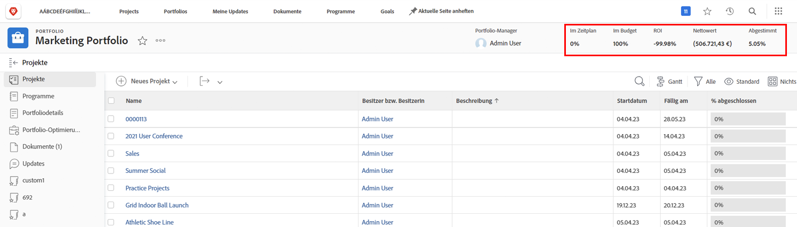
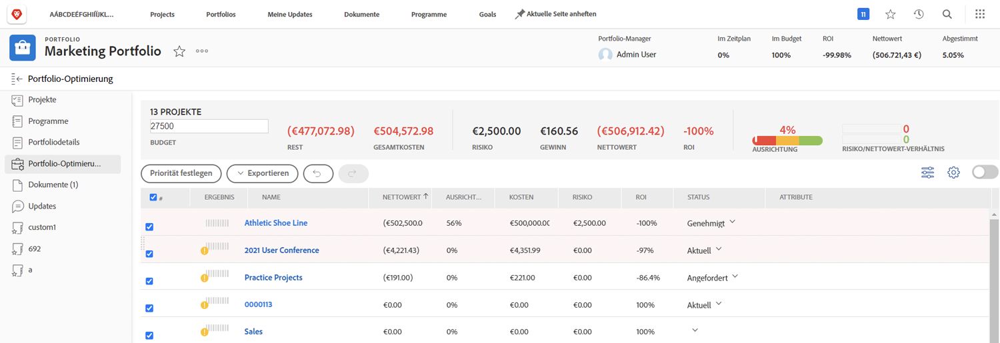

# Überblick über Portfolios

Führungskräfte haben oft die schwierige Aufgabe herauszufinden, welche Projekte ihrem Unternehmen am besten dabei helfen, seine Ziele und Ziele zu erreichen. Das bedeutet, ein aktuelles oder potenzielles Projekt anhand von Kriterien zu beurteilen, die für diese Ziele wichtig sind. Diese Kriterien können Dinge wie die Anzahl der benötigten Ressourcen, die Höhe der Kosten des Projekts im Vergleich zu dem, was es einbringen wird, und/oder die Anzahl der damit verbundenen Risiken umfassen. Mit diesen Informationen können Manager entscheiden, welche Projekte zuerst durchgeführt werden sollen und welche auf den Rücken gestellt werden können.

Das Denken und Planen von Projekten ist keine allzu schwierige Aufgabe - es ist ein Prozess, den die meisten Manager gewohnt sind. Der wirkliche Kampf kommt mit dem Vergleich von Projekten miteinander. Das Durchblättern einer langen und detaillierten Projektliste ist zeitaufwendig. Dort befinden sich Portfolios in [!DNL  Workfront] kann helfen.

## Was ist ein Portfolio?

Ein Portfolio ist eine Sammlung von Projekten, die für dieselben Ressourcen, Budgets, Zeitpläne und Prioritäten ausgeführt werden. Beispielsweise könnte eine Marketing-Agentur ein Portfolio verwenden, um alle Projekte für einen bestimmten Kunden zu gruppieren.

Navigieren Sie zum **[!UICONTROL Portfolios]** aus dem Abschnitt [!UICONTROL Hauptmenü]klicken Sie auf einen Portfolionamen, um ihn zu öffnen.

Sie können die **[!UICONTROL Neues Projekt]** -Schaltfläche zum einfachen Hinzufügen eines vorhandenen Projekts zum Portfolio. Oder Sie können ein neues Projekt direkt im Portfolio erstellen.

![Ein Bild des Dropdown-Menüs für die [!UICONTROL Neues Projekt] button](assets/01-portfolio-management3.png)

Nachdem die Projekte dem Portfolio hinzugefügt wurden, können Sie die Zusammenfassungen im Seitenkopf verwenden, um einen allgemeinen Überblick darüber zu erhalten, wie die Sammlung von Projekten entweder positiv oder negativ zu den Gesamtzielen beiträgt.

Sie können auch das Portfolio-Optimierungstool verwenden, um Projekte zu priorisieren, die die übergeordneten strategischen Ziele unterstützen.

## Zugreifen auf Portfolios

Um mit Portfolios arbeiten zu können, muss Ihnen eine Planungslizenz in [!DNL Workfront] und haben eine Zugriffsstufe zugewiesen, die Ihnen Berechtigungen für die Arbeit mit Portfolios erteilt.

Wenn ein Portfolio erstellt wird, hat nur der Ersteller oder Manager des Portfolios Zugriff darauf. Sie können Zugriff auf das Portfolio gewähren, indem Sie es freigeben. Dadurch erhalten Sie auch Zugriff auf die im Portfolio erstellten Programme und Projekte.

Öffnen Sie das Portfolio, klicken Sie auf das Menü mit drei Punkten und wählen Sie dann **[!UICONTROL Freigabe]**. Fügen Sie die Personen, Teams, Rollen, Gruppen oder Unternehmen hinzu, die Zugriff haben sollten. Bestimmen Sie dann, welche Zugriffsart jeder haben sollte - verwalten oder anzeigen.

![Ein Bild der [!UICONTROL Freigabe] in einer [!DNL Workfront] Portfolio](assets/04-portfolio-management11.png)

<!--
Pro-tips graphic
If a user can’t access a specific portfolio, make sure it’s shared with them. The Workfront access level determines that a user can access portfolios in general, but sharing makes sure they can see specific portfolios. 
-->

<!--
Learn more graphic and links to documentation articles
* Portfolio overview   
* Create a portfolio 
* Create and manage portfolios 
* Navigate within a portfolio 
* Share a portfolio   
-->
