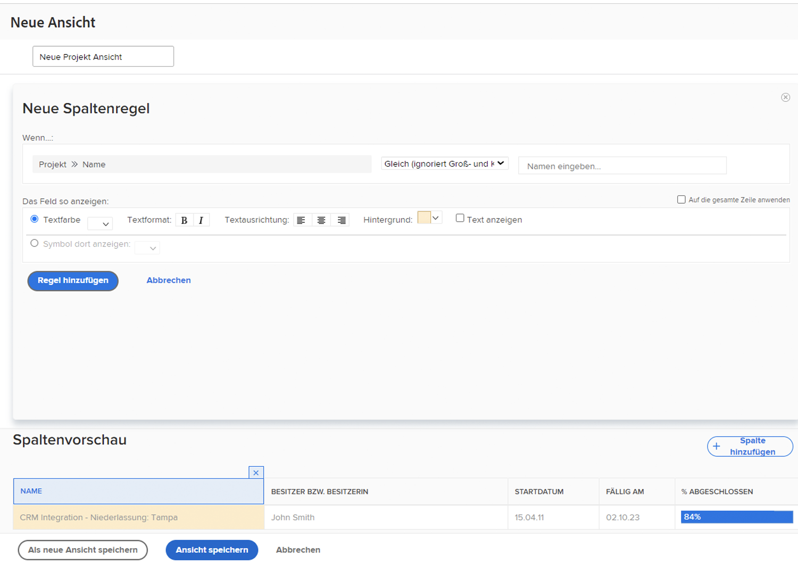

# Hinzufügen einer grundlegenden bedingten Formatierung zu einer Ansicht

Eine bedingte Formatierung erfolgt durch die Erstellung von Spaltenregeln. Spaltenregeln ermöglichen die Formatierung einer Spalte nach benutzerspezifischen Kriterien.

In diesem Video lernen Sie Folgendes:

* Welche bedingte Formatierung hat eine Ansicht?
* Erstellen und Ändern einer bedingten Formatierung

>[!VIDEO] (https://video.tv.adobe.com/v/335149/?quality=12&learn=on&enablevpops=0

## Zusammenfassung zur bedingten Formatierung

So erstellen Sie eine bedingte Formatierung:

1. Wählen Sie die Spalte, für die die Formatierung gelten soll
1. Legen Sie fest, unter welchen Bedingungen Sie die Formatierung ändern möchten
1. Entscheiden Sie, welche Art von Formatierungsänderung am besten geeignet ist

   * Hintergrundfarbe
   * Textfarbe
   * Ersatztext
   * Symbol anzeigen

## Aktivitäten zum Hinzufügen einer grundlegenden bedingten Formatierung zu einer Ansicht

### Aktivität 1: Hinzufügen einer grundlegenden Formatierung zu einer Ansicht

Erstellen Sie eine Aufgabenansicht mit dem Namen „Standard + Fortschritt“, indem Sie diese bedingte Formatierung zur Spalte [!UICONTROL Name] der bestehenden Standardansicht hinzufügen.

1. Fügen Sie eine Spaltenregel hinzu, die den Feldhintergrund rot färbt, wenn der Fortschrittsstatus der Aufgabe „Spät“ ist.
1. Fügen Sie eine Spaltenregel hinzu, die den Feldhintergrund gelb färbt, wenn der Fortschrittsstatus „Rückstand“ oder „Gefährdet“ ist.

Auf diese Weise können Sie problematische Aufgaben erkennen, ohne die Spalte für den Fortschrittsstatus in Ihre Ansicht aufzunehmen.

### Antwort 1

1. Wechseln Sie in einem Aufgabenlistenbericht zum Dropdown-Menü **[!UICONTROL Ansicht]** und wählen Sie **[!UICONTROL Neue Ansicht]**.
1. Nennen Sie Ihre Ansicht „Standard + Fortschritt“.
1. Verwenden Sie die bereitgestellten Standardspalten.
1. Wählen Sie die Spalte [!UICONTROL Aufgabenname]. Dies ist die Spalte, auf die Sie die bedingte Formatierung anwenden möchten, damit sie rot oder gelb erscheint, wenn der Fortschrittsstatus der Aufgabe nicht „Im Zeitplan“ ist.
1. Klicken Sie auf **[!UICONTROL Erweiterte Optionen]** oben rechts im Report Builder-Fenster.
1. Klicken Sie auf **[!UICONTROL Dieser Spalte eine Regel hinzufügen]**.
1. Starten Sie die Spaltenregel, indem Sie [!UICONTROL Aufgabe] > [!UICONTROL Name] im oberen Teil des Fensters in [!UICONTROL Aufgabe] > [!UICONTROL Fortschrittsstatus] ändern. Klicken Sie einfach auf das Symbol **[!UICONTROL X]** neben [!UICONTROL Aufgabe] > [!UICONTROL Name], um sie aus dem Feld zu löschen.
1. Geben Sie „Fortschritt“ in das Feld ein und wählen Sie dann [!UICONTROL Fortschrittsstatus] unter der Feldquelle [!UICONTROL Aufgabe].
1. Wählen Sie **[!UICONTROL Spät]** in dem Feld rechts neben dem Qualifizierer [!UICONTROL Gleich].
1. Wählen Sie in der Zeile [!UICONTROL Textfarbe] einen roten Hintergrund aus.
1. Klicken Sie auf **[!UICONTROL Regel hinzufügen]**, um die Spaltenregel zu speichern.
1. Klicken Sie nun erneut auf **[!UICONTROL Spaltenregel hinzufügen]**, um eine weitere Regel hinzuzufügen.
1. Löschen Sie wie zuvor [!UICONTROL Aufgabe] > [!UICONTROL Name] aus dem Kriterienfeld. Ersetzen Sie dies durch [!UICONTROL Fortschrittsstatus] unter der Feldquelle [!UICONTROL Aufgabe].
1. Wählen Sie [!UICONTROL Gefährdet] sowie [!UICONTROL Im Rückstand] in dem Feld rechts neben dem Qualifizierer „Gleich“.
1. Wählen Sie in der Zeile [!UICONTROL Textfarbe] einen gelben Hintergrund aus.
1. Klicken Sie auf **[!UICONTROL Regel hinzufügen]**, um die Spaltenregel zu speichern.
1. Klicken Sie auf **[!UICONTROL Ansicht speichern]**, um die Ansicht zu speichern.
