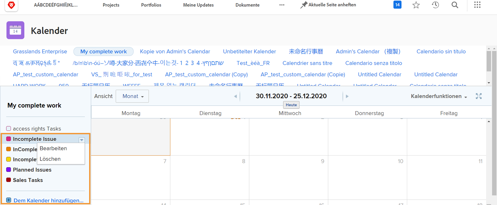

# Zusätzliche Kalenderoptionen verstehen

In diesem Abschnitt lernen Sie Folgendes:

* Kalendergruppierungen bearbeiten
* Kalendergruppierung löschen
* Kalender freigeben

## Kalendergruppierungen bearbeiten

Um eine Gruppierung zu bearbeiten, bewegen Sie den Mauszeiger über den Namen im Kalender. Klicken Sie auf den Pfeil nach unten, der rechts angezeigt wird, und wählen Sie **[!UICONTROL Bearbeiten]**.

## Kalendergruppierung löschen

Um eine Gruppierung zu löschen, bewegen Sie den Mauszeiger über den Namen im Kalender. Klicken Sie auf den Pfeil nach unten, der rechts angezeigt wird, und wählen Sie **[!UICONTROL Löschen]**.

## Kalenderfreigabe

Als Projektmanager können Sie einen Kalender erstellen, den Sie für andere Benutzer freigeben möchten, z. B. für Projektmanager, Teammitglieder usw.

1. Aus dem **[!UICONTROL Hauptmenü]**, wählen Sie eine **[!UICONTROL Kalender]** Bereich.
1. Wählen Sie den Kalender aus, den Sie freigeben möchten.
1. Auswählen **[!UICONTROL Freigabe]** von **[!UICONTROL Kalenderaktionen]** Dropdown-Menü.
1. Geben Sie die Namen der Benutzer, Rollen, Teams, Gruppen oder Unternehmen ein, für die Sie den Kalender freigeben möchten.
1. Wählen Sie aus, ob Benutzer [!UICONTROL Ansicht] oder [!UICONTROL Verwalten] Zugriff auf den Kalenderbericht.
1. Klicken Sie auf **[!UICONTROL Speichern]**.

Wenn Sie Kalender freigeben, sollten Sie Folgendes beachten:

* Klicken Sie auf **[!UICONTROL Zahnradsymbol]** in der rechten oberen Ecke des Fensters Freigabe , um den Kalender systemweit sichtbar zu machen oder ihn für externe Benutzer öffentlich zu machen.
* [!UICONTROL Ansicht] Der Zugriff ermöglicht es Benutzern, sich den Kalender anzusehen, aber nicht die Filter zu ändern, die die Gruppierungen steuern.
* [!UICONTROL Verwalten] -Zugriff ermöglicht es Benutzern, sich den Kalender anzusehen und die Filter zu ändern, die die Gruppierungen steuern.

## Teilbarer Link

Sie können einen Kalender für andere freigeben [!DNL Workfront] -Benutzer über einen privaten Link. Dadurch gelangen sie direkt zum Kalender in [!DNL Workfront].

Sie können dies über die **[!UICONTROL Kalenderaktionen]** durch Auswahl von **[!UICONTROL Freigabe-Link abrufen]**. Klicken Sie dort auf die **[!UICONTROL Link kopieren]** und fügen Sie die URL mit einer anderen Person in eine E-Mail oder eine Instant Message ein.

![Ein Bild eines [!UICONTROL Freigabe-Link abrufen] Bildschirm](assets/calendar-3-1.png)
