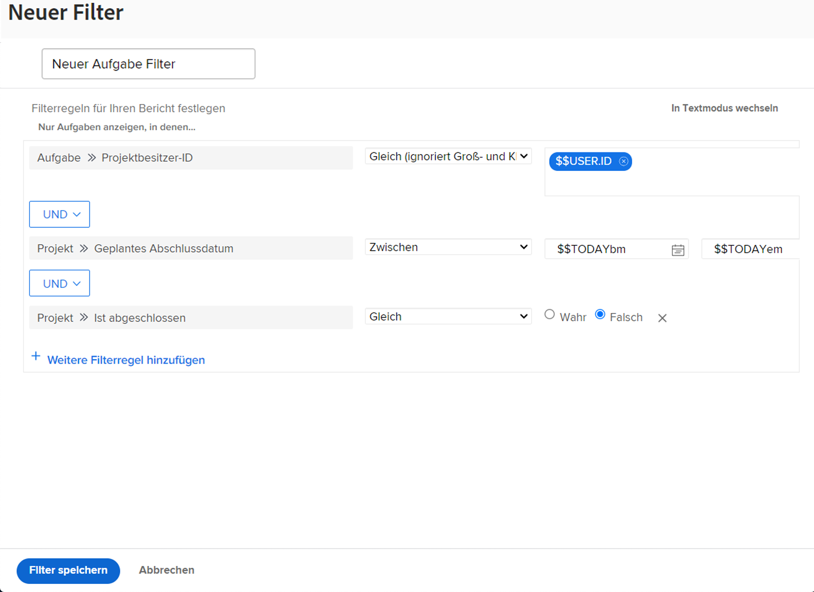

# Erstellen einer einfachen Filteraktivität

## Aktivität 1 – Alle Projekte im Marketing-Portfolio

In dieser Aktivität erstellen Sie einen Projektfilter mit dem Namen „Alle Projekte im Marketing-Portfolio“ im [!UICONTROL alten Filtererlebnis]. Dadurch werden alle Projekte im Portfolio mit dem Namen „Marketing Portfolio“ unabhängig von ihrem Status angezeigt.

Eine schrittweise Anleitung finden Sie weiter unten.

### Antwort auf Aktivität 1

1. Navigieren Sie vom [!UICONTROL Hauptmenü] zum Bereich [!UICONTROL Projekte]. Dort sehen Sie eine Liste der Projekte.
1. Klicken Sie auf das Menü **[!UICONTROL Filter]** und wählen Sie [!UICONTROL Alte Filter] aus.
1. Wählen Sie **[!UICONTROL Neuer Filter]** aus.
1. Nennen Sie Ihren Filter „Alle Projekte im Marketing-Portfolio“.
1. Klicken Sie auf **[!UICONTROL Filterregel hinzufügen]**.
1. Geben Sie im Feld [!UICONTROL Eingabe des Feldnamens beginnen] „[!UICONTROL Portfolio-Name]“ ein. Wählen Sie dann[!UICONTROL Name] unter der Feldquelle [!UICONTROL Portfolio] aus.
1. Belassen Sie den Operator [!UICONTROL Gleich] so, wie er ist.
1. Tippen Sie „[!UICONTROL Marketing]“ in das Feld [!UICONTROL Eingabe des Namens beginnen] ein.
1. Wählen Sie [!UICONTROL Marketing-Portfolio] aus, vorausgesetzt, Sie verfügen über ein Portfolio mit dem Namen, nach dem Sie filtern möchten. Wenn nicht, nutzen Sie einfach die Funktion zum automatischen Vervollständigen, um das gewünschte Portfolio zu finden.
1. Klicken Sie auf **[!UICONTROL Filter speichern]**.

## Aktivität 2 – Projekte, für die ich verantwortlich bin, die in diesem Monat abgeschlossen werden

In diesem Video erstellen Sie einen Projektfilter mit dem Namen „Projekte, für die ich verantwortlich bin, die in diesem Monat abgeschlossen werden“ im [!UICONTROL alten Filtererlebnis]. Wenn Sie viele Projekte im Auge behalten, können Sie mit diesem Filter die Projekte herausfiltern, die in Kürze abgeschlossen werden sollen.

Eine schrittweise Anleitung finden Sie weiter unten.

>[!VIDEO](https://video.tv.adobe.com/v/336807/?quality=12&learn=on)

### Antwort auf Aktivität 2

1. Navigieren Sie vom [!UICONTROL Hauptmenü] zum Bereich [!UICONTROL Projekte]. Dort sehen Sie eine Liste der Projekte.
1. Klicken Sie auf das Menü **[!UICONTROL Filter]** und wählen Sie [!UICONTROL Alte Filter] aus.
1. Wählen Sie **[!UICONTROL Neuer Filter]** aus.
1. Nennen Sie Ihren Filter „Projekte, für die ich verantwortlich bin, die in diesem Monat abgeschlossen werden“.
1. Klicken Sie auf **[!UICONTROL Filterregel hinzufügen]**.
1. Geben Sie im Feld [!UICONTROL Eingabe des Feldnamens beginnen] „Besitzer“ ein. Wählen Sie dann [!UICONTROL Besitzer-ID] unter der Feldquelle [!UICONTROL Projekt].
1. Belassen Sie den Operator [!UICONTROL Gleich] so, wie er ist.
1. Geben Sie „$$“ in das Feld [!UICONTROL Eingabe des Feldnamens beginnen] ein.
1. Wählen Sie [!UICONTROL $$USER.ID]. Dies ist der Platzhalter für die angemeldeten Benutzenden.
1. Klicken Sie erneut auf [!UICONTROL Filterregel hinzufügen].
1. Beginnen Sie im Feld [!UICONTROL Eingabe des Feldnamens beginnen] mit der Eingabe von „Ist abgeschlossen“. Wählen Sie dann [!UICONTROL Ist abgeschlossen] unter der Projektfeldquelle.
1. Belassen Sie den Operator [!UICONTROL Gleich] so, wie er ist.
1. Wählen Sie „False“ aus.
1. Klicken Sie erneut auf [!UICONTROL Filterregel hinzufügen].
1. Geben Sie in das Feld [!UICONTROL Eingabe des Feldnamens beginnen] den Begriff „geplant“ ein und wählen Sie dann [!UICONTROL Geplantes Fertigstellungsdatum] unter der Feldquelle [!UICONTROL Projekt].
1. Ändern Sie den Operator [!UICONTROL Gleich] zu [!UICONTROL Dieser Monat].
1. Klicken Sie auf **[!UICONTROL Filter speichern]**.
