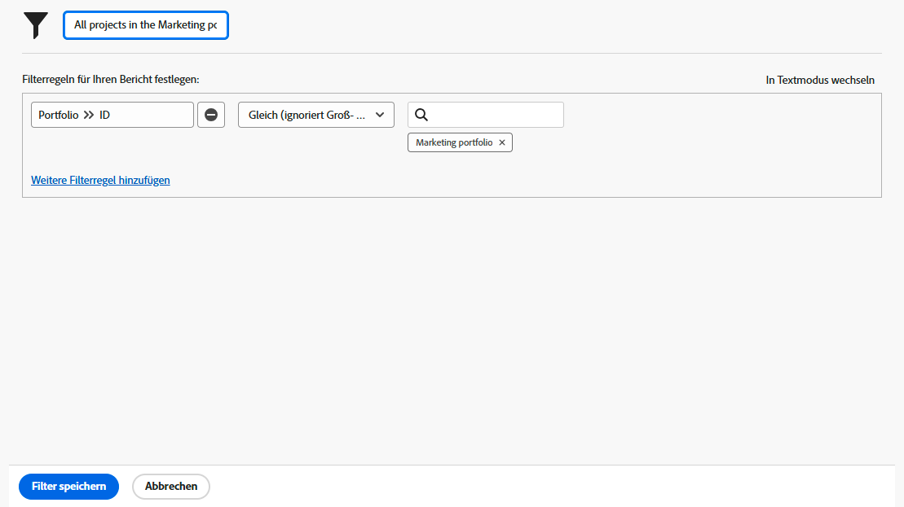

# Basisfilteraktivitäten erstellen

## Aktivität 1 - Alle Projekte im Marketingportfolio

In dieser Aktivität erstellen Sie einen Projektfilter mit dem Namen &quot;Alle Projekte im Marketing-Portfolio&quot;im [!UICONTROL Veralteter Filter] Erlebnis. Dadurch werden alle Projekte im Portfolio mit dem Namen &quot;Marketing Portfolio&quot;unabhängig von ihrem Status angezeigt.

Eine schrittweise Anleitung finden Sie weiter unten.

### Antwort auf Aktivität 1

1. Navigieren Sie vom [!UICONTROL Hauptmenü] zum Bereich [!UICONTROL Projekte]. Dort sehen Sie eine Liste der Projekte.
1. Klicken Sie auf **[!UICONTROL Filter]** Menü und wählen Sie [!UICONTROL Alte Filter].
1. Auswählen **[!UICONTROL Neuer Filter]**.
1. Benennen Sie Ihren Filter &quot;Alle Projekte im Marketing-Portfolio&quot;.
1. Klicken Sie auf **[!UICONTROL Filterregel hinzufügen]**.
1. Im [!UICONTROL Eingabe des Feldnamens beginnen] Feld, Typ[!UICONTROL Portfolioname]&quot;. Wählen Sie anschließend [!UICONTROL Name] unter [!UICONTROL Portfolio] -Feldquelle.
1. Belassen Sie den Operator [!UICONTROL Gleich] so, wie er ist.
1. Typ &quot;[!UICONTROL Marketing]&quot; in der [!UICONTROL Eingabe des Namens beginnen] -Feld.
1. Auswählen [!UICONTROL Marketing-Portfolio] vorausgesetzt, Sie verfügen über ein Portfolio mit diesem Namen, nach dem Sie filtern möchten. Wenn Sie nicht einfach die type ahead-Funktion verwenden, um das gewünschte Portfolio zu finden.
1. Klicks **[!UICONTROL Filter speichern]**.

## Aktivität 2 - Projekte, deren Inhaber ich bin, schließen diesen Monat

In diesem Video erstellen Sie einen Projektfilter mit dem Namen &quot;Projekte, deren Inhaber ich bin, schließen diesen Monat&quot;im [!UICONTROL Veralteter Filter] Erlebnis. Wenn Sie viele Projekte im Auge behalten, kann dieser Filter Ihnen helfen, die zu schließenden Projekte heranzuzoomen.

Eine schrittweise Anleitung finden Sie weiter unten.

>[!VIDEO](https://video.tv.adobe.com/v/336807/?quality=12&learn=on)

### Antwort auf Aktivität 2

1. Navigieren Sie vom [!UICONTROL Hauptmenü] zum Bereich [!UICONTROL Projekte]. Dort sehen Sie eine Liste der Projekte.
1. Klicken Sie auf **[!UICONTROL Filter]** Menü und wählen Sie [!UICONTROL Alte Filter].
1. Auswählen **[!UICONTROL Neuer Filter]**.
1. Nennen Sie Ihren Filter &quot;Projekte, deren Inhaber ich bin, schließen diesen Monat&quot;.
1. Klicken Sie auf **[!UICONTROL Filterregel hinzufügen]**.
1. Im [!UICONTROL Eingabe des Feldnamens beginnen] -Feld, geben Sie &quot;owner&quot;ein. Wählen Sie dann [!UICONTROL Besitzer-ID] unter der Feldquelle [!UICONTROL Projekt].
1. Belassen Sie den Operator [!UICONTROL Gleich] so, wie er ist.
1. Geben Sie &quot;$$&quot;in das Feld [!UICONTROL Eingabe des Namens beginnen] -Feld.
1. Wählen Sie [!UICONTROL $$USER.ID]. Dies ist der Platzhalter für die angemeldeten Benutzenden.
1. Klicken Sie erneut auf [!UICONTROL Filterregel hinzufügen].
1. Im [!UICONTROL Eingabe des Feldnamens beginnen] eingeben, beginnen Sie mit der Eingabe &quot;Ist abgeschlossen&quot;. Wählen Sie dann [!UICONTROL Ist abgeschlossen] unter der Projektfeldquelle.
1. Belassen Sie den Operator [!UICONTROL Gleich] so, wie er ist.
1. Wählen Sie &quot;False&quot;.
1. Klicken Sie erneut auf [!UICONTROL Filterregel hinzufügen].
1. Im [!UICONTROL Eingabe des Feldnamens beginnen] Feldtyp &quot;Geplant&quot;, dann auswählen [!UICONTROL Geplantes Abschlussdatum] unter [!UICONTROL Projekt] -Feldquelle.
1. Ändern Sie den Operator [!UICONTROL Gleich] zu [!UICONTROL Dieser Monat].
1. Klicks **[!UICONTROL Filter speichern]**.
