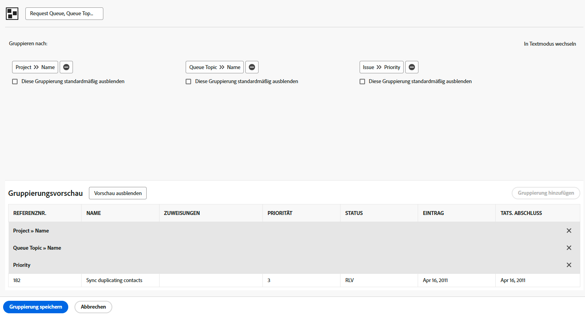

# Erstellen einer einfachen Gruppierung

In diesem Video wird erläutert, wie Sie in Workfront Gruppierungen erstellen und verwalten können, um Projektlisten effektiv zu organisieren. Gruppierungen sind neben Filtern und Ansichten eines der drei Hauptberichtselemente und helfen, Ergebnisse auf der Grundlage von freigegebenen Informationen zu organisieren. 
In diesem Tutorial werden praktische Schritte zum Organisieren von Projektlisten beschrieben, die die tägliche Arbeit und Zusammenarbeit optimieren. 

>[!VIDEO](https://video.tv.adobe.com/v/335147/?quality=12&learn=on&enablevpops=0)

## Die wichtigsten Punkte

* **Zweck von Gruppierungen:** Gruppierungen sind ein wichtiges Berichtselement in Workfront, mit dem Projektlisten auf der Grundlage freigegebener Informationen wie Abschlussdaten, Portfolios oder Programmen organisiert werden. 
* **Erstellen von Gruppierungen:** Sie können benutzerdefinierte Gruppierungen mit bis zu drei Kriterienebenen erstellen. Beispielsweise können Projekte zur besseren Organisation zunächst nach Portfolio und dann nach Programm gruppiert werden. 
* **Bearbeiten und Speichern von Gruppierungen:** Integrierte Gruppierungen können nicht überschrieben werden, Sie können Änderungen jedoch als neue Gruppierung speichern. Benutzerdefinierte Gruppierungen sollten klare, beschreibende Namen haben, damit sie leicht identifiziert werden können. 
* **Freigeben von Gruppierungen:** Gruppierungen können für andere Benutzende freigegeben werden, wobei diese durch die standardmäßigen Anzeigeberechtigungen die Gruppierung verwenden und freigeben, aber nicht bearbeiten dürfen. Berechtigungen vom Typ „Verwalten“ ermöglichen Bearbeitungs- und Löschvorgänge. 
* **Entfernen von Gruppierungen:** Wenn Sie eine von Ihnen erstellte Gruppierung löschen, wird sie auch aus den Listen der Benutzenden entfernt, für die Sie die Gruppierung freigegeben haben. Freigegebene Gruppierungen werden für andere Benutzende im Abschnitt „Für mich freigegeben“ angezeigt. 

## Aktivitäten zum Erstellen einer einfachen Gruppierung

### Aktivität 1: Erstellen einer einfachen Gruppierung

Erstellen Sie eine Problemgruppierung, mit der in einem Bericht Anfragen verfolgt werden können, die in einer Anfrage-Warteschlange eingehen. In dieser Gruppierung lassen sich ähnliche Problem-/Anfragetypen bequem in Prioritätsgruppen anzeigen. Weisen Sie der Gruppierung den Namen „Anfrage-Warteschlange, Warteschlangenthema, Priorität“ zu.

Gruppieren Sie den Problembericht nach:

1. Dem Namen der Anfrage-Warteschlange (dies ist der Name des Projekts)
1. Dem Warteschlangen-Thema
1. Der Anfragepriorität

### Antwort 1

1. Rufen Sie in einem Problemlistenbericht das Menü **[!UICONTROL Gruppierung]** auf und wählen Sie **[!UICONTROL Neue Gruppierung]**.
1. Weisen Sie der Gruppierung den Namen „Anfrage-Warteschlange, Warteschlangenthema, Priorität“ zu.
1. Klicken Sie auf **[!UICONTROL Gruppierung hinzufügen]**.
1. Geben Sie in das Feld [!UICONTROL Gruppieren nach] den Text „Projektname“ ein und wählen Sie für die Feldquelle „Projekt“ die Option **[!UICONTROL Name]** aus.
1. Klicken Sie auf **[!UICONTROL Weitere Gruppierung hinzufügen]**, geben Sie „Warteschlange“ ein und wählen Sie **[!UICONTROL Name]** unter der Feldquelle ]Warteschlangenthema[!UICONTROL  aus.
1. Klicken Sie auf **[!UICONTROL Weitere Gruppierung hinzufügen]**, geben Sie „Priorität“ ein und wählen Sie **[!UICONTROL Priorität]** unter der Feldquelle [!UICONTROL Problem] aus.
1. Klicken Sie auf **[!UICONTROL Gruppierung speichern]**
