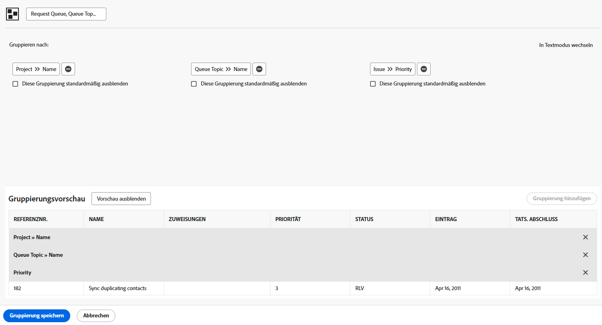

# Erstellen einer einfachen Gruppierung

In diesem Video wird erläutert, wie Sie in Workfront Gruppierungen erstellen und verwalten können, um Projektlisten effektiv zu organisieren. &#x200B; Gruppierungen sind neben Filtern und Ansichten eines der drei Hauptberichtselemente und helfen, Ergebnisse auf der Grundlage von gemeinsamen Informationen zu organisieren. &#x200B;
In diesem Tutorial werden praktische Schritte zum Organisieren von Projektlisten beschrieben, um die tägliche Arbeit und Zusammenarbeit zu optimieren. &#x200B;

>[!VIDEO](https://video.tv.adobe.com/v/3449824/?captions=ger&quality=12&learn=on&enablevpops=0)

## Wichtige Schlussfolgerungen

* **Zweck der Gruppierungen:** Gruppierungen sind ein wichtiges Berichterstellungselement in Workfront, mit dem Projektlisten auf der Grundlage gemeinsam genutzter Informationen wie Abschlussdaten, Portfolios oder Programmen organisiert werden. &#x200B;
* **Gruppierungen erstellen** Sie können benutzerdefinierte Gruppierungen mit bis zu drei Kriterienebenen erstellen. &#x200B; können Projekte zur besseren Organisation zunächst nach Portfolio und dann nach Programm gruppiert werden. &#x200B;
* **Bearbeiten und Speichern von Gruppierungen** Integrierte Gruppierungen können nicht überschrieben werden, Sie können Änderungen jedoch als neue Gruppierung speichern. &#x200B; benutzerdefinierte Gruppierungen sollten klare, beschreibende Namen haben, damit sie leicht identifiziert werden können. &#x200B;
* **Freigeben von Gruppierungen:** Gruppierungen können für andere Benutzende freigegeben werden, wobei diese durch die standardmäßigen Anzeigeberechtigungen die Gruppierung verwenden und freigeben, aber nicht bearbeiten dürfen. &quot;&#x200B;Verwalten“-Berechtigungen ermöglichen das Bearbeiten und Löschen. &#x200B;
* **Gruppierungen entfernen:** Sie eine von Ihnen erstellte Gruppierung löschen, wird sie auch aus den Listen der Benutzer entfernt, für die Sie sie freigegeben haben. &#x200B; freigegebene Gruppierungen werden für andere Benutzer unter dem Abschnitt „Für mich freigegeben“ angezeigt. &#x200B;

## Aktivitäten zum Erstellen einer einfachen Gruppierung

### Aktivität 1: Erstellen einer einfachen Gruppierung

Erstellen Sie eine Problemgruppierung, mit der in einem Bericht Anfragen verfolgt werden können, die in einer Anfrage-Warteschlange eingehen. In dieser Gruppierung lassen sich ähnliche Problem-/Anfragetypen bequem in Prioritätsgruppen anzeigen. Weisen Sie der Gruppierung den Namen „Anfrage-Warteschlange, Warteschlangenthema, Priorität“ zu.

Gruppieren Sie den Problembericht nach:

1. Dem Namen der Anfrage-Warteschlange (dies ist der Name des Projekts)
1. Dem Warteschlangen-Thema
1. Der Anfragepriorität

### Antwort 1

1. Rufen Sie in einem Problemlistenbericht das Menü **[!UICONTROL Gruppierung]** auf und wählen Sie **[!UICONTROL Neue Gruppierung]**.
1. Weisen Sie der Gruppierung den Namen „Anfrage-Warteschlange, Warteschlangenthema, Priorität“ zu.
1. Klicken Sie auf **[!UICONTROL Gruppierung hinzufügen]**.
1. Geben Sie in das Feld [!UICONTROL Gruppieren nach] den Text „Projektname“ ein und wählen Sie für die Feldquelle „Projekt“ die Option **[!UICONTROL Name]** aus.
1. Klicken Sie auf **[!UICONTROL Weitere Gruppierung hinzufügen]**, geben Sie „Warteschlange“ ein und wählen Sie **[!UICONTROL Name]** unter der Feldquelle Warteschlangenthema aus.
1. Klicken Sie auf **[!UICONTROL Weitere Gruppierung hinzufügen]**, geben Sie „Priorität“ ein und wählen Sie **[!UICONTROL Priorität]** unter der Feldquelle [!UICONTROL Problem] aus.
1. Klicken Sie auf **[!UICONTROL Gruppierung speichern]**
