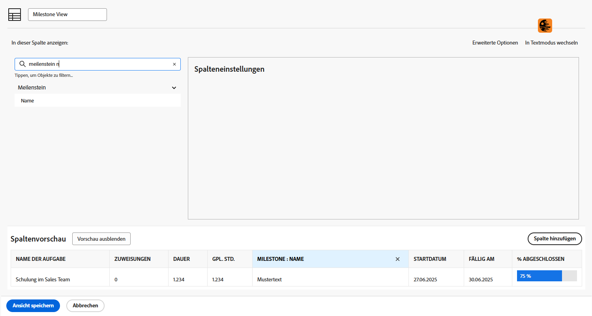
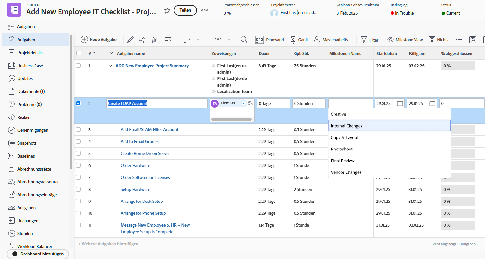
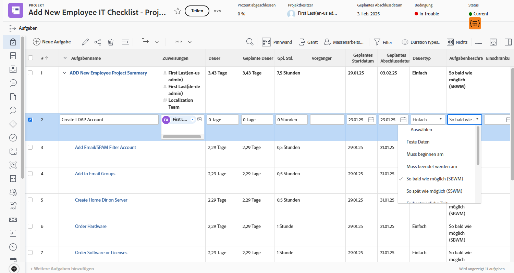

# Basisansicht erstellen

In diesem Video erfahren Sie:

* Was ist eine Ansicht in Workfront?
* Erstellen und Ändern einer Ansicht
* So geben Sie eine Ansicht für andere Workfront-Benutzer frei

>[!VIDEO](https://video.tv.adobe.com/v/335148/?quality=12&learn=on)

## Aktivität 1: Aufgabenstatusansicht erstellen

Als Projektmanager, Teamleiter oder Ressourcen-Manager möchten Sie den Fortschritt der Aufgabenarbeit verfolgen. In dieser Ansicht werden mehrere Statusindikatoren einer Aufgabe in einer Zeile der Liste oder des Berichts angezeigt.

Erstellen Sie eine Aufgabenansicht mit dem Namen &quot;Aufgabenstatusansicht&quot;mit den folgenden Spalten:

* [!UICONTROL Aufgabenname]
* [!UICONTROL Arbeitsaufträge]
* [!UICONTROL Dauer]
* [!UICONTROL Prozent abgeschlossen]
* [!UICONTROL Status]
* [!UICONTROL Fortschritt]
* [!UICONTROL Status-Symbole]

## Antwort zu Aktivität 1

1. Gehen Sie in einem Aufgabenlistenbericht zum **[!UICONTROL Ansicht]** Dropdown-Menü und **[!UICONTROL Neue Ansicht]**.
1. Benennen Sie Ihre Ansicht mit &quot;Aufgabenstatusansicht&quot;.
1. Entfernen Sie diese Spalten: [!UICONTROL PLN Hrs], [!UICONTROL Vorgänger], [!UICONTROL Starten ein]und [!UICONTROL aufgrund von].
1. Klicken **[!UICONTROL Spalte hinzufügen]**.
1. Im [!UICONTROL In dieser Spalte anzeigen] Geben Sie &quot;status&quot;ein und wählen Sie dann &quot;Status&quot;unter dem [!UICONTROL Aufgabe] -Feldquelle.
1. Klicken **[!UICONTROL Spalte hinzufügen]** erneut.
1. Im [!UICONTROL In dieser Spalte anzeigen] Geben Sie &quot;status&quot;ein und wählen Sie dann &quot;Progress Status&quot;unter dem [!UICONTROL Aufgabe] -Feldquelle.
1. Klicken **[!UICONTROL Spalte hinzufügen]** erneut.
1. Im [!UICONTROL In dieser Spalte anzeigen] Geben Sie &quot;status&quot;ein und wählen Sie dann &quot;Status-Symbole&quot;unter der Aufgabenfeldquelle aus.
1. Klicken Sie auf **[!UICONTROL Speichern]**.

Bewegen Sie den Mauszeiger über die einzelnen Symbole in der [!UICONTROL Statussymbole] um zu sehen, was sie darstellen. Wenn sie ausgegraut sind, bedeutet dies, dass die Aufgabe keine Notizen, Dokumente, Genehmigungsprozesse usw. hat. Wenn ein Symbol farbig angezeigt wird, ist mindestens ein Element mit der Aufgabe verknüpft. Sie können auf die Notiz- oder Dokumentsymbole klicken, um zu diesem Element zu wechseln.

## Aktivität 2: Erstellen einer Meilensteinansicht

Wenn Sie Meilensteine verwenden, ist diese Ansicht die einfachste Möglichkeit, Meilensteine nach Namen zu sehen und sie mithilfe der Inline-Bearbeitung hinzuzufügen oder zu bearbeiten.

Erstellen Sie eine Aufgabenansicht mit dem Namen &quot;Milestone-Ansicht&quot;mit den folgenden Spalten:

* [!UICONTROL Aufgabenname]
* [!UICONTROL Arbeitsaufträge]
* [!UICONTROL Dauer]
* [!UICONTROL Gpl. Std.]
* [!UICONTROL Milestone: Name]
* [!UICONTROL Starten am]
* [!UICONTROL Fällig am]
* [!UICONTROL Prozent abgeschlossen]

## Antwort zu Aktivität 2

1. Wechseln Sie in einer Projektaufgabenliste zum **[!UICONTROL Ansicht]** Dropdown-Menü und **[!UICONTROL Neue Ansicht]**.
1. Benennen Sie Ihre Ansicht mit &quot;Milestone-Ansicht&quot;.
1. Klicken Sie auf [!UICONTROL Vorgänger] auswählen.
1. Im [!UICONTROL In dieser Spalte anzeigen] auf das X-Symbol im Feld [!UICONTROL Aufgabe >> Vorgänger] ein und geben Sie dann &quot;[!UICONTROL Meilensteinname]und klicken Sie auf &quot;[!UICONTROL Name]&quot; in der Liste.
1. Klicken Sie auf **[!UICONTROL Speichern]**.

## Aktivität 3: Erstellen einer Ansicht mit Dauer- und Aufgabenbegrenzungen

Diese Ansicht ermöglicht es Ihnen, alle Dauern- und Aufgabenbeschränkungen in Ihrem Projekt zu untersuchen und zu bearbeiten.

Erstellen Sie eine Aufgabenansicht mit dem Namen &quot;Dauer-Typen und Aufgabenbegrenzungsansicht&quot;mit den folgenden Spalten:

* [!UICONTROL Aufgabenname]
* [!UICONTROL Arbeitsaufträge]
* [!UICONTROL Dauer]
* [!UICONTROL Geplante Dauer]
* [!UICONTROL Gpl. Std.]
* [!UICONTROL Vorgänger]
* [!UICONTROL Starten am]
* [!UICONTROL Fällig am]
* [!UICONTROL Dauertyp]
* [!UICONTROL Aufgabenbeschränkung]
* [!UICONTROL Einschränkungsdatum]

Ändern Sie die [!UICONTROL Feldformat] auf [!UICONTROL Starten ein] und [!UICONTROL aufgrund von] Spalten, um sowohl Datum als auch Uhrzeit anzuzeigen.

## Antwort zu Aktivität 3

1. Wechseln Sie in einer Projektaufgabenliste zum **[!UICONTROL Ansicht]** Dropdown-Menü und **[!UICONTROL Neue Ansicht]**.
1. Benennen Sie Ihre Ansicht mit &quot;Dauer-Typen und Aufgabenbegrenzungen&quot;.
1. Entfernen Sie die [!UICONTROL % Complete] Spalte.
1. Klicken **[!UICONTROL Spalte hinzufügen]**.
1. Im [!UICONTROL In dieser Spalte anzeigen] Feld, Typ [!UICONTROL &quot;duration&quot;] und wählen Sie [!UICONTROL &quot;Geplante Dauer&quot;] unter [!UICONTROL Aufgabe] -Feldquelle.
1. Verschieben Sie diese Spalte zwischen [!UICONTROL Dauer] und [!UICONTROL PLN Hrs] Spalten.
1. Klicken **[!UICONTROL Spalte hinzufügen]** erneut.
1. Im [!UICONTROL In dieser Spalte anzeigen] Feld, Typ [!UICONTROL &quot;duration type&quot;] und wählen Sie [!UICONTROL &quot;Dauer&quot;] unter [!UICONTROL Aufgabe] -Feldquelle.
1. Klicken **[!UICONTROL Spalte hinzufügen]** erneut.
1. Im [!UICONTROL In dieser Spalte anzeigen] Feld, Typ [!UICONTROL &quot;constraint&quot;] und wählen Sie [!UICONTROL &quot;Task Constraint&quot;] unter der Aufgabenfeldquelle.
1. Klicken **[!UICONTROL Spalte hinzufügen]** erneut.
1. Im [!UICONTROL In dieser Spalte anzeigen] Feld, Typ [!UICONTROL &quot;constraint&quot;] und wählen Sie [!UICONTROL &quot;Beschränkungsdatum&quot;] unter der Aufgabenfeldquelle.
1. Wählen Sie die [!UICONTROL Starten ein] und klicken Sie auf [!UICONTROL Erweiterte Optionen].
1. Unter dem [!UICONTROL Feldformat] Dropdown-Auswahl [!UICONTROL &quot;17.10.60 3:00 Uhr&quot;].
1. Wählen Sie die [!UICONTROL aufgrund von] und klicken Sie auf [!UICONTROL Erweiterte Optionen].
1. Unter dem [!UICONTROL Feldformat] Dropdown-Auswahl [!UICONTROL &quot;17.10.60 3:00 Uhr&quot;].
1. Klicken Sie auf **[!UICONTROL Speichern]**.
