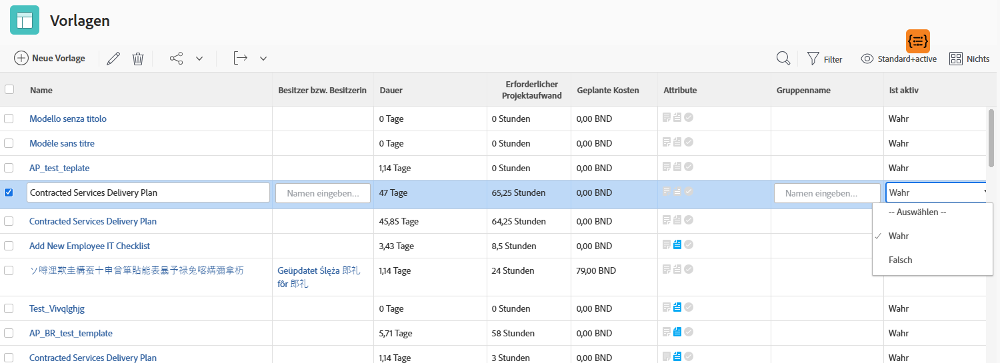

# Erstellen einer einfachen Ansicht

In diesem Video wird erläutert, wie Sie in Workfront Ansichten erstellen und anpassen können, um bestimmte Informationen zu Elementen in einer Liste anzuzeigen, z. B. zu Projekten, Aufgaben, Problemen und Dokumenten. Ansichten ermöglichen es Benutzenden, Details wie Namen, Beschreibung, Status und andere Felder anzuzeigen, die für die Elemente relevant sind.

Das Video hebt die Flexibilität der Ansichten in Workfront hervor und enthält schrittweise Anweisungen zum Erstellen, Anpassen und Verwalten dieser Ansichten.

>[!VIDEO](https://video.tv.adobe.com/v/335148/?quality=12&learn=on)

## Die wichtigsten Punkte

* **Anpassen von Ansichten**: Benutzende können vorhandene Ansichten bearbeiten oder neue erstellen, indem sie Spalten hinzufügen, entfernen oder neu anordnen, um bestimmte Informationen wie Projektstatus oder Budget anzuzeigen.
* **Inline-Bearbeitung**: Einige Felder in einer Listenansicht können direkt aktualisiert werden, ohne einzelne Elemente zu öffnen, wodurch Änderungen schneller vorgenommen werden können.
* **Neuerstellen von Ansichten**: Benutzende können Ansichten für bestimmte Anforderungen entwerfen, z. B. zum Nachverfolgen des Projektzustands, indem sie relevante Spalten wie Budget, tatsächliche Kosten und Fortschrittsstatus hinzufügen.
* **Freigeben und Verwalten von Ansichten**: Benutzerdefinierte Ansichten können für Team-Mitglieder zur Zusammenarbeit freigegeben oder entfernt werden, wenn sie nicht mehr benötigt werden.

## Aktivitäten zum Erstellen einer einfachen Ansicht

### Aktivität 1: Erstellen einer Aufgabenstatusansicht

Als Projektmanager oder -managerin, Team-Leitung oder Ressourcen-Manager oder -Managerin möchten Sie den Fortschritt der Aufgabenarbeit verfolgen. In dieser Ansicht werden mehrere Statusindikatoren einer Aufgabe in einer Zeile der Liste oder des Berichts angezeigt.

Erstellen Sie eine Aufgabenansicht mit dem Namen „Aufgabenstatusansicht“ mit den folgenden Spalten:

* [!UICONTROL Aufgabenname]
* [!UICONTROL Arbeitsaufträge]
* [!UICONTROL Dauer]
* [!UICONTROL Prozent abgeschlossen]
* [!UICONTROL Status]
* [!UICONTROL Fortschrittsstatus]
* [!UICONTROL Status-Symbole]

### Antwort 1

1. Wechseln Sie in einem Aufgabenlistenbericht zum Dropdown-Menü **[!UICONTROL Ansicht]** und wählen Sie **[!UICONTROL Neue Ansicht]** aus.
1. Nennen Sie Ihre Ansicht „Aufgabenstatusansicht“.
1. Entfernen Sie diese Spalten: [!UICONTROL PLN Hrs], [!UICONTROL Vorgänger], [!UICONTROL Starten am] und [!UICONTROL Fällig am].
1. Klicken Sie auf **[!UICONTROL Spalte hinzufügen]**.
1. Geben Sie im Feld [!UICONTROL In dieser Spalte anzeigen] „Status“ ein und wählen Sie dann „Status“ unter der Feldquelle [!UICONTROL Aufgabe] aus.
1. Klicken Sie erneut auf **[!UICONTROL Spalte hinzufügen]**.
1. Geben Sie im Feld [!UICONTROL In dieser Spalte anzeigen] „Status“ ein und wählen Sie dann „Fortschrittsstatus“ unter der Feldquelle [!UICONTROL Aufgabe] aus.
1. Klicken Sie erneut auf **[!UICONTROL Spalte hinzufügen]**.
1. Geben Sie im Feld [!UICONTROL In dieser Spalte anzeigen] „Status“ ein und wählen Sie dann „Statusbildsymbole“ unter der Feldquelle „Aufgaben“ aus.
1. Klicken Sie auf **[!UICONTROL Speichern]**.

Bewegen Sie den Mauszeiger über die einzelnen Symbole in der Spalte [!UICONTROL Statusbildsymbole], um zu sehen, was sie bedeuten. Wenn sie ausgegraut sind, bedeutet dies, dass die Aufgabe keine Notizen, Dokumente, Genehmigungsprozesse usw. hat. Wenn ein Symbol farbig angezeigt wird, ist mindestens ein Element mit der Aufgabe verknüpft. Sie können auf die Notiz- oder Dokumentsymbole klicken, um zu diesem Element zu wechseln.

### Aktivität 2: Erstellen einer Meilensteinansicht

Wenn Sie Meilensteine verwenden, ist diese Ansicht die einfachste Möglichkeit, Meilensteine nach Namen in Ihrer Aufgabenliste zu sehen und sie mithilfe einer Inline-Bearbeitung hinzuzufügen oder zu bearbeiten.

Erstellen Sie eine Aufgabenansicht mit dem Namen „Meilensteinansicht“ mit den folgenden Spalten:

* [!UICONTROL Aufgabenname]
* [!UICONTROL Arbeitsaufträge]
* [!UICONTROL Dauer]
* [!UICONTROL Gpl. Std.]
* [!UICONTROL Meilenstein: Name]
* [!UICONTROL Starten am]
* [!UICONTROL Fällig am]
* [!UICONTROL Prozent abgeschlossen]

### Antwort 2

1. Wechseln Sie in einer Projektaufgabenliste zum Dropdown-Menü **[!UICONTROL Ansicht]** und wählen Sie **[!UICONTROL Neue Ansicht]**.
1. Nennen Sie Ihre Ansicht „Meilensteinansicht“.
1. Klicken Sie auf die Spalte [!UICONTROL Vorgänger], um sie auszuwählen.
1. Klicken Sie im Feld [!UICONTROL In dieser Spalte anzeigen] auf das Minussymbol im Feld [!UICONTROL Aufgabe >> Vorgänger], geben Sie dann „[!UICONTROL Meilensteinname]“ ein und klicken Sie auf „[!UICONTROL Name]“ in der Liste.
1. Klicken Sie auf **[!UICONTROL Speichern]**.

### Aktivität 3: Erstellen einer Ansicht mit Dauertypen und Aufgabenbeschränkungen

Diese Ansicht ermöglicht es Ihnen, alle Dauertypen und Aufgabenbeschränkungen in Ihrem Projekt zu untersuchen und zu bearbeiten.

Erstellen Sie eine Aufgabenansicht mit dem Namen „Ansicht der Dauertypen und Aufgabenbeschränkungen“ mit den folgenden Spalten:

* [!UICONTROL Aufgabenname]
* [!UICONTROL Arbeitsaufträge]
* [!UICONTROL Dauer]
* [!UICONTROL Geplante Dauer]
* [!UICONTROL Gpl. Std.]
* [!UICONTROL Vorgänger]
* [!UICONTROL Starten am]
* [!UICONTROL Fällig am]
* [!UICONTROL Dauertyp]
* [!UICONTROL Aufgabenbeschränkung]
* [!UICONTROL Einschränkungsdatum]

Ändern Sie das [!UICONTROL Feldformat] in den Spalten [!UICONTROL Beginnt am] und [!UICONTROL Fällig am], um sowohl Datum als auch Uhrzeit anzuzeigen.

### Antwort 3

1. Wechseln Sie in einer Projektaufgabenliste zum Dropdown-Menü für die **[!UICONTROL Ansicht]** und wählen Sie **[!UICONTROL Neue Ansicht]**.
1. Benennen Sie Ihre Ansicht mit „Dauertypen und Aufgabenbeschränkungen“.
1. Entfernen Sie die Spalte [!UICONTROL % Abgeschlossen].
1. Klicken Sie auf **[!UICONTROL Spalte hinzufügen]**.
1. Geben Sie im Feld [!UICONTROL In dieser Spalte anzeigen] [!UICONTROL „Dauer“] ein und wählen Sie [!UICONTROL „Geplante Dauer“] unter der Feldquelle [!UICONTROL Aufgabe].
1. Verschieben Sie diese Spalte zwischen die Spalten [!UICONTROL Dauer] und [!UICONTROL Gpl. St.].
1. Klicken Sie erneut auf **[!UICONTROL Spalte hinzufügen]**.
1. Geben Sie im Feld [!UICONTROL In dieser Spalte anzeigen] [!UICONTROL „Dauertyp“] ein und wählen Sie [!UICONTROL „Dauertyp“] unter der Feldquelle[!UICONTROL Aufgabe].
1. Klicken Sie erneut auf **[!UICONTROL Spalte hinzufügen]**.
1. Geben Sie im Feld [!UICONTROL In dieser Spalte anzeigen] [!UICONTROL „Beschränkung“] ein und wählen Sie [!UICONTROL „Aufgabenbeschränkung“] unter der Aufgabenfeldquelle.
1. Klicken Sie erneut auf **[!UICONTROL Spalte hinzufügen]**.
1. Geben Sie im Feld [!UICONTROL In dieser Spalte anzeigen] [!UICONTROL „Einschränkung“] ein und wählen Sie [!UICONTROL „Einschränkungsdatum“] unter der Aufgabenfeldquelle.
1. Wählen Sie die die Spalte [!UICONTROL Beginnt am] und klicken Sie auf [!UICONTROL Erweiterte Optionen].
1. Wählen Sie in [!UICONTROL  Dropdown-] „Feldformat[!UICONTROL  „10/17/60 3:00 AM“].
1. Wählen Sie die Spalte [!UICONTROL Fällig am] und klicken Sie auf [!UICONTROL Erweiterte Optionen].
1. Wählen Sie in [!UICONTROL  Dropdown-] „Feldformat[!UICONTROL  „10/17/60 3:00 AM“].
1. Klicken Sie auf **[!UICONTROL Speichern]**.

### Aktivität 4: Erstellen einer aktiven Statusansicht einer Projektvorlage

Jeder, der Projektvorlagen verwaltet, wird es schätzen, den aktiven Status („True“ oder „False“) der einzelnen Vorlagen in einer Liste zu sehen. Noch besser – das Feld kann inline bearbeitet werden!

Erstellen Sie eine Projektvorlagenansicht namens „Standard+aktiver Status“ mit den folgenden Spalten:

* [!UICONTROL Name]
* [!UICONTROL Besitzer bzw. Besitzerin]
* [!UICONTROL Dauer]
* [!UICONTROL Geplante Stunden]
* [!UICONTROL Geplante Kosten]
* [!UICONTROL Flags]
* [!UICONTROL Gruppenname]
* [!UICONTROL Ist aktiv]

### Antwort 4

1. Wechseln Sie in einer Projektvorlagenliste zum Dropdown-Menü **[!UICONTROL Ansicht]** und wählen Sie **[!UICONTROL Neue Ansicht]**.
1. Nennen Sie Ihre Ansicht „Standard+aktiver Status“.
1. Klicken Sie auf **[!UICONTROL Spalte hinzufügen]**.
1. Geben Sie in das Feld [!UICONTROL In dieser Spalte anzeigen] „ist“ ein und wählen Sie dann „Ist aktiv“ unter der Feldquelle [!UICONTROL Vorlage].
1. Klicken Sie auf **[!UICONTROL Ansicht speichern]**.
