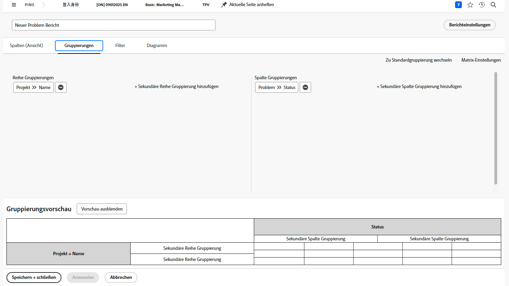
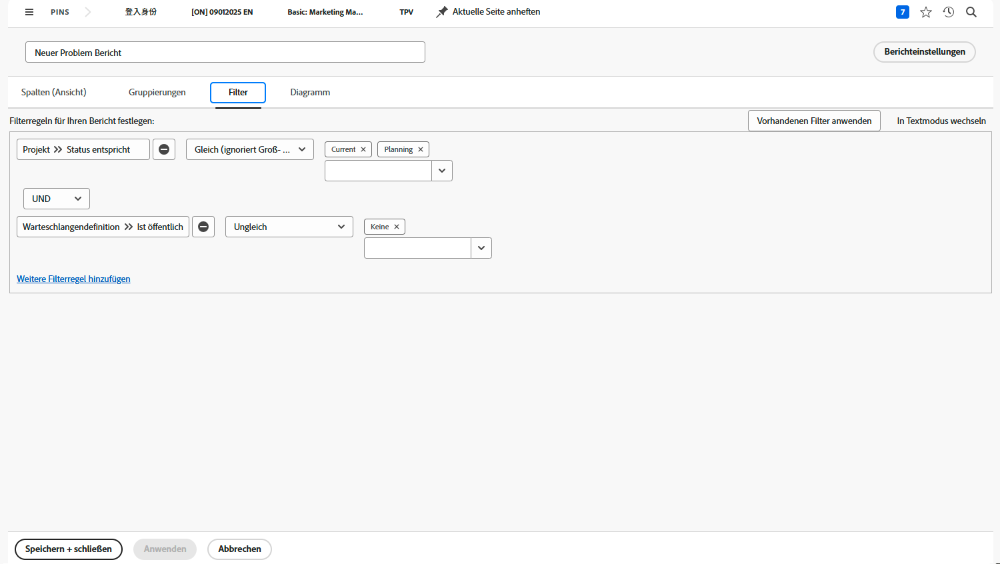

# Erstellen eines Matrix-Berichts

In diesem Video lernen Sie Folgendes:

* Wann ein Matrix-Bericht nützlich sein kann
* Und wie man einen Matrix-Bericht erstellt

>[!VIDEO] (https://video.tv.adobe.com/v/335156/?quality=12&learn=on&enablevpops=0

## Die wichtigsten Punkte

* **Matrixberichtsstruktur:** Matrixberichte organisieren Daten in Zeilen und Spalten mit automatischen Zeilen- und Spaltensummen. Sie eignen sich ideal zur Verfolgung von Metriken wie Arbeitsstunden, Kosten und Umsatz. 
* **Einrichtung von Filtern:** Verwenden Sie Filter, um sich auf bestimmte Daten zu konzentrieren, z. B. auf die von Benutzenden eines bestimmten Stamm-Teams im letzten Quartal geleisteten Stunden. Die Besitzerfeldquelle hilft bei der Identifizierung relevanter Team-Mitglieder. 
* **Gruppierungsoptionen:** In unserem Beispiel werden Zeilen nach „Name des Inhabers“ (Person, die die Stunden gearbeitet hat) gruppiert, während Spalten nach dem Datum des Stundeneintrags (nach Monat und Woche) gruppiert sind. 
* **Zusammengefasste Daten:** Spalten für Stunden, tatsächliche Kosten und Umsatz werden standardmäßig zusammengefasst, damit in der Matrix Gesamtsummen angezeigt werden. Diese Standardeinstellungen können bei Bedarf deaktiviert werden. 
* **Diagrammintegration:** Matrixberichte können durch Diagramme für eine alternative Datenvisualisierung ergänzt werden, wobei dieselben Gruppierungsinformationen verwendet werden. Sie können die Registerkarte „Matrix“ oder „Diagramm“ als Standardansicht festlegen. 

## Aktivitäten zum Erstellen eines Matrix-Berichts

### Aktivität 1: Erstellen eines Matrix-Berichts

Erstellen Sie einen Matrix-Bericht, aus dem hervorgeht, wie viele Anfragen in jedem Status vorhanden sind, sortiert nach Anfrage-Warteschlange. Dies gibt Ihnen einen schnellen Überblick über die eingehende Arbeit und darüber, wie gut Sie mit ihr Schritt halten.

Sie möchten, dass die Anfrage-Warteschlangen in den Zeilengruppierungen erscheinen. Der Status erscheint als die Spaltengruppierungen. Nennen Sie den Bericht „Anfragen nach Status und Anfrage-Warteschlange“.

### Antwort 1

1. Wählen Sie **[!UICONTROL Berichte]** aus dem **[!UICONTROL Hauptmenü]** aus.
1. Klicken Sie auf die Option **[!UICONTROL Neuer Bericht]** und wählen Sie **[!UICONTROL Problem]** aus.
1. Navigieren Sie zur Registerkarte **[!UICONTROL Gruppierungen]** und klicken Sie auf **[!UICONTROL Zu Matrix-Gruppierung wechseln]**.
1. Wählen Sie für [!UICONTROL Zeilengruppierungen] die Option **[!UICONTROL Projekt]** > **[!UICONTROL Name]** aus.
1. Wählen Sie für [!UICONTROL Spaltengruppierung] die Option **[!UICONTROL Problem]** > **[!UICONTROL Status]** aus.

   

1. Wechseln Sie zur Registerkarte **[!UICONTROL Filter]**.
1. Um sicherzustellen, dass nur Anfragen in aktiven Anfrage-Warteschlangen angezeigt werden, fügen Sie die folgenden Filterregeln hinzu:

   * [!UICONTROL Projekt] > [!UICONTROL Status entspricht] > [!UICONTROL Gleich] > [!UICONTROL Aktuell]
   * [!UICONTROL Warteschlangendefinition] > [!UICONTROL Ist öffentlich] > [!UICONTROL Ungleich] > [!UICONTROL Keines] (So wissen wir, dass ein Projekt tatsächlich eine Anfrage-Warteschlange ist, indem die Warteschlangendefinition einer der öffentlichen Optionen zugewiesen wird.)

1. Klicken Sie auf **[!UICONTROL Speichern + schließen]**. Wenn Sie zur Eingabe eines Berichtnamens aufgefordert werden, geben Sie „Anfragen nach Status und Anfrage-Warteschlange“ ein.

   
