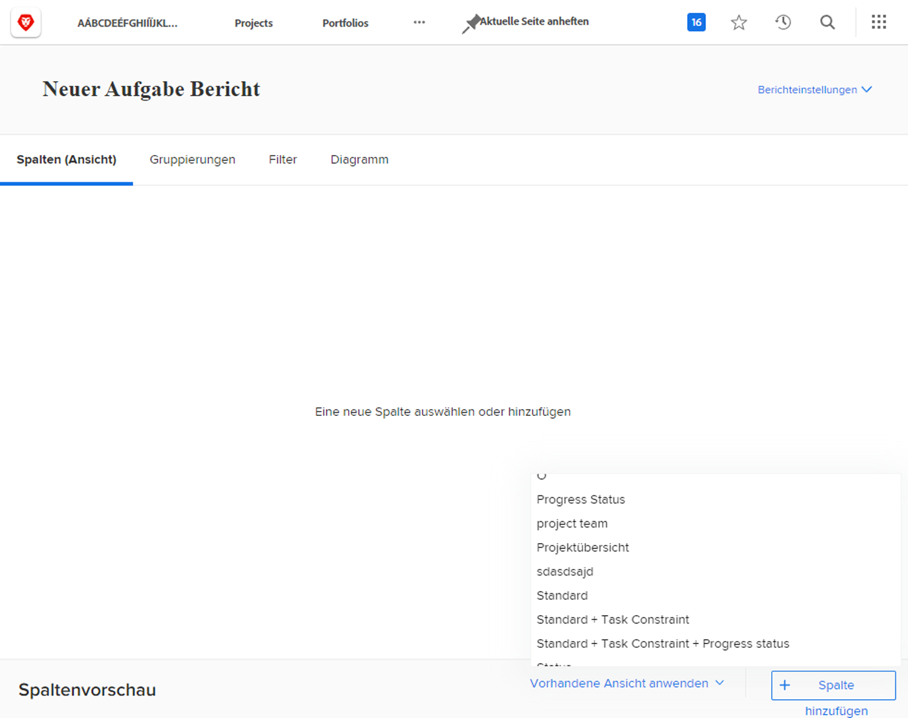
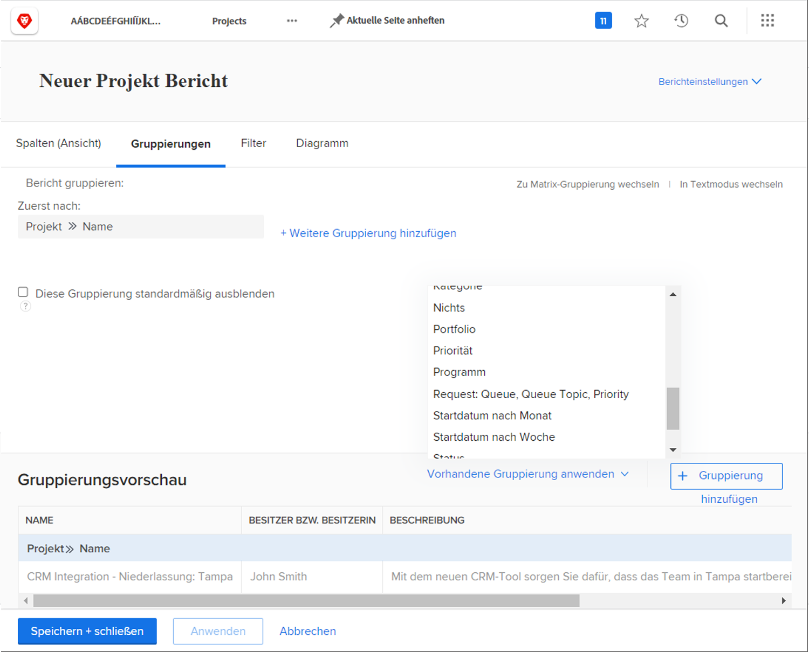
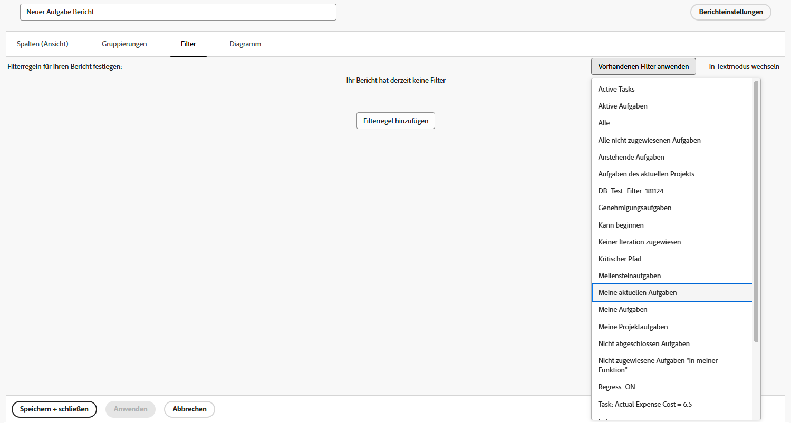
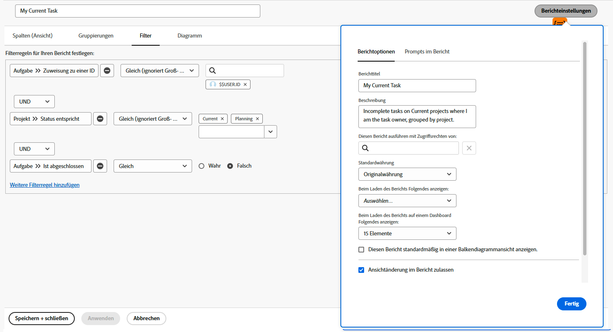

# Erstellen eines einfachen Berichts

In diesem Video wird erläutert, wie Sie Projektberichte erstellen und anpassen, um Daten effektiv zu analysieren. Zunächst wird die Bedeutung von Berichten bei der Verfolgung des Projektfortschritts, des Aufgabenabschlusses, der Budgeteinhaltung und der Identifizierung von Problemen hervorgehoben. Das Video zeigt, wie Sie mit einem Projektlistenbericht beginnen, Filter, Ansichten und Gruppierungen anpassen und aus praktischen Gründen einen benutzerdefinierten Bericht erstellen. 

Im Video wird hervorgehoben, dass benutzerdefinierte Berichte zwar ihre Standardeinstellungen beibehalten, bei der Anzeige jedoch temporäre Änderungen vorgenommen werden können. Berichte werden im Abschnitt „Meine Berichte“ gespeichert, während freigegebene Berichte in „Für mich freigegeben“ angezeigt werden. Häufig verwendete Berichte können angeheftet oder als Favoriten markiert werden, um einen schnellen Zugriff zu ermöglichen. 

>[!VIDEO](https://video.tv.adobe.com/v/335153/?quality=12&learn=on)

## Die wichtigsten Punkte

* **Zweck von Berichten:** Berichte helfen dabei, den Projektfortschritt, den Aufgabenabschluss und die Budgeteinhaltung zu verfolgen und Probleme zu identifizieren, wodurch sie für ein effektives Projekt-Management unerlässlich sind.
* **Erstellung benutzerdefinierter Berichte:** Benutzerdefinierte Berichte ermöglichen es Ihnen, bestimmte Filter, Ansichten und Gruppierungen zu speichern, um einen einfachen Zugriff zu ermöglichen, sodass Sie die Einstellungen nicht wiederholt anpassen müssen. 
* **Schritte zum Erstellen eines Berichts:** Wählen Sie den entsprechenden Objekttyp aus, benennen Sie den Bericht, wenden Sie Filter, Ansichten und Gruppierungen an, passen Sie Spalten an und speichern Sie den Bericht. 
* **Temporäre vs. Standardeinstellungen:** Während Betrachtende vorübergehend Filter, Ansichten und Gruppierungen ändern können, wird der Bericht beim erneuten Öffnen immer auf die Standardeinstellungen zurückgesetzt. 
* **Organisieren von Berichten:** Benutzerdefinierte Berichte werden in „Meine Berichte“ gespeichert, freigegebene Berichte in „Für mich freigegeben“ und häufig verwendete Berichte können für den Schnellzugriff angeheftet oder als Favoriten markiert werden. 

## Aktivitäten zum Erstellen eines einfachen Berichts

### Aktivität 1: Erstellen eines einfachen Aufgabenberichts

Sie möchten alle Ihre aktiven Aufgaben in einem einzigen Bericht verfolgen. Erstellen Sie einen Aufgabenbericht mit dem Namen „Meine aktuellen Aufgaben“ und verwenden Sie dabei Folgendes:

* Spalten (Ansicht) = Standard
* Gruppierungen = Projekt
* Filter = Meine aktuellen Aufgaben
* Beschreibung = Unerledigte Aufgaben in aktuellen Projekten, bei denen ich die bzw. der Aufgabenverantwortliche bin, gruppiert nach Projekt.

### Antwort 1

1. Rufen Sie das **[!UICONTROL Hauptmenü]** auf und wählen Sie **[!UICONTROL Berichte]** aus.
1. Klicken Sie auf das Dropdown-Menü **[!UICONTROL Neuer Bericht]** und wählen Sie **[!UICONTROL Aufgabenbericht]** aus.
1. Klicken Sie unter [!UICONTROL Spalten (Ansicht)] auf das Menü **[!UICONTROL Vorhandene Ansicht anwenden]** und wählen Sie **[!UICONTROL Standard]** aus.

   

1. Klicken Sie auf der Registerkarte **[!UICONTROL Gruppierungen]** auf das Menü **[!UICONTROL Vorhandene Gruppierung anwenden]** und wählen Sie **[!UICONTROL Projekt]** aus.

   

1. Klicken Sie auf der Registerkarte **[!UICONTROL Filter]** auf das Menü **[!UICONTROL Vorhandenen Filter anwenden]** und wählen Sie „Meine aktuellen Aufgaben“ aus.

   

1. Öffnen Sie **[!UICONTROL Berichteinstellungen]** und nennen Sie den Bericht „Meine aktuellen Aufgaben“.
1. Geben Sie in das Feld „Beschreibung“ Folgendes ein: „Unerledigte
Aufgaben in aktuellen Projekte, bei denen ich für die 
Aufgaben verantwortlich bin, gruppiert nach Projekt“.

   

1. Speichern und schließen Sie den Bericht.
