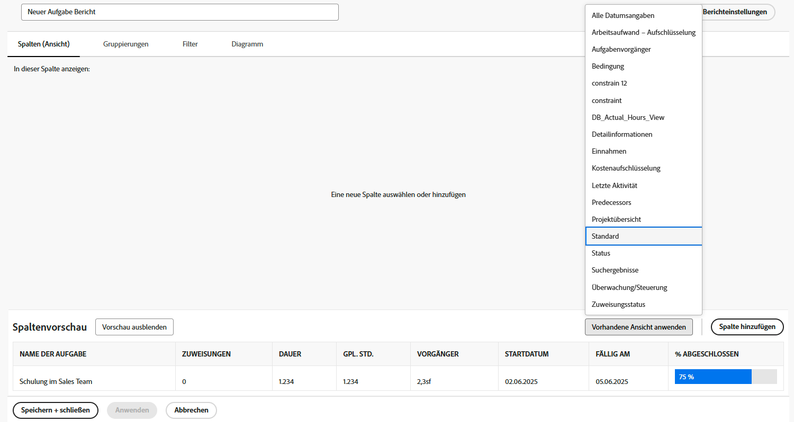
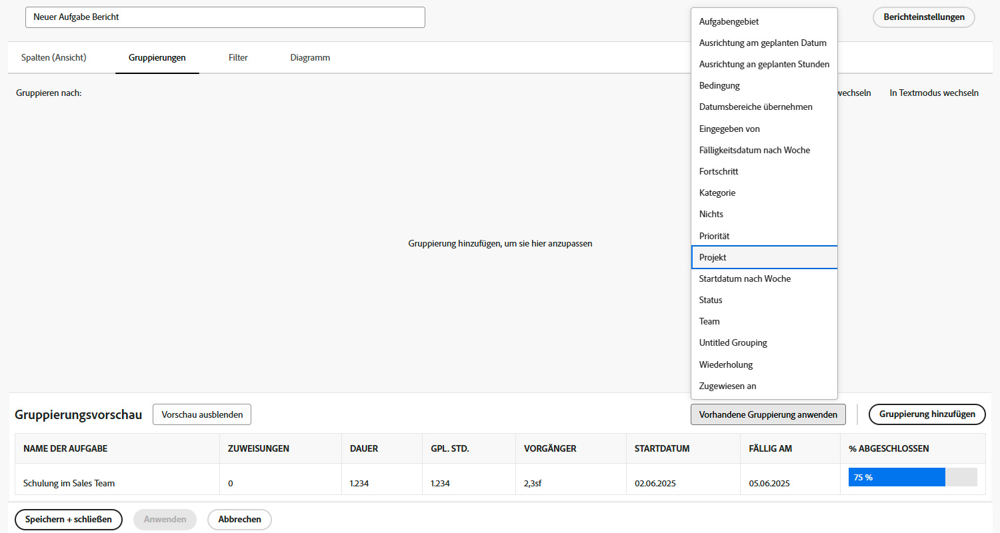

# Einfache Berichte erstellen

In diesem Video erfahren Sie, wie Sie:

* Erstellen eines einfachen Berichts mit einem vorhandenen Filter, einer vorhandenen Ansicht und Gruppierung

>[!VIDEO](https://video.tv.adobe.com/v/335153/?quality=12)

## Aktivität: Einfache Aufgabenberichte erstellen

Sie möchten alle Ihre aktiven Aufgaben in einem einzigen Bericht nachverfolgen. Erstellen Sie einen Aufgabenbericht mit dem Namen &quot;Meine aktuellen Aufgaben&quot;mit folgenden Optionen:

* Spalten (Ansicht) = Standard
* Gruppierungen = Projekt
* Filter = Meine aktuellen Aufgaben
* Beschreibung = Unvollständige Aufgaben in aktuellen Projekten, in denen ich der Aufgabeneigentümer bin, gruppiert nach Projekt.

## Antwort

1. Navigieren Sie zu **[!UICONTROL Hauptmenü]** und wählen Sie **[!UICONTROL Berichte]**.
1. Klicken Sie auf **[!UICONTROL Neuer Bericht]** Dropdown-Menü und **[!UICONTROL Aufgabenbericht]**.
1. In [!UICONTROL Spalten (Ansicht)], klicken Sie auf die **[!UICONTROL Anwenden einer vorhandenen Ansicht]** Menü und wählen Sie **[!UICONTROL Standard]**.

   

1. Im **[!UICONTROL Gruppierungen]** klicken Sie auf die **[!UICONTROL Vorhandene Gruppierung anwenden]** Menü und wählen Sie **[!UICONTROL Projekt]**.

   

1. Im **[!UICONTROL Filter]** klicken Sie auf die **[!UICONTROL Vorhandenen Filter anwenden]** und wählen Sie &quot;My Current Tasks&quot;.

   

1. Öffnen **[!UICONTROL Berichtseinstellungen]** und benennen Sie den Bericht &quot;Meine aktuellen Aufgaben&quot;.
1. Geben Sie im Feld Beschreibung die Option &quot;Unvollständige Aufgaben bei aktuellen Projekten, in denen ich der Aufgabenbesitzer bin, gruppiert nach Projekt&quot;ein.

   

1. Speichern und schließen Sie den Bericht.
