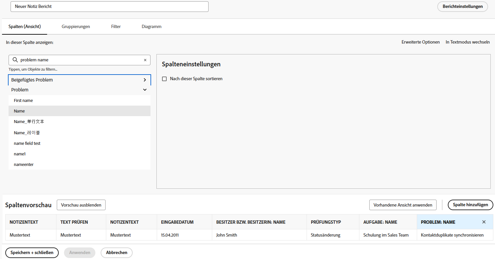
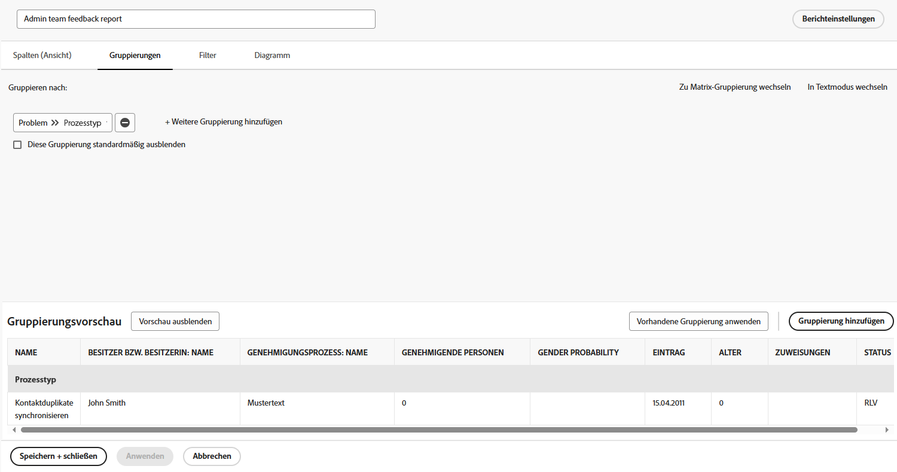

# Erstellen eines Aufgabenberichts für verspätete Zuweisungen

Das Video enthält eine schrittweise Anleitung zum Erstellen eines benutzerdefinierten Berichts, um in Verzug geratene Aufgaben zu verfolgen, die der angemeldeten Person zugewiesen sind. Zunächst wird erklärt, dass benutzerdefinierte Berichte erforderlich sind, wenn vorhandene Filter, Ansichten oder integrierte Berichte bestimmte Anforderungen nicht erfüllen.  Der Bericht trägt den Namen „In Verzug geratene Aufgaben, die mir zugewiesen sind“ und umfasst aus Gründen der Klarheit eine Beschreibung. 

Der daraus resultierende Bericht hilft Benutzenden, sich auf in Verzug geratene Aufgaben zu konzentrieren, bietet Informationen zu Abhängigkeiten und vereinfacht die Navigation zu den Host-Projekten. 

>[!VIDEO](https://video.tv.adobe.com/v/335154/?quality=12&learn=on&enablevpops=0)

## Die wichtigsten Punkte

* **Erstellung benutzerdefinierter Berichte:** Wenn vorhandene Filter und integrierte Berichte Ihre Anforderungen nicht erfüllen, können Sie einen benutzerdefinierten Bericht ganz neu erstellen, um sich auf bestimmte Daten zu konzentrieren, z. B. in Verzug geratene Aufgaben, die Ihnen zugewiesen sind. 
* **Filtereinrichtung:** Verwenden Sie Filter, um Berichtskriterien zu definieren, einschließlich in Verzug geratener Aufgaben, unvollständiger Aufgaben, aktueller Projekte und Aufgaben, die der angemeldeten Person zugewiesen sind. 
* **Spalten für Kontext:** Fügen Sie Spalten wie „Kann beginnen“ hinzu, um Abhängigkeitsprobleme zu identifizieren, und „Projektname“ mit Hyperlinks, um die Navigation zu zugehörigen Projekten zu erleichtern. 
* **Sortierung nach Priorität:** Sortieren Sie Aufgaben nach der Spalte „Fällig am“ in aufsteigender Reihenfolge, um die am längsten überfälligen Aufgaben oben im Bericht zu priorisieren. 
* **Barrierefreiheit:** Speichern Sie den Bericht, heften Sie ihn an oder markieren Sie ihn als Favoriten für den Schnellzugriff, um eine effiziente Nachverfolgung und Verwaltung von in Verzug geratenen Aufgaben sicherzustellen.

## Aktivitäten zum Erstellen eines Aufgabenberichts

>[!TIP]
>
>Holen Sie Ihre Spachtel und Rührschüsseln hervor und machen Sie sich bereit, die „Rezepte“ in unserem [Adobe Workfront Customer Reporting-Kochbuch](/help/assets/workfront-customer-reporting-cookbook.pdf) auszuprobieren. Darin finden Sie Schritt-für-Schritt-Anweisungen für 10 Berichte, die Ihnen heute in Ihrer Umgebung zur Verfügung stehen.
>Wir haben Lieblingsberichte von Kundinnen und Kunden gesammelt und in einem kleinen, leicht verdaulichen Kochbuch zusammengestellt, in dem Sie Ihre Workfront-Küche wieder ausprobieren können.
>Diese 10 Berichte stammen von Kundinnen und Kunden, die genau wie Sie sind. Verteilt auf verschiedene Branchen, Abteilungen, Teams, Positionen und alle in verschiedenen Unternehmen, schulden wir den unglaublichen Kundinnen und Kunden, die einen ihrer Lieblingsberichte geteilt haben, ein riesiges Dankeschön. Einige Berichte sind einfach (aber unglaublich nützlich) und einige sind komplexer, um Ihre Berichterstellung auf die nächste Ebene zu bringen.

### Aktivität 1: Erstellen eines Notizberichts mit Prompts

Erstellen Sie einen Notizbericht, mit dem Sie nach Benutzernotizen (d. h. Kommentaren oder Aktualisierungen) oder Systemnotizen auf Grundlage des Inhalts, der Autorin oder des Autors, des Eingabedatums, des Projektnamens oder der Überprüfungsart suchen können. Nennen Sie den Bericht „Notizsuche“.

Bei Verwendung des Prompts aus dem Notiztext sucht dieser Bericht in den Aktualisierungs-Threads, um schnell alle zu extrahieren, die den in den Prompts angegebenen Kriterien entsprechen. Um den Bericht auszuführen, müssen Sie nicht jeden Prompt ausfüllen, sondern nur diejenigen, die Ihnen wichtig sind. Leere Felder werden automatisch ignoriert.

Die Ansicht sollte Spalten für Folgendes enthalten:

* Notiztext
* Audit-Text
* Eingabedatum
* Eigentümer: Name
* Prüfungstyp
* Aufgabenname
* Name des Problems

Lassen Sie die Registerkarte „Filter“ leer.

Gruppe zum Projektnamen.

Schließen Sie Prompts zu Folgendem ein:

* Audit-Text
* Notiztext
* Name der Eigentümerin bzw. des Eigentümers
* Eingabedatum
* Projektname
* Prüfungstyp

### Antwort 1

1. Wählen Sie **[!UICONTROL Berichte]** aus dem **[!UICONTROL Hauptmenü]** aus.
1. Klicken Sie auf das Menü **[!UICONTROL Neuer Bericht]** und wählen Sie **[!UICONTROL Notiz]**.
1. Unter **[!UICONTROL Spalten (Ansicht)]** können Sie Ihre Spalten einrichten:

   

   * [!UICONTROL Notiz] > [!UICONTROL Notiztext]
   * [!UICONTROL Notiz] > [!UICONTROL Prüftext]
   * [!UICONTROL Notiz] > [!UICONTROL Eingabedatum]
   * [!UICONTROL Eigentümer] > [!UICONTROL Name]
   * [!UICONTROL Notiz] > [!UICONTROL Prüfungstyp]
   * [!UICONTROL Aufgabe] > [!UICONTROL Name]
   * [!UICONTROL Problem] > [!UICONTROL Name]

1. Wählen Sie die Spalte **[!UICONTROL Eingabedatum]** und ändern Sie die Option **[!UICONTROL Absteigend sortieren]**.
1. Legen Sie auf der Registerkarte **[!UICONTROL Gruppierungen]** fest, dass der Bericht nach [!UICONTROL Projekt] > [!UICONTROL Name] gruppiert werden soll.

   

1. Lassen Sie das Feld [!UICONTROL Filter] leer.
1. Öffnen Sie die **[!UICONTROL Berichtseinstellungen]** und nennen Sie den Bericht „Notizsuche“.
1. Geben Sie in das Feld [!UICONTROL Beschreibung] etwas ein wie „Suche nach System- oder Benutzernotizen“ auf Grundlage des ausgewählten Prüfungstyps und anderer Prompts. Systemnotizen erscheinen in der Spalte „Prüftext“ und Benutzernotizen in der Spalte „Notiztext“.

   

1. Wählen Sie die Registerkarte **[!UICONTROL Details]**, damit sie beim Laden des Berichts angezeigt wird.
1. Richten Sie den Bericht so ein, dass 200 Elemente angezeigt werden, wenn der Bericht in ein Dashboard aufgenommen wird.
1. Klicken Sie auf **[!UICONTROL Berichts-Prompts]** und fügen Sie Folgendes hinzu:

   

   * [!UICONTROL Notiz] > [!UICONTROL Prüftext]
   * [!UICONTROL Notiz] > [!UICONTROL Notiztext]
   * [!UICONTROL Eigentümer] > [!UICONTROL Name]
   * [!UICONTROL Notiz] > [!UICONTROL Eingabedatum]
   * [!UICONTROL Projekt] > [!UICONTROL Name]
   * [!UICONTROL Notiz] > [!UICONTROL Prüfungstyp]

1. Aktivieren Sie das Kontrollkästchen **[!UICONTROL Prompts in Dashboards anzeigen]**.
1. Speichern und schließen Sie den Bericht.

### Aktivität 2: Erstellen eines Feedback-Berichts für das Admin-Team

Dieser Problembericht zeigt alle Probleme aus einer Feedback-Anfrage-Warteschlange an, die für System-Admins erstellt wurde. Wie man diese Anfrage-Warteschlange erstellt, können Sie in der Anleitung [Erstellen einer Feedback-Anfrage-Warteschlange für System-Admins](https://experienceleague.adobe.com/docs/workfront-learn/tutorials-workfront/manage-work/request-queues/create-a-system-admin-feedback-request-queue.html?lang=de) sehen.

Dieser Bericht verwendet auch ein benutzerdefiniertes Formular. Informationen zum Erstellen eines benutzerdefinierten Formulars finden Sie in der Anleitung [Erstellen und Freigeben eines benutzerdefinierten Formulars](https://experienceleague.adobe.com/docs/workfront-learn/tutorials-workfront/custom-data/custom-forms/custom-forms-creating-and-sharing-a-custom-form.html?land=de).

Dieses benutzerdefinierte Formular sollte die Objekttypen „Projekt“ und „Problem“ verwenden und folgendermaßen erstellt werden:

Name: Admin-Prozess-Feedback

1. Prozesstyp (Dropdown-Feld mit Einfachauswahl)
   * Zugriffsebenen
   * Genehmigungsprozess (nur global)
   * E-Mail-Benachrichtigungen
   * Layout-Vorlage
   * Meilensteinpfad
   * Projektvorlage
   * Erinnerungsbenachrichtigungen
   * Anfrage-Warteschlange
1. Prozessname (einzeiliges Textfeld)
1. Prozessqualität (Dropdown-Feld mit Einfachauswahl)
   * 1 - völlig nutzlos
   * 2 - nicht sehr nützlich
   * 3 - gut, aber könnte besser sein
   * 4 - hervorragend
1. Problem oder gute Nachrichten (Absatztextfeld)

Erstellen Sie einen Problembericht mit dem Namen **Admin-Team-Feedback-Bericht**.

Die Ansicht sollte die folgenden Spalten enthalten:

* Problem: Name
* Primärer Kontakt: Name
* Problem: Prozesstyp
* Problem: Prozessname
* Problem: Prozessqualität
* Problem: Problem oder gute Nachricht
* Problem: Eingabedatum
* Problem: Alter
* Problem: Arbeitsaufträge
* Problem: Status

Gruppieren Sie nach dem Prozesstyp.

Filtern Sie nach der ID des Projekts der Anfrage-Warteschlange, in dem sich die Feedback-Probleme befinden.

### Antwort 2

1. Wählen Sie **[!UICONTROL Berichte]** aus dem **[!UICONTROL Hauptmenü]** aus.
1. Klicken Sie auf das Menü **[!UICONTROL Neuer Bericht]** und wählen Sie **[!UICONTROL Problem]** aus.
1. Unter **[!UICONTROL Spalten (Ansicht)]** können Sie Ihre Spalten einrichten:

   

   * [!UICONTROL Problem] > [!UICONTROL Name]
   * [!UICONTROL Primärer Kontakt] > [!UICONTROL Name]
      * Hinweis: Dies wird mit „Inhaber:Name“ als Spaltenbezeichnung angezeigt. Sie können dies in „Gemeldet von“ ändern, indem Sie auf „Erweiterte Optionen“ klicken und im Feld **Benutzerdefinierte Spaltenbeschriftung** „Gemeldet von“ eingeben.
   * [!UICONTROL Problem] > [!UICONTROL Prozesstyp]
   * [!UICONTROL Problem] > [!UICONTROL Prozessname]
   * [!UICONTROL Problem] > [!UICONTROL Prozessqualität]
   * [!UICONTROL Problem] > [!UICONTROL Problem oder gute Nachrichten]
   * [!UICONTROL Problem] > [!UICONTROL Eingabedatum]
   * [!UICONTROL Problem] > [!UICONTROL Alter]
   * [!UICONTROL Problem] > [!UICONTROL Zuweisungen]
   * [!UICONTROL Problem] > [!UICONTROL Status]

1. Wählen Sie die Spalte **[!UICONTROL Eingabedatum]** und ändern Sie die Option **[!UICONTROL Absteigend sortieren]**.
1. Legen Sie auf der Registerkarte **[!UICONTROL Gruppierungen]** fest, dass der Bericht nach **[!UICONTROL Problem] > [!UICONTROL Prozesstyp]** gruppiert werden soll.

   

1. Fügen Sie auf der Registerkarte **[!UICONTROL Filter]** einen Filter für **[!UICONTROL Problem] > [!UICONTROL Projekt-ID]** hinzu, der dem Projekt der Anfrage-Warteschlange entspricht, in dem sich die Feedback-Probleme befinden.

   

1. Speichern und schließen Sie den Bericht.
