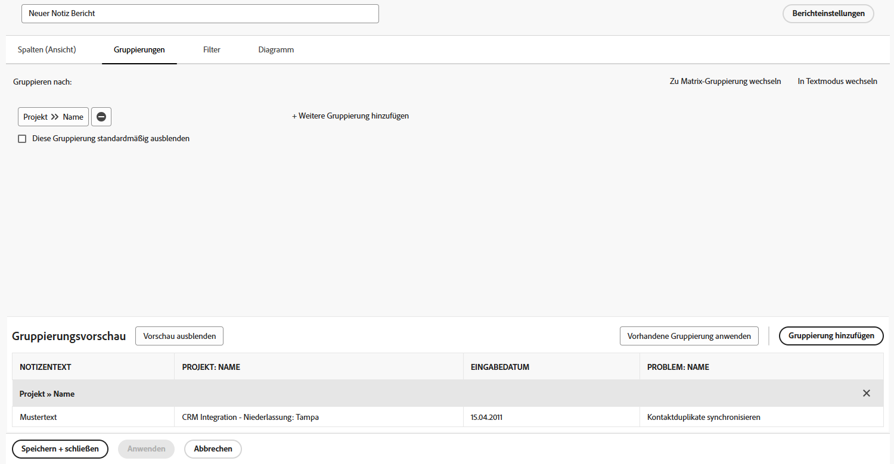

# Aufgabenbericht erstellen

In diesem Video erfahren Sie:

* Erstellen eines Aufgabenberichts mit einem komplexen Filter
* So finden Sie die erstellten Berichte

>[!VIDEO](https://video.tv.adobe.com/v/335154/?quality=12&learn=on)

## Aktivität 1: Erstellen eines Berichts mit Eingabeaufforderungen

Erstellen Sie einen Hinweis -Bericht, mit dem Sie nach Benutzerhinweisen (d. h. Kommentaren oder Aktualisierungen) oder Systemnotizen suchen können, die auf dem Inhalt der Notiz, dem Autor, dem Eintragsdatum, dem Projektnamen oder dem Audittyp basieren. Nennen Sie den Bericht &quot;Notizsuche&quot;.

Bei Verwendung der Eingabeaufforderung Text notieren durchsucht dieser Bericht in Aktualisierungs-Threads, um schnell alle zu extrahieren, die die in den Eingabeaufforderungen angegebenen Kriterien erfüllen. Wenn Sie den Bericht ausführen, müssen Sie nicht jede Eingabeaufforderung ausfüllen, nur die, die Ihnen wichtig sind. Die leeren werden automatisch ignoriert.

Die Ansicht sollte Spalten für Folgendes enthalten:

* Notizentext
* Text prüfen
* Eingabedatum
* Inhaber: Name
* Prüfungstyp
* Aufgabenname
* Name des Problems

Lassen Sie die Registerkarte Filter leer.

Gruppe für den Projektnamen.

Fügen Sie Aufforderungen für Folgendes ein:

* Text prüfen
* Notizentext
* Name des Inhabers
* Eingabedatum
* Projektname
* Prüfungstyp

## Antwort zu Aktivität 1

1. Auswählen **[!UICONTROL Berichte]** aus dem **[!UICONTROL Hauptmenü]**.
1. Klicken Sie auf **[!UICONTROL Neuer Bericht]** Menü und wählen Sie **[!UICONTROL Hinweis]**.
1. In **[!UICONTROL Spalten (Ansicht)]** Richten Sie Ihre Spalten so ein, dass Folgendes enthalten ist:

   

   * [!UICONTROL Hinweis] > [!UICONTROL Hinweis: Text]
   * [!UICONTROL Hinweis] > [!UICONTROL Audit-Text]
   * [!UICONTROL Hinweis] > [!UICONTROL Datum der Einsendung]
   * [!UICONTROL Inhaber] > [!UICONTROL Name]
   * [!UICONTROL Hinweis] > [!UICONTROL Audittyp]
   * [!UICONTROL Aufgabe] > [!UICONTROL Name]
   * [!UICONTROL Problem] > [!UICONTROL Name]

1. Wählen Sie die **[!UICONTROL Datum der Einsendung]** und ändern Sie die **[!UICONTROL Nach Absteigend sortieren]**.
1. Im **[!UICONTROL Gruppierungen]** -Registerkarte, legen Sie für den Bericht eine Gruppierung nach [!UICONTROL Projekt] > [!UICONTROL Name].

   

1. Urlaub [!UICONTROL Filter] leer.
1. Öffnen **[!UICONTROL Berichtseinstellungen]** und benennen Sie den Bericht &quot;Notizsuche&quot;.
1. Im [!UICONTROL Beschreibung] -Feld ein, z. B. &quot;Suchen Sie basierend auf dem ausgewählten Audittyp und anderen Eingabeaufforderungen nach System- oder Benutzernotizen. Systemnotizen werden in der Spalte &quot;Audit Text&quot;und Benutzerhinweise in der Spalte Hinweis Text angezeigt.&quot;

   

1. Auswählen **[!UICONTROL Registerkarte &quot;Details&quot;]** sodass sie beim Laden des Berichts angezeigt wird.
1. Stellen Sie den Bericht so ein, dass 200 Elemente angezeigt werden, wenn der Bericht in ein Dashboard aufgenommen wird.
1. Klicks **[!UICONTROL Berichtsaufforderungen]** und fügen Sie Folgendes hinzu:

   

   * [!UICONTROL Hinweis] > [!UICONTROL Audit-Text]
   * [!UICONTROL Hinweis] > [!UICONTROL Hinweis: Text]
   * [!UICONTROL Inhaber] > [!UICONTROL Name]
   * [!UICONTROL Hinweis] > [!UICONTROL Datum der Einsendung]
   * [!UICONTROL Projekt] > [!UICONTROL Name]
   * [!UICONTROL Hinweis] > [!UICONTROL Audittyp]

1. Aktivieren Sie das Kontrollkästchen für **[!UICONTROL Anzeigen von Eingabeaufforderungen in Dashboards]**.
1. Speichern und schließen Sie den Bericht.

## Aktivität 2: Erstellen eines Feedback-Berichts für das Admin-Team

Dieser Problembericht zeigt alle Probleme aus einer Feedback-Anforderungswarteschlange an, die für Systemadministratoren erstellt wurde. Sie können sehen, wie Sie diese Anforderungswarteschlange in der [Erstellen einer Feedback-Anforderungswarteschlange für Systemadministratoren](https://experienceleague.adobe.com/docs/workfront-learn/tutorials-workfront/manage-work/request-queues/create-a-system-admin-feedback-request-queue.html) Tutorial.

Dieser Bericht verwendet auch ein benutzerdefiniertes Formular. Informationen zum Erstellen eines benutzerdefinierten Formulars finden Sie unter [Benutzerdefiniertes Formular erstellen und freigeben](https://experienceleague.adobe.com/docs/workfront-learn/tutorials-workfront/custom-data/custom-forms/custom-forms-creating-and-sharing-a-custom-form.html) Tutorial.

Dieses benutzerdefinierte Formular sollte wie folgt erstellt werden:

Name: Feedback zum Admin-Prozess

1. Prozesstyp (Dropdown-Feld)
   * Zugriffsstufen
   * Validierungsprozess (nur global)
   * E-Mail-Benachrichtigungen
   * Layoutvorlage
   * Milestone-Pfad
   * Projektvorlage
   * Erinnerungsbenachrichtigungen
   * Anforderungswarteschlange
1. Prozessname (einzeiliges Textfeld)
1. Prozessqualität (Dropdown-Feld)
   * 1 - völlig nutzlos
   * 2 - nicht sehr nützlich
   * 3 - gut, aber besser
   * 4 - hervorragend
1. Problem oder gute Nachrichten (Absatztextfeld)

Erstellen Sie einen Problembericht mit dem Namen **Feedback-Bericht des Administrators**.

Die Ansicht sollte die folgenden Spalten enthalten:

* Problem: Name
* Primärer Ansprechpartner: Name
* Problem: Prozesstyp
* Problem: Prozessname
* Problem: Process Grade
* Problem: Problem oder gute Nachrichten
* Problem: Eingangsdatum
* Problem: Alter
* Problem: Zuweisungen
* Problem: Status

Gruppe für den Prozesstyp.

Filtern Sie nach der ID des Anforderungswarteschlangenprojekts, in dem sich die Feedback-Probleme befinden.

## Antwort zu Aktivität 2

1. Auswählen **[!UICONTROL Berichte]** aus dem **[!UICONTROL Hauptmenü]**.
1. Klicken Sie auf **[!UICONTROL Neuer Bericht]** Menü und wählen Sie **[!UICONTROL Problem]**.
1. In **[!UICONTROL Spalten (Ansicht)]** Richten Sie Ihre Spalten so ein, dass Folgendes enthalten ist:

   

   * [!UICONTROL Problem] > [!UICONTROL Name]
   * [!UICONTROL Primärer Kontakt] > [!UICONTROL Name]
      * Hinweis: Dies wird mit &quot;Owner:Name&quot;als Spaltenbezeichnung angezeigt. Sie können dies in &quot;Gemeldet von&quot;ändern, indem Sie auf Erweiterte Optionen klicken und in die Variable **Eigene Spaltenbeschriftung** -Feld.
   * [!UICONTROL Problem] > [!UICONTROL Prozesstyp]
   * [!UICONTROL Problem] > [!UICONTROL Prozessname]
   * [!UICONTROL Problem] > [!UICONTROL Prozessqualität]
   * [!UICONTROL Problem] > [!UICONTROL Problem oder gute Nachrichten]
   * [!UICONTROL Problem] > [!UICONTROL Datum der Einsendung]
   * [!UICONTROL Problem] > [!UICONTROL Alter]
   * [!UICONTROL Problem] > [!UICONTROL Zuweisungen]
   * [!UICONTROL Problem] > [!UICONTROL Status]

1. Wählen Sie die **[!UICONTROL Datum der Einsendung]** und ändern Sie die **[!UICONTROL Nach Absteigend sortieren]**.
1. Im **[!UICONTROL Gruppierungen]** -Registerkarte, legen Sie für den Bericht eine Gruppierung nach **[!UICONTROL Problem] > [!UICONTROL Prozesstyp]**.

   

1. Im **[!UICONTROL Filter]** Registerkarte einen Filter für die **[!UICONTROL Problem] > [!UICONTROL Projekt-ID]** , um das Anforderungswarteschlangenprojekt zu entsprechen, in dem sich die Feedback-Probleme befinden.

   

1. Speichern und schließen Sie den Bericht.
