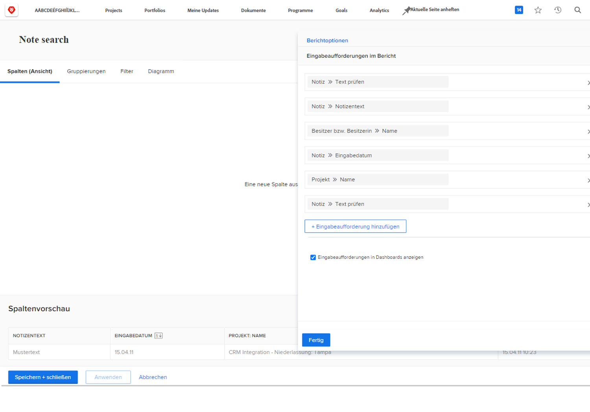
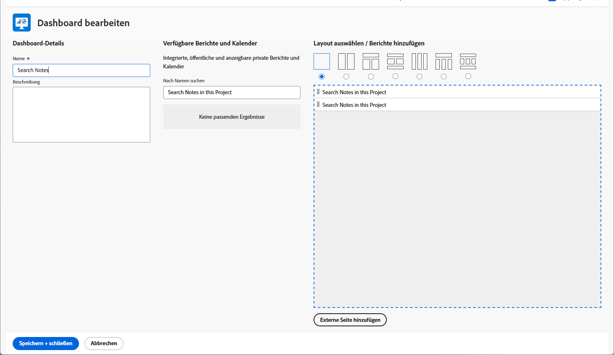
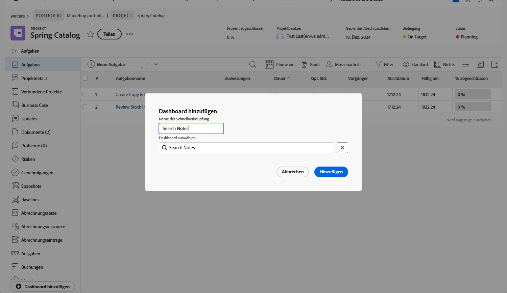

# Erstellen von Dashboards in Workfront

Das Video bietet eine umfassende Anleitung zum Verständnis und zur Verwendung von Dashboards in Workfront.
&#x200B;Es wird erläutert, dass ein Dashboard eine Sammlung von Berichten ist, mit denen Benutzende verknüpfte Daten an einem Ort organisieren und anzeigen können.

>[!VIDEO](https://video.tv.adobe.com/v/335157/?quality=12&learn=on&enablevpops=0)

## Die wichtigsten Punkte

* **Dashboards in Workfront:** Ein Dashboard ist eine Berichtssammlung, mit der Benutzende zusammengehörige Daten wie Projekte, Aufgaben und Probleme in einer zentralen Ansicht organisieren und anzeigen können.
* **Erstellen von Dashboards:** Dashboards können angepasst werden, indem ein Layout ausgewählt, Berichte, benutzerdefinierte Kalender oder externe Seiten hinzugefügt und für eine optimale Anzeige angeordnet werden. &#x200B; Benutzer können auch anpassen, welche Spalten in nebeneinander angezeigten Berichten im Dashboard angezeigt werden. &#x200B;
* **Zugriff auf Dashboards:** Dashboards finden Sie unter „Meine Dashboards“, „Freigegebene Dashboards“ oder „Alle Dashboards“ im Bereich Dashboards. &#x200B; häufig verwendeten Dashboards können angeheftet oder zu den Favoriten hinzugefügt werden, um einen schnellen Zugriff zu ermöglichen. &#x200B;
* **Freigeben von Dashboards:** Dashboards können über das Menü „Dashboard-Aktionen“ für andere Workfront-Benutzende freigegeben werden. Dazu gehören auch alle Berichte innerhalb des Dashboards.
* **Drucken von Dashboards:** Dashboards können direkt über das Menü „Dashboard-Aktionen“ gedruckt werden. Physische Kopien der Daten können so einfacher verteilt werden.

## Aktivitäten zum Erstellen eines Dashboards

### Aktivität 1: Erstellen eines Dashboards

Erstellen Sie ein [!UICONTROL Dashboard] mit nur einem Bericht – „Nach Notizen in diesem Projekt suchen“. Damit können Sie schnell alle Aktualisierungen eines Projekts finden, selbst wenn es Tausende von Aktualisierungen zu durchsuchen gibt. Dadurch werden die Aktualisierungs-Threads durchsucht, um schnell alle Aktualisierungen zu extrahieren, die den Kriterien entsprechen, die Sie in den Prompts angeben.

Erstellen Sie diesen Bericht, indem Sie eine Kopie des Berichts „Notizensuche“ erstellen, den Sie in der Aktivität „Notizbericht erstellen“ erstellt haben. Sie haben ihn noch nicht erstellt? Klicken Sie hier, um sich die Aktivität im Tutorial [Erstellen eines Aufgabenberichts](https://experienceleague.adobe.com/de/docs/workfront-learn/tutorials-workfront/reporting/basic-reporting/create-a-task-report#activity-1-create-a-note-report-with-prompts) anzusehen.

* Entfernen Sie den Prompt „Projektname“ aus der Kopie und benennen Sie den Bericht in „Nach Notizen in diesem Projekt suchen“ um.
* Weisen Sie dem [!UICONTROL Dashboard] den Namen „Notizensuche“ zu.
* Gehen Sie auf eine beliebige Projekt-Landingpage und erstellen Sie einen benutzerdefinierten Abschnitt für ein [!UICONTROL Dashboard].
* Beachten Sie, dass bei der Suche nach Notizen im benutzerdefinierten Abschnitt nur Notizen angezeigt werden, die in dem Projekt enthalten sind, in dem Sie sich gerade befinden.

### Antwort 1

1. Führen Sie den Bericht aus, den Sie in der Aktivität „Notizbericht erstellen“ erstellt haben. Sie haben ihn noch nicht erstellt? Klicken Sie hier, um sich die Aktivität im Tutorial [Erstellen eines Aufgabenberichts](https://experienceleague.adobe.com/de/docs/workfront-learn/tutorials-workfront/reporting/basic-reporting/create-a-task-report#activity-1-create-a-note-report-with-prompts) anzusehen.
1. Klicken Sie auf **[!UICONTROL Berichtaktionen]** und wählen Sie **[!UICONTROL Kopieren]**. [!DNL Workfront] erstellt einen neuen Bericht mit dem Namen „Notizensuche (Kopie)“.
1. Gehen Sie zu **[!UICONTROL Berichtaktionen]** und wählen Sie **[!UICONTROL Bearbeiten]**. Klicken Sie auf **[!UICONTROL Berichteinstellungen]** und ändern Sie den Namen in „Nach Notizen in diesem Projekt suchen“.
1. Klicken Sie auf [!UICONTROL Berichts-Prompts] und löschen Sie den Prompt [!UICONTROL Projekt] > [!UICONTROL Name] aus der Liste.

   

1. Aktivieren Sie das Kontrollkästchen **[!UICONTROL Berichts-Prompts im Dashboard anzeigen]**.
1. Klicken Sie auf **[!UICONTROL Fertig]**, dann auf **[!UICONTROL Speichern + schließen]**. Sie sehen nun den Bildschirm [!UICONTROL Prompts] des Berichts.

   Als Nächstes verwenden Sie eine Abkürzung, um ein neues Dashboard zu erstellen und diesen Bericht hinzuzufügen.

1. Klicken Sie auf **[!UICONTROL Berichtaktionen]** und wählen Sie **[!UICONTROL Zum klassischen Dashboard hinzufügen]** > **[!UICONTROL Neues Dashboard]**.
1. Ziehen Sie den Bericht „Nach Notizen in diesem Projekt suchen“ in das Bedienfeld **[!UICONTROL Layout]**.
1. Beachten Sie, dass der Name des Berichts zum Namen des Dashboards wird. Ändern Sie den Namen in „Notizensuche“.

   

1. Klicken Sie auf **[!UICONTROL Speichern + schließen]**.

   Fügen Sie nun das Dashboard zu einer Projektseite hinzu.

   

1. Öffnen Sie ein beliebiges Projekt. Klicken Sie im Menü des linken Panels auf die Schaltfläche **[!UICONTROL Dashboard hinzufügen]**.
1. Geben Sie in das Feld **[!UICONTROL Dashboard auswählen]** den Namen „Notizensuche“ ein und wählen Sie das [!UICONTROL Dashboard] aus der Liste aus.
1. Geben Sie in das Feld **[!UICONTROL Name der Schnellverknüpfung]** den Namen „Notizensuche“ ein.
1. Klicken Sie auf **[!UICONTROL Hinzufügen]**.
1. Suchen Sie im Menü des linken Panels nach „Notizensuche“. Klicken Sie auf die Punkte links neben dem Namen und ziehen Sie ihn nach oben bis direkt unter „Aktualisierungen“.

### Aktivität 2: Offene Aufgaben meiner Teams

Erstellen Sie ein [!UICONTROL Dashboard] mit drei „Offene Aufgabe“-Berichten, die jeweils von einem anderen Team gefiltert werden, das den Aufgaben zugewiesen wurde.

Verwenden Sie einen vorhandenen Bericht „Aufgabe öffnen“ (gefiltert von einem Team), wenn Sie einen haben, oder erstellen Sie einen neuen für dieses Dashboard. Kopieren Sie den Bericht zweimal und bearbeiten Sie ihn für zwei weitere Teams. Platzieren Sie sie dann in einem einzigen Dashboard mit dem Namen **Offene Aufgaben meiner Teams“**

### Antwort 2

#### Teil 1: Erstellen eines Berichts „Offene Aufgaben“, der von einem Ihrer Teams gefiltert wird

1. Wählen Sie **[!UICONTROL Berichte]** aus dem **[!UICONTROL Hauptmenü]** aus.
1. Klicken Sie auf **[!UICONTROL Neuer Bericht]** und wählen Sie **[!UICONTROL Aufgabe]**.
1. Benennen Sie Ihren Bericht mit „Dem Creative-Team zugewiesene offene Aufgaben“ (oder eines Ihrer anderen Teams).
1. Unter **[!UICONTROL Spalten (Ansicht)]** können Sie Ihre Spalten einrichten:

   

   * [!UICONTROL Projekt] > [!UICONTROL Name]
   * [!UICONTROL Aufgabe] > [!UICONTROL Name]
   * [!UICONTROL Aufgabe] > [!UICONTROL Arbeitsaufträge]
   * [!UICONTROL Aufgabe] > [!UICONTROL Dauer]
   * [!UICONTROL Aufgabe] > [!UICONTROL Geplante Stunden]
   * [!UICONTROL Aufgabe] > [!UICONTROL Geplantes Startdatum]
   * [!UICONTROL Aufgabe] > [!UICONTROL Geplantes Abschlussdatum]
   * [!UICONTROL Aufgabe] > [!UICONTROL Prozent abgeschlossen]

1. Wählen Sie die Spalte **[!UICONTROL Geplantes Abschlussdatum]** und ändern Sie die Sortierung in **Aufsteigend**.

1. Fügen Sie auf **[!UICONTROL Registerkarte]** Filterregeln hinzu, um Folgendes einzuschließen:

   

   * [!UICONTROL Projekt] > [!UICONTROL Status entspricht] > [!UICONTROL Gleich] > „Aktuell“
   * [!UICONTROL Aufgabe] > [!UICONTROL Team-ID] > [!UICONTROL Gleich] > &quot;Creative&quot;
   * [!UICONTROL Aufgabe] > [!UICONTROL Prozent abgeschlossen] > [!UICONTROL kleiner als] > „100“

1. Klicken Sie auf **[!UICONTROL Speichern+Schließen]**, um Ihren Bericht zu speichern und zu schließen.

#### Teil 2: Kopieren Sie den soeben erstellten Bericht und erstellen Sie einen neuen Bericht für Ihr zweites Team

1. Klicken Sie in dem soeben erstellten Bericht auf **[!UICONTROL Berichtsaktionen] > [!UICONTROL Kopieren]**.
1. Der neue Bericht wird mit dem Namen **„(Kopie)“** im Titel angehängt.
1. Klicken Sie **[!UICONTROL Berichtsaktionen] > [!UICONTROL Bearbeiten]**. Ändern Sie dann den Filter und den Berichtstitel, um sich auf das Orion-Team (oder eines Ihrer anderen Teams) zu konzentrieren.
1. Klicken Sie auf die [!UICONTROL Filter] und ändern Sie dann die Filterregel
   **[!UICONTROL Aufgabe] > [!UICONTROL Team-ID] > [!UICONTROL Gleich] > &quot;Creative&quot;** bis
   **[!UICONTROL Aufgabe] > [!UICONTROL Team-ID] > [!UICONTROL Gleich] > „Orion“**
1. Ändern Sie im Feld Berichtstitel das Wort **[!UICONTROL &quot;Creative&quot;]** in **[!UICONTROL „Orion“]** und löschen Sie das Wort **„(Copy)“**.
1. Klicken Sie auf **[!UICONTROL Speichern+Schließen]**, um Ihren Bericht zu speichern und zu schließen.

#### Teil 3: Kopieren Sie den Bericht erneut und erstellen Sie einen neuen Bericht für Ihr drittes Team

1. Klicken Sie in dem soeben erstellten Bericht erneut auf **[!UICONTROL Berichtsaktionen] > [!UICONTROL Kopieren]**. Dieses Mal ändern Sie den Namen des Teams im Titel und den Filter in „Digitales Marketing“ (oder eines anderen Ihrer Teams).

#### Teil 4: Erstellen Sie ein Dashboard, das die offenen Aufgaben in jedem Ihrer Teams anzeigt

1. Klicken Sie im Hauptmenü auf **[!UICONTROL Dashboards]**.
1. Klicken Sie dann auf **[!UICONTROL Neues Dashboard]**.

   

1. Benennen Sie das Dashboard **„Offene Aufgaben meiner Teams“**.
1. Geben Sie den Namen Ihrer Berichte in das Feld **[!UICONTROL Nach Name suchen]** ein.
1. Da Ihre Berichtsnamen alle mit denselben Wörtern beginnen, sehen Sie sie möglicherweise alle wie folgt auftauchen:

   

1. Ziehen Sie sie jeweils in den Layout-Bereich und klicken Sie dann auf Speichern + Schließen.

   

1. Hier ist das letzte Dashboard:

   
