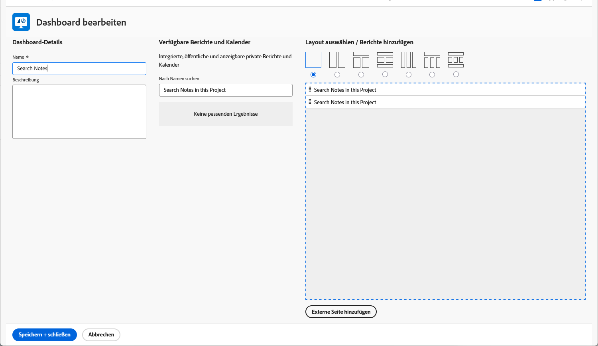

# Erstellen von Dashboards

In diesem Video erfahren Sie:

* Was für ein Dashboard in Workfront ist
* Erstellen eines Dashboards
* So finden und verwenden Sie Dashboards
* Freigeben eines Dashboards für andere Workfront-Benutzer
* Drucken eines Dashboards

>[!VIDEO](https://video.tv.adobe.com/v/335157/?quality=12&learn=on)

## Aktivität: Dashboard erstellen

Erstellen Sie eine [!UICONTROL Dashboard] mit nur einem Bericht darin -&quot;Suchhinweise in diesem Projekt&quot;. Dies ist nützlich, um schnell alle Aktualisierungen zu finden, die an einem Projekt vorgenommen wurden, selbst wenn Tausende von Updates durchsucht werden müssen. Dadurch werden in Update-Threads gesucht, um schnell alle Aktualisierungen zu extrahieren, die den Kriterien entsprechen, die Sie in den Eingabeaufforderungen angeben.

Erstellen Sie diesen Bericht, indem Sie eine Kopie des Berichts &quot;Suchhinweise&quot;anfertigen, den Sie in der Aktivität &quot;Notizbericht erstellen&quot;erstellt haben (oder verwenden Sie einen anderen Bericht, wenn Sie diese Aktivität nicht durchgeführt haben).

* Entfernen Sie die Eingabeaufforderung für den Projektnamen aus der Kopie und benennen Sie den Bericht &quot;Suchhinweise in diesem Projekt&quot;um.
* Benennen Sie die [!UICONTROL Dashboard] &quot;Suchhinweise&quot;.
* Navigieren Sie zu einer beliebigen Projekt-Landingpage und erstellen Sie einen benutzerdefinierten Abschnitt für eine [!UICONTROL Dashboard].
* Beachten Sie, dass bei der Suche nach Notizen in Ihrem benutzerdefinierten Abschnitt nur Notizen angezeigt werden, die in dem Projekt enthalten sind, in dem Sie sich gerade befinden.

## Antwort

1. Führen Sie den Bericht aus, den Sie in der Aktivität &quot;Notizbericht erstellen&quot;erstellt haben.
1. Klicken **[!UICONTROL Berichtaktionen]** und wählen Sie **[!UICONTROL Kopieren]**. [!DNL Workfront] erstellt einen neuen Bericht mit dem Namen &quot;Notizsuche (Kopieren)&quot;.
1. Navigieren Sie zu **[!UICONTROL Berichtaktionen]** und wählen Sie **[!UICONTROL Bearbeiten]**. Klicken **[!UICONTROL Berichtseinstellungen]** und ändern Sie den Namen in &quot;Suchhinweise in diesem Projekt&quot;.
1. Klicken [!UICONTROL Berichtsaufforderungen] und löschen Sie die [!UICONTROL Projekt] > [!UICONTROL Name] von der Liste aus.

   

1. Überprüfen Sie die **[!UICONTROL Anzeigen von Eingabeaufforderungen im Dashboard]** ankreuzen.
1. Klicken **[!UICONTROL Fertig]**, dann **[!UICONTROL Speichern und schließen]**. Sie sehen sich jetzt die [!UICONTROL Eingabeaufforderungen] angezeigt.

   Als Nächstes erstellen Sie ein neues Dashboard und fügen diesen Bericht hinzu.

1. Klicken **[!UICONTROL Berichtaktionen]** und wählen Sie **[!UICONTROL Zum Dashboard hinzufügen]** > **[!UICONTROL Neues Dashboard]**.
1. Ziehen Sie den Bericht &quot;Suchhinweise in diesem Projekt&quot;in den **[!UICONTROL Layout]** Bereich.
1. Beachten Sie, dass der Name des Berichts zum Namen des Dashboards wird. Bearbeiten Sie den Namen einfach in &quot;Suchhinweise&quot;.

   

1. Klicken **[!UICONTROL Speichern und schließen]**.

   Fügen Sie das Dashboard jetzt einer Projektseite hinzu.

   

1. Wechseln Sie zu einem beliebigen Projekt. Klicken Sie im Menü des linken Bedienfelds auf das **[!UICONTROL Benutzerspezifischen Abschnitt hinzufügen]** Symbol.
1. Im **[!UICONTROL Hinzufügen eines Dashboards]** Geben Sie &quot;Suchhinweise&quot;ein und wählen Sie die [!UICONTROL Dashboard] aus der Liste.
1. Im **[!UICONTROL Titel des benutzerdefinierten Abschnitts]** eingeben, &quot;Suchhinweise&quot;.
1. Klicken **[!UICONTROL Neuen Abschnitt hinzufügen]**.
1. Suchen Sie im Menü des linken Bedienfelds nach Suchhinweisen. Klicken Sie auf die Punkte links neben dem Abschnittsnamen und ziehen Sie ihn rechts unter Updates.
