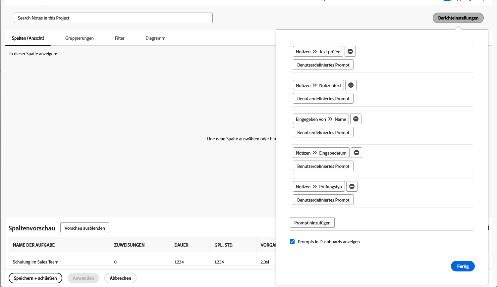

# Erstellen von Dashboards

In diesem Video lernen Sie Folgendes:

* Was ist ein Dashboard in Workfront?
* Erstellen eines Dashboards
* Suchen und Verwenden eines Dashboards
* Freigabe eines Dashboards für andere Workfront-Benutzende
* Ausdrucken eines Dashboards

>[!VIDEO](https://video.tv.adobe.com/v/335157/?quality=12&learn=on&enablevpops)

## Aktivität: Erstellen eines Dashboards

Erstellen Sie ein [!UICONTROL Dashboard] mit nur einem Bericht – „Nach Notizen in diesem Projekt suchen“. Damit können Sie schnell alle Aktualisierungen eines Projekts finden, selbst wenn es Tausende von Aktualisierungen zu durchsuchen gibt. Dadurch werden die Aktualisierungs-Threads durchsucht, um schnell alle Aktualisierungen zu extrahieren, die den Kriterien entsprechen, die Sie in den Eingabeaufforderungen angeben.

Erstellen Sie diesen Bericht, indem Sie eine Kopie des Berichts „Notizsuche“ erstellen, den Sie in der Aktivität „Notizbericht erstellen“ erstellt haben (oder verwenden Sie einen anderen Bericht, wenn Sie diese Aktivität nicht durchgeführt haben).

* Entfernen Sie die Eingabeaufforderung „Projektname“ aus der Kopie und benennen Sie den Bericht in „Nach Notizen in diesem Projekt suchen“ um.
* Benennen Sie das [!UICONTROL Dashboard] „Notizensuche“.
* Gehen Sie auf eine beliebige Projekt-Landingpage und erstellen Sie einen benutzerdefinierten Abschnitt für ein [!UICONTROL Dashboard].
* Beachten Sie, dass bei der Suche nach Notizen in Ihrem benutzerdefinierten Abschnitt nur Notizen angezeigt werden, die in dem Projekt enthalten sind, in dem Sie sich gerade befinden.

## Antwort

1. Führen Sie den Bericht aus, den Sie in der Aktivität „Notizbericht erstellen“ erstellt haben.
1. Klicken Sie auf **[!UICONTROL Berichtaktionen]** und wählen Sie **[!UICONTROL Kopieren]**. [!DNL Workfront] erstellt einen neuen Bericht mit dem Namen „Notizensuche (Kopie)“.
1. Gehen Sie zu **[!UICONTROL Berichtaktionen]** und wählen Sie **[!UICONTROL Bearbeiten]**. Klicken Sie auf **[!UICONTROL Berichteinstellungen]** und ändern Sie den Namen in „Nach Notizen in diesem Projekt suchen“.
1. Klicken Sie auf [!UICONTROL Eingabeaufforderungen im Bericht] und löschen Sie die Eingabeaufforderung [!UICONTROL Projekt] > [!UICONTROL Name] aus der Liste.

   

1. Aktivieren Sie das Kontrollkästchen **[!UICONTROL Eingabeaufforderungen im Dashboard anzeigen]**.
1. Klicken Sie auf **[!UICONTROL Fertig]**, dann auf **[!UICONTROL Speichern + schließen]**. Sie sehen nun den Bildschirm [!UICONTROL Eingabeaufforderungen] des Berichts.

   Als Nächstes verwenden Sie eine Verknüpfung, um ein neues Dashboard zu erstellen und diesen Bericht hinzuzufügen.

1. Klicken Sie auf **[!UICONTROL Berichtaktionen]** und wählen Sie **[!UICONTROL Zu Dashboard hinzufügen]** > **[!UICONTROL Neues Dashboard]**.
1. Ziehen Sie den Bericht „Nach Notizen in diesem Projekt suchen“ in das Bedienfeld **[!UICONTROL Layout]**.
1. Beachten Sie, dass der Name des Berichts zum Namen des Dashboards wird. Ändern Sie den Namen in „Notizensuche“.

   

1. Klicken Sie auf **[!UICONTROL Speichern + schließen]**.

   Fügen Sie nun das Dashboard zu einer Projektseite hinzu.

   

1. Öffnen Sie ein beliebiges Projekt. Klicken Sie im Menü des linken Bedienfelds auf das Symbol **[!UICONTROL Benutzerdefinierten Abschnitt hinzufügen]**.
1. Geben Sie in das Feld **[!UICONTROL Dashboard hinzufügen]** „Notizensuche“ ein und wählen Sie das [!UICONTROL Dashboard] aus der Liste aus.
1. Geben Sie in das Feld **[!UICONTROL Benutzerdefinierter Abschnittstitel]** „Notizensuche“ ein.
1. Klicken Sie auf **[!UICONTROL Neuen Abschnitt hinzufügen]**.
1. Suchen Sie mithilfe des Menüs des linken Bedienfelds nach Notizen. Klicken Sie auf die Punkte links neben dem Abschnittsnamen und ziehen Sie ihn rechts unter „Aktualisierungen“.
