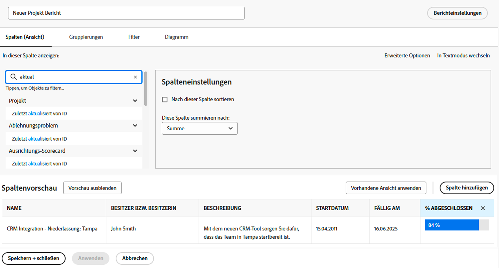
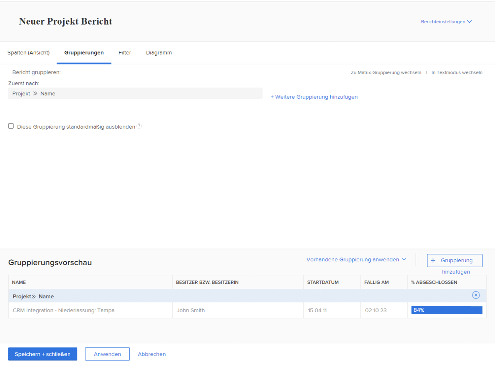
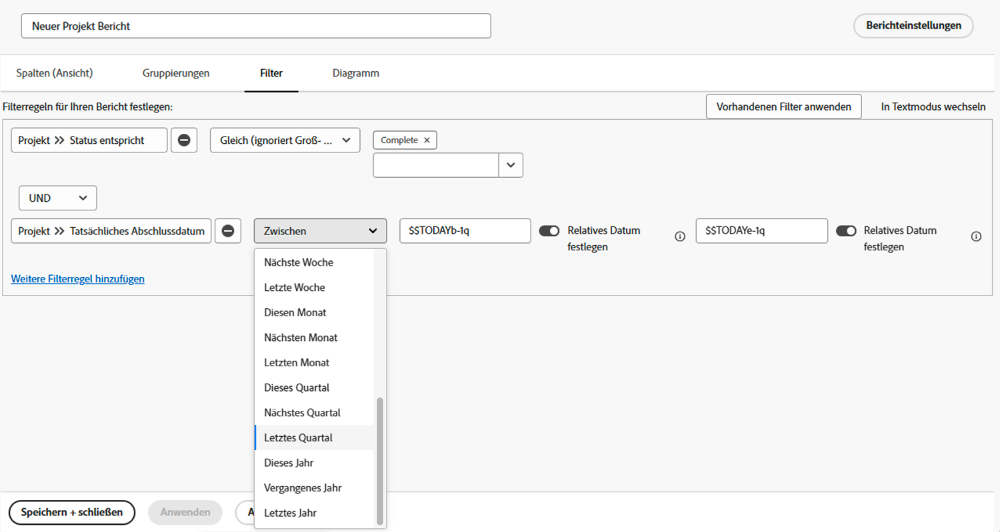
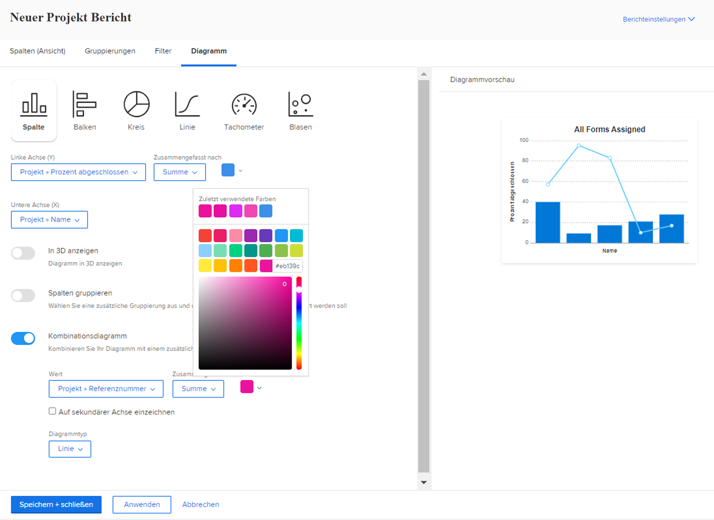

# Erstellen von Berichten mit Diagrammen

In diesem Video wird erläutert, wie Diagramme zur effektiven Visualisierung von Daten verwendet werden können, insbesondere zur Verfolgung von Projektaufgaben. &#x200B; Es zeigt die Erstellung von zwei Berichtstypen in Workfront:

**Bericht zu verspäteten Aufgaben nach Projekt:**

* Beginnen Sie mit einem Listenbericht und wenden Sie Filter an, um in aktuellen Projekten nur unvollständige, verspätete Aufgaben anzuzeigen. &#x200B;
* Aufgaben nach Projektname gruppieren und ein Tortendiagramm erstellen, um die Verteilung überfälliger Aufgaben auf die Projekte anzuzeigen. &#x200B;
* Legen Sie das Diagramm als Standardregisterkarte für einfachen Zugriff fest. &#x200B;

**Aufgaben nach Projekt und Fortschrittsbericht:**

* Kopieren Sie den ersten Bericht und fügen Sie eine weitere Gruppierung für den Aufgabenstatus hinzu.
* Filter entfernen, um alle Aufgaben einzubeziehen und ihren Fortschritt während der Projektausführung anzuzeigen.
* Verwenden Sie ein gestapeltes Säulendiagramm, um die Gesamtzahl der Aufgaben pro Projekt anzuzeigen, wobei Stacks verschiedene Fortschrittsstatus darstellen.
* Passen Sie bei Bedarf Farben an und speichern Sie den Bericht.

In diesem Video wird gezeigt, wie Diagramme wie Torten- und gestapelte Säulendiagramme Einblicke in die Aufgabenverteilung und Projektleistung bieten können, sodass Benutzende Projekte vergleichen und den Aufgabenfortschritt visuell verstehen können. &#x200B;

>[!VIDEO](https://video.tv.adobe.com/v/335155/?quality=12&learn=on)

## Die wichtigsten Punkte

* **Diagramme erhöhen die Datenklarheit**: Die Visualisierung von Daten mit Diagrammen, wie z. B. Torten- oder Spaltendiagrammen, erleichtert das Verständnis der Aufgabenverteilung und des Projektfortschritts im Vergleich zu Listenberichten. &#x200B;
* **Nach spezifischen Einblicken filtern**: Durch die Anwendung von Filtern (z. B. unvollständige, in aktuellen Projekten in Verzug geratene Aufgaben) können Sie sich auf relevante Daten für eine zielgerichtete Analyse konzentrieren. &#x200B;
* **Gruppierung für bessere Organisation**: Durch Gruppierung von Aufgaben nach Projektname oder Fortschrittsstatus werden die Daten effektiv organisiert, was aussagekräftige Vergleiche zwischen den Projekten ermöglicht. &#x200B;
* **Diagrammanpassungsoptionen**: Benutzer können Diagrammtypen (z. B. Kreis, Spalte, Balken) auswählen und Farben anpassen, um sie an Voreinstellungen oder Branding anzupassen. &#x200B;
* **Gestapelte Säulendiagramme für detaillierte**: Gestapelte Säulendiagramme bieten eine umfassende Ansicht des Aufgabenfortschritts innerhalb von Projekten, wobei sowohl die Gesamtzahl der Aufgaben als auch deren Status in einer einzigen Visualisierung angezeigt werden.

## Aktivitäten zum Erstellen von Berichten mit Diagrammen

### Aktivität 1: Hinzufügen eines Diagramms zu einem Bericht

Das Quartalsende naht, und Sie möchten sehen, inwieweit die kürzlich abgeschlossenen Projekte ihr Budget eingehalten haben. Erstellen Sie einen Bericht, der die geplanten Kosten im Vergleich zu den tatsächlichen Kosten für Projekte zeigt. Sie möchten nur die Projekte sehen, die im letzten Quartal abgeschlossen wurden. Fügen Sie ein Diagramm mit einer Kombination von Spalten hinzu, das benutzerdefinierte Farben verwendet.

### Antwort 1

1. Wählen Sie **[!UICONTROL Berichte]** aus dem **[!UICONTROL Hauptmenü]** aus.
1. Klicken Sie auf das Menü **[!UICONTROL Neuer Bericht]** und wählen Sie **[!UICONTROL Projekt]** aus.
1. Klicken Sie auf die Registerkarte **[!UICONTROL Spalten (Ansicht)]** und dann auf **[!UICONTROL Spalte hinzufügen]**.
1. Wählen Sie [!UICONTROL Projekt] > [!UICONTROL Geplante Kosten] aus und fassen Sie diese Spalte mit **[!UICONTROL Summieren]** zusammen.
1. Klicken Sie erneut auf **[!UICONTROL Spalte hinzufügen]**.
1. Wählen Sie [!UICONTROL Projekt] > [!UICONTROL Tatsächliche Kosten] aus und fassen Sie diese Spalte mit **[!UICONTROL Summieren]** zusammen.

   

1. Legen Sie auf der Registerkarte **[!UICONTROL Gruppierungen]** fest, dass der Bericht nach [!UICONTROL Projekt] > [!UICONTROL Name] gruppiert werden soll.

   

1. Fügen Sie auf der Registerkarte **[!UICONTROL Filter]** zwei Filterregeln hinzu:

   * [!UICONTROL Projekt] > [!UICONTROL Status entspricht] > [!UICONTROL Abgeschlossen]
   * [!UICONTROL Projekt] > [!UICONTROL Tatsächliches Abschlussdatum] > [!UICONTROL Letztes Quartal]

   

1. Wählen Sie auf der Registerkarte **[!UICONTROL Diagramm]** die Option **[!UICONTROL Spalte]** für den Diagrammtyp aus.
1. Wählen Sie für die [!UICONTROL linke Achse (Y)] [!UICONTROL Projekt] > [!UICONTROL Geplante Kosten].
1. Wählen Sie für die [!UICONTROL untere Achse (X)] [!UICONTROL Projekt] > [!UICONTROL Name].
1. Klicken Sie auf die Schaltfläche **[!UICONTROL Kombinationsdiagramm]** und wählen Sie [!UICONTROL Projekt] > [!UICONTROL Tatsächliche Kosten] im Feld **[!UICONTROL Wert]** aus.
1. Klicken Sie auf den Pfeil neben dem Farbfeld, um die Farbe der [!UICONTROL tatsächlichen Kosten] zu ändern. Wählen Sie eine der angezeigten Farben aus oder klicken Sie auf das Feld unten rechts, um die Farbpalette aufzurufen.
1. Klicken Sie auf **[!UICONTROL Speichern + schließen]**. Wenn Sie zur Eingabe eines Berichtnamens aufgefordert werden, nennen Sie ihn „Geplante vs. tatsächliche Kosten nach abgeschlossenem Projekt im letzten Quartal“.

   
