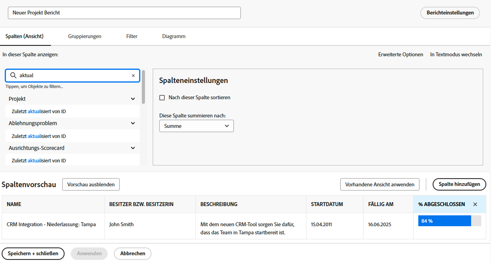
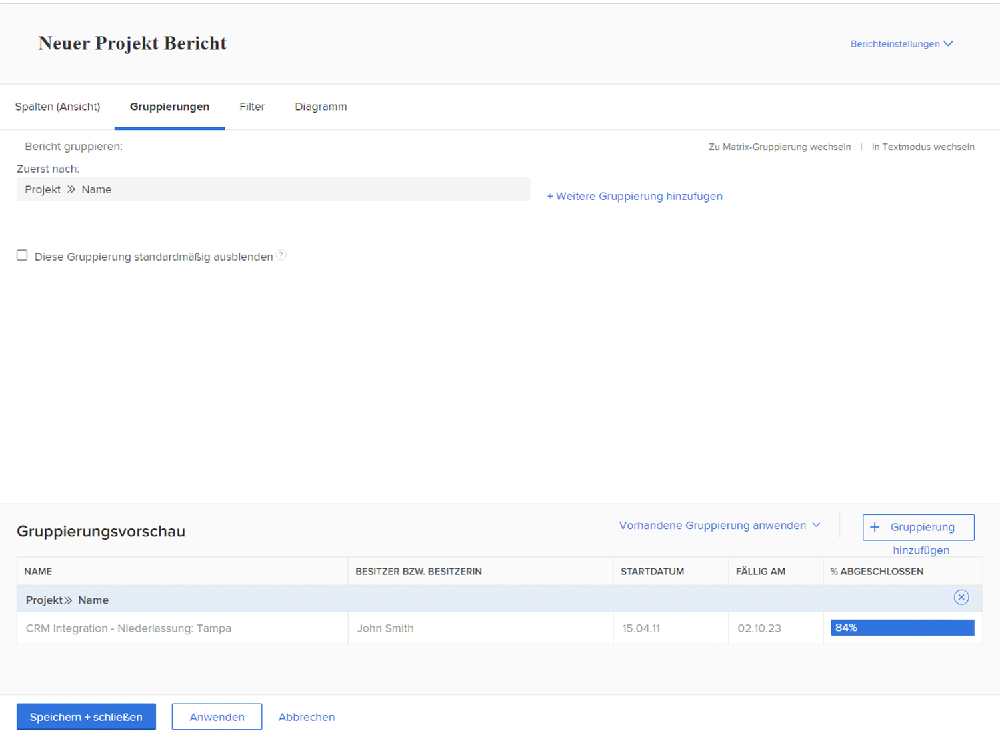
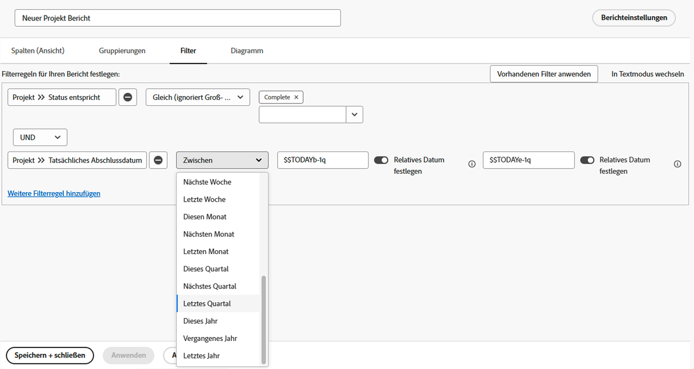
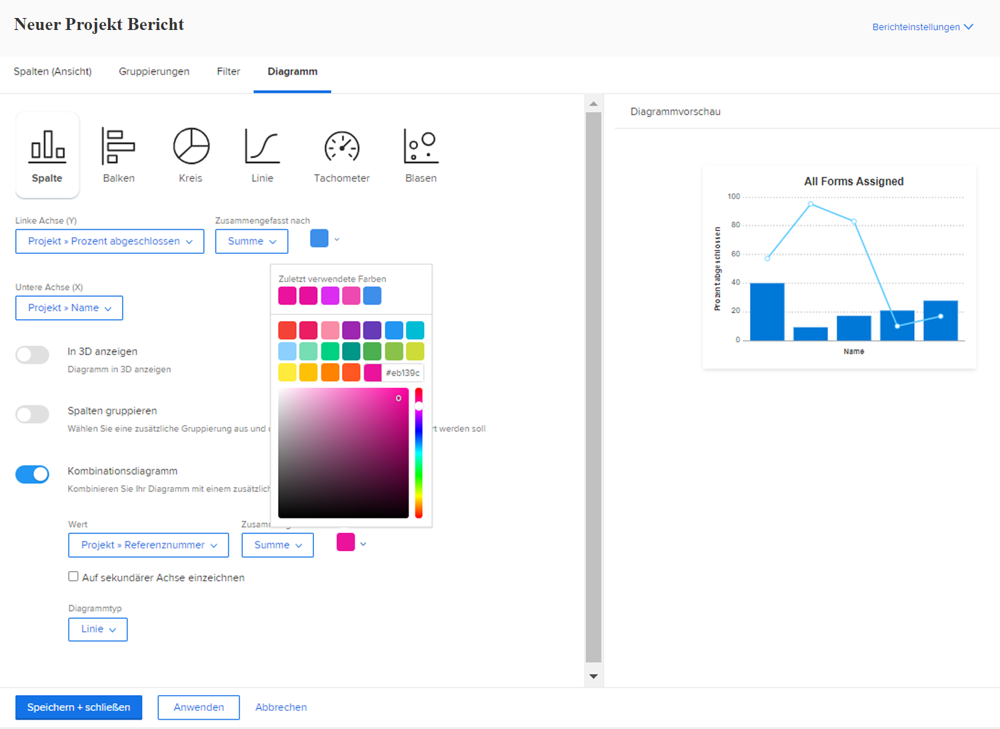

# Visualisieren von Daten mit Diagrammen in Berichten

In diesem Video wird erläutert, wie Diagramme zur effektiven Visualisierung von Daten verwendet werden können, insbesondere zur Verfolgung von Projektaufgaben. &#x200B; wird die Erstellung von zwei Berichtstypen in Workfront veranschaulicht:

**Bericht zu in Verzug geratenen Aufgaben nach Projekt:**

* Beginnen Sie mit einem Listenbericht und wenden Sie Filter an, um in aktuellen Projekten nur unvollständige, verspätete Aufgaben anzuzeigen. &#x200B;
* Aufgaben nach Projektname gruppieren und ein Tortendiagramm erstellen, um die Verteilung überfälliger Aufgaben auf die Projekte anzuzeigen. &#x200B;
* Legen Sie das Diagramm als Standardregisterkarte für einfachen Zugriff fest. &#x200B;

**Bericht zu Aufgaben nach Projekt und Fortschrittsstatus:**

* Kopieren Sie den ersten Bericht und fügen Sie eine weitere Gruppierung für den Fortschrittsstatus der Aufgaben hinzu.
* Entfernen Sie Filter, um alle Aufgaben einzuschließen und ihren Fortschritt während der Projektausführung anzuzeigen.
* Verwenden Sie ein gestapeltes Säulendiagramm, um die Gesamtzahl der Aufgaben pro Projekt anzuzeigen, wobei die einzelnen Säulen für die verschiedenen Fortschrittsstatus stehen.
* Passen Sie bei Bedarf Farben an und speichern Sie den Bericht.

In diesem Video wird gezeigt, wie Diagramme wie Torten- und gestapelte Säulendiagramme Einblicke in die Aufgabenverteilung und Projektleistung bieten können, sodass Benutzende Projekte vergleichen und den Aufgabenfortschritt visuell verstehen können. &#x200B;

>[!VIDEO](https://video.tv.adobe.com/v/3450023/?captions=ger&quality=12&learn=on&enablevpops=0)

## Wichtige Schlussfolgerungen

* **Diagramme erhöhen die Datenklarheit**: Die Visualisierung von Daten mit Diagrammen, wie z. B. Torten- oder Spaltendiagrammen, erleichtert das Verständnis der Aufgabenverteilung und des Projektfortschritts im Vergleich zu Listenberichten. &#x200B;
* **Nach spezifischen Einblicken filtern**: Durch die Anwendung von Filtern (z. B. unvollständige, in aktuellen Projekten in Verzug geratene Aufgaben) können Sie sich auf relevante Daten für eine zielgerichtete Analyse konzentrieren. &#x200B;
* **Gruppierung für bessere Organisation**: Durch Gruppierung von Aufgaben nach Projektname oder Fortschrittsstatus werden die Daten effektiv organisiert, was aussagekräftige Vergleiche zwischen den Projekten ermöglicht. &#x200B;
* **Diagrammanpassungsoptionen**: Benutzer können Diagrammtypen (z. B. Kreis, Spalte, Balken) auswählen und Farben anpassen, um sie an Voreinstellungen oder Branding anzupassen. &#x200B;
* **Gestapelte Säulendiagramme für detaillierte Erkenntnisse**: Gestapelte Säulendiagramme bieten eine umfassende Ansicht des Aufgabenfortschritts innerhalb von Projekten, wobei sowohl die Gesamtzahl der Aufgaben als auch deren Status in einer einzigen Visualisierung angezeigt werden.

## Aktivitäten zum Erstellen von Berichten mit Diagrammen

### Aktivität 1: Hinzufügen eines Diagramms zu einem Bericht

Das Quartalsende naht, und Sie möchten sehen, inwieweit die kürzlich abgeschlossenen Projekte ihr Budget eingehalten haben. Erstellen Sie einen Bericht, der die geplanten Kosten im Vergleich zu den tatsächlichen Kosten für Projekte zeigt. Sie möchten nur die Projekte sehen, die im letzten Quartal abgeschlossen wurden. Fügen Sie ein Diagramm mit einer Kombination von Spalten hinzu, das benutzerdefinierte Farben verwendet.

### Antwort 1

1. Wählen Sie **[!UICONTROL Berichte]** aus dem **[!UICONTROL Hauptmenü]** aus.
1. Klicken Sie auf das Menü **[!UICONTROL Neuer Bericht]** und wählen Sie **[!UICONTROL Projekt]** aus.
1. Klicken Sie auf die Registerkarte **[!UICONTROL Spalten (Ansicht)]** und dann auf **[!UICONTROL Spalte hinzufügen]**.
1. Wählen Sie [!UICONTROL Projekt] > [!UICONTROL Geplante Kosten] aus und fassen Sie diese Spalte mit **[!UICONTROL Summieren]** zusammen.
1. Klicken Sie erneut auf **[!UICONTROL Spalte hinzufügen]**.
1. Wählen Sie [!UICONTROL Projekt] > [!UICONTROL Tatsächliche Kosten] aus und fassen Sie diese Spalte mit **[!UICONTROL Summieren]** zusammen.

   

1. Legen Sie auf der Registerkarte **[!UICONTROL Gruppierungen]** fest, dass der Bericht nach [!UICONTROL Projekt] > [!UICONTROL Name] gruppiert werden soll.

   

1. Fügen Sie auf der Registerkarte **[!UICONTROL Filter]** zwei Filterregeln hinzu:

   * [!UICONTROL Projekt] > [!UICONTROL Status entspricht] > [!UICONTROL Abgeschlossen]
   * [!UICONTROL Projekt] > [!UICONTROL Tatsächliches Abschlussdatum] > [!UICONTROL Letztes Quartal]

   

1. Wählen Sie auf der Registerkarte **[!UICONTROL Diagramm]** die Option **[!UICONTROL Spalte]** für den Diagrammtyp aus.
1. Wählen Sie unter [!UICONTROL Linke Achse (Y)] die Option [!UICONTROL Geplante Kosten] aus.
1. Wählen Sie unter [!UICONTROL Untere Achse (X)] die Option [!UICONTROL Name] aus.
1. Klicken Sie auf die Schaltfläche **[!UICONTROL Kombinationsdiagramm]** und wählen Sie im Feld **[!UICONTROL Wert]** die Option [!UICONTROL Ist-Kosten] aus.
1. Wählen Sie im Feld **[!UICONTROL Diagrammtyp]** die Option für das Liniendiagramm aus.
1. Klicken Sie auf das Farbfeld, um die Farbe für die [!UICONTROL Ist-Kosten] zu ändern. Wählen Sie eine Farbe aus.
1. Klicken Sie auf **[!UICONTROL Speichern + schließen]**. Wenn Sie zur Eingabe eines Berichtnamens aufgefordert werden, nennen Sie ihn „Geplante vs. tatsächliche Kosten nach abgeschlossenem Projekt im letzten Quartal“.

   
