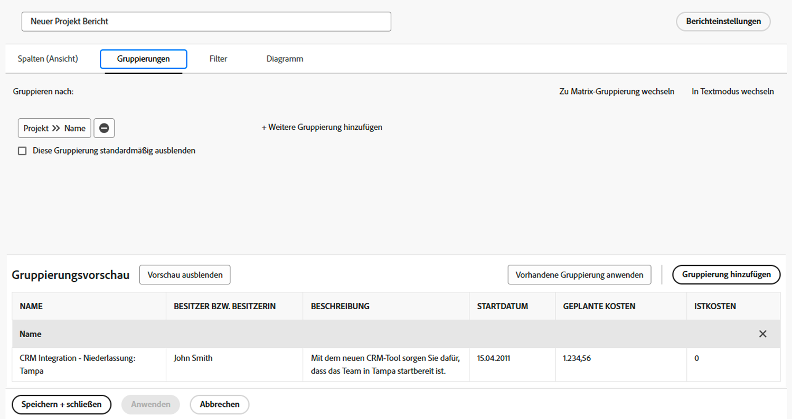

# Erstellen von Berichten mit Diagrammen

In diesem Video erfahren Sie:

* Wie Diagramme die Visualisierung von Daten verbessern können
* Verwendung der Diagrammtools von Workfront

>[!VIDEO](https://video.tv.adobe.com/v/335155/?quality=12&learn=on)

## Aktivität: Diagramm zu einem Bericht hinzufügen

Das Ende des Quartals nähert sich, und Sie möchten sehen, wie kürzlich abgeschlossene Projekte an ihren Budgets feststeckten. Erstellen Sie einen Bericht, der die geplanten Kosten im Vergleich zu den tatsächlichen Kosten für Projekte anzeigt. Sie möchten nur Projekte sehen, die im letzten Quartal abgeschlossen wurden. Fügen Sie mithilfe benutzerdefinierter Farben ein kombiniertes Spaltendiagramm hinzu.

## Antwort

1. Auswählen **[!UICONTROL Berichte]** von **[!UICONTROL Hauptmenü]**.
1. Klicken Sie auf **[!UICONTROL Neuer Bericht]** Menü und wählen Sie **[!UICONTROL Projekt]**.
1. Im **[!UICONTROL Spalten (Ansicht)]** Registerkarte, klicken Sie auf **[!UICONTROL Spalte hinzufügen]**.
1. Auswählen [!UICONTROL Projekt] > [!UICONTROL Geplante Kosten] und diese Spalte nach **[!UICONTROL Summe]**.
1. Klicken **[!UICONTROL Spalte hinzufügen]** erneut.
1. Auswählen [!UICONTROL Projekt] > [!UICONTROL Tatsächliche Kosten] und diese Spalte nach **[!UICONTROL Summe]**.

   

1. Im **[!UICONTROL Gruppierungen]** Registerkarte, den Bericht auf [!UICONTROL Projekt] > [!UICONTROL Name].

   

1. Im **[!UICONTROL Filter]** Fügen Sie zwei Filterregeln hinzu:

   * [!UICONTROL Projekt] > [!UICONTROL Status entspricht] > [!UICONTROL Fertig]
   * [!UICONTROL Projekt] >[!UICONTROL  Tatsächliches Abschlussdatum] > [!UICONTROL Letztes Quartal]

   

1. Im **[!UICONTROL Diagramm]** Registerkarte, wählen Sie **[!UICONTROL Spalte]** für den Diagrammtyp.
1. Für [!UICONTROL Linke (Y) Achse]auswählen [!UICONTROL Projekt] > [!UICONTROL Geplante Kosten].
1. Für [!UICONTROL Untere (X) Achse]auswählen [!UICONTROL Projekt] > [!UICONTROL Name].
1. Klicken Sie auf **[!UICONTROL Kombinationsdiagramm]** Schaltfläche und wählen Sie [!UICONTROL Projekt] > [!UICONTROL Tatsächliche Kosten] im **[!UICONTROL Wert]** -Feld.
1. Klicken Sie auf den Pfeil neben dem Farbfeld, um die [!UICONTROL Tatsächliche Kosten] Farbe. Wählen Sie eine der angezeigten Farben aus oder klicken Sie auf das Feld in der rechten unteren Ecke, um die Farbpalette aufzurufen.
1. Klicken Sie auf **[!UICONTROL Speichern und schließen]**. Wenn Sie nach einem Berichtsnamen gefragt werden, nennen Sie ihn &quot;Geplant vs. Tatsächliche Kosten nach Projekt abgeschlossen im letzten Quartal&quot;.

   
