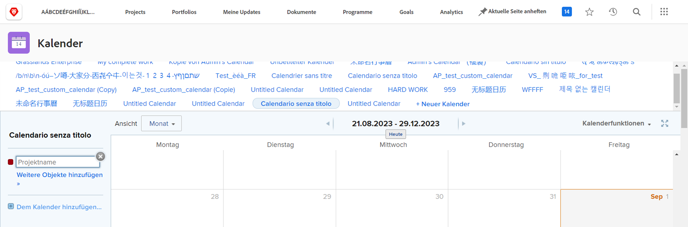
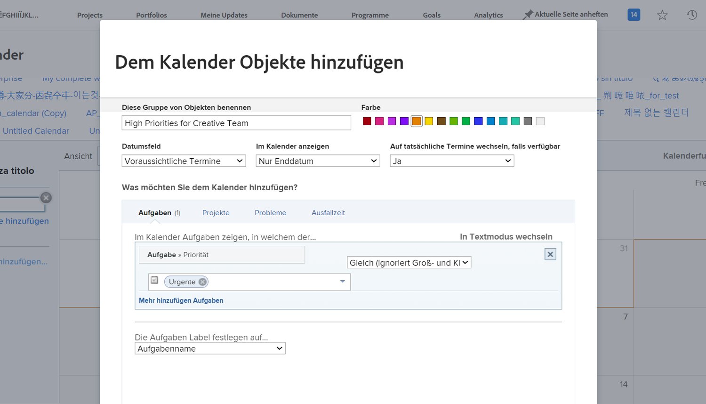
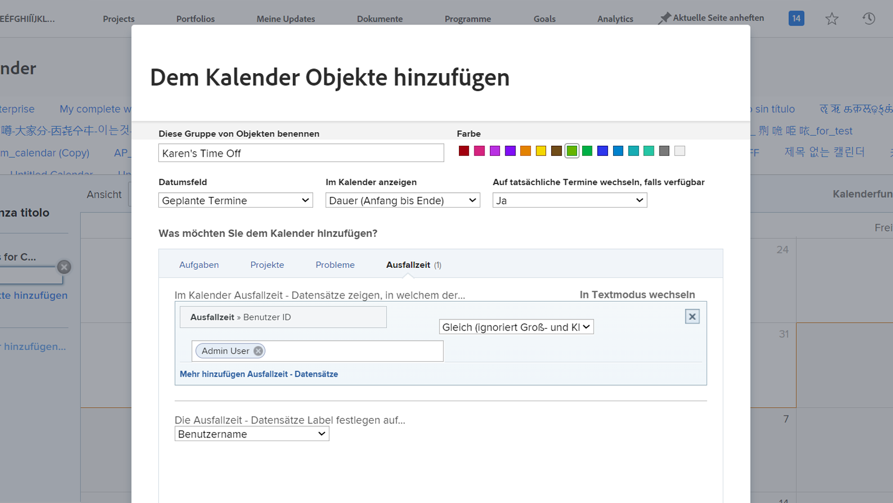

# Benutzerdefinierten Kalender erstellen

In diesem Abschnitt lernen Sie Folgendes:

* Neuen Kalender erstellen
* Kalendergruppierung erstellen
* Hinzufügen von Arbeitselementen zur Kalendergruppierung
* Erstellen einer Kalenderzeit

So erstellen Sie Ihren eigenen benutzerdefinierten Kalender.

## Fügen Sie zunächst einen neuen Kalender hinzu

1. Aus dem **[!UICONTROL Hauptmenü]**, wählen Sie die **[!UICONTROL Kalender]** Bereich.
1. Klicken Sie auf **[!UICONTROL Neuer Kalender]** -Option.
1. Geben Sie einen Namen für den Kalender ein und drücken Sie die Eingabetaste **[!UICONTROL Rückgabe]**.

## Fügen Sie anschließend eine Kalendergruppierung hinzu.

1. Um Elemente anzuzeigen, die sich auf ein bestimmtes Projekt beziehen, geben Sie den Projektnamen in die [!UICONTROL grouping] (zeigt alle Aufgaben an, die mit diesem Projekt verbunden sind).
1. Oder klicken Sie auf **[!UICONTROL Erweiterte Elemente hinzufügen]** Option zum Einbeziehen von Arbeitselementen aus verschiedenen Projekten in das System.

## Fügen Sie drittens Arbeitselemente zur Kalendergruppierung hinzu.

1. Benennen Sie die Gruppierung, um den Inhalt anzuzeigen.
1. Wählen Sie eine Farbbezeichnung für die Gruppe aus.
1. Wählen Sie den zu verwendenden Datentyp aus.[!UICONTROL Vorgeschlagene Datumsangaben], [!UICONTROL Geplante Datumsangaben]oder [!UICONTROL Benutzerdefiniert]. ([!UICONTROL Benutzerdefiniert] Datumsfelder sind Datumsfelder, die in [!UICONTROL benutzerdefinierte Formulare].
1. Wählen Sie aus, welche Daten im Kalender angezeigt werden sollen.[!UICONTROL Nur Enddatum], [!UICONTROL Nur Startdatum]oder [!UICONTROL Dauer (Start bis Ende)].
1. Wenn Sie [!UICONTROL Tatsächliche Datumswerte] Wenn diese Informationen verfügbar sind, wählen Sie im Menü die Option Ja . Wählen Sie Nein aus, wenn Sie immer den ausgewählten Datumstyp wünschen ([!UICONTROL Projiziert], [!UICONTROL Geplant]oder [!UICONTROL Benutzerdefiniert]), um angezeigt zu werden.
1. Wählen Sie den Elementtyp aus, den Sie im Kalender sehen möchten.[!UICONTROL Aufgaben], [!UICONTROL Projekte], [!UICONTROL Probleme]oder [!UICONTROL Zeitlimit].
1. Richten Sie die Filter ein, um die gewünschten Informationen anzuzeigen.
1. Klicken Sie auf **[!UICONTROL Speichern]**.

>[!NOTE]
>
>Mit der Option Zum Kalender hinzufügen können einem vorhandenen Kalender weitere Gruppierungen hinzugefügt werden.

## Erstellen eines Kalenders mit einer persönlichen Zeitzone

[!DNL Workfront] bietet Ihnen die Möglichkeit, Ihre Auszeit mit der persönlichen Zeitabweichung in Ihrem Benutzerprofil anzugeben. Dadurch werden Projektmanager darauf hingewiesen, dass Sie nicht verfügbar sind und geplante Abschlussdaten bei Bedarf automatisch oder manuell angepasst werden können.

Im Kalenderbereich können Sie eine Kalenderansicht erstellen, die diese Zeitpunkte der Einsendungen anzeigt.

So erstellen Sie einen Kalender für eine bestimmte Person:

1. Klicken **[!UICONTROL Zum Kalender hinzufügen]** im linken Bereich.
1. Klicken **[!UICONTROL Erweiterte Elemente hinzufügen]**.
1. Benennen Sie die Gruppierung, um den Inhalt anzuzeigen.
1. Wählen Sie eine Farbbezeichnung für die Gruppierung aus.
1. Legen Sie die [!UICONTROL Datumsfeld] nach [!UICONTROL Geplante Datumsangaben].
1. Wählen Sie aus, welche Daten im Kalender angezeigt werden sollen.[!UICONTROL Dauer].
1. Ignorieren Sie, wie die Informationen angezeigt werden, wenn die tatsächlichen Daten nicht verfügbar sind. Dies gilt nicht.
1. Auswählen [!UICONTROL Zeitlimit] für den Informationstyp, den Sie sehen möchten.
1. Legen Sie für den Filter die Benutzer-ID auf den Namen des Teammitglieds fest.
1. Klicken Sie auf **[!UICONTROL Speichern]**.

