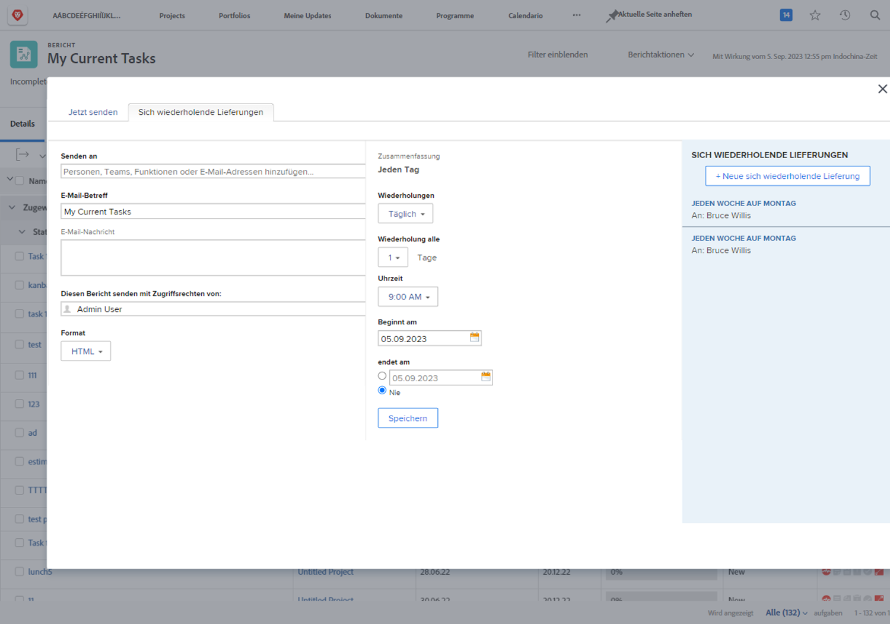

# Effektives Senden und Freigeben von Berichten

In diesem Video lernen Sie Folgendes:

* Wie Berichte an Benutzende, Teams oder beliebige E-Mail-Adressen gesendet werden
* Wie Berichte für andere freigegeben werden
* Was die Empfängerinnen und Empfänger in einem Workfront-Bericht sehen und was sie damit tun können

>[!VIDEO](https://video.tv.adobe.com/v/335158/?quality=12&learn=on&enablevpops=0)

## Wichtige Schlussfolgerungen

* **Berichte an externe Benutzer senden:** Sie können Berichte an Nicht-Workfront-Benutzer senden, indem Sie deren E-Mail-Adressen eingeben, um die Freigabe von Daten außerhalb Ihres Unternehmens zu erleichtern. &#x200B;
* **Sichtbarkeit der Zugriffsberechtigungen:** Ansicht des Berichts durch den Empfänger hängt von den von Ihnen festgelegten Zugriffsrechten ab. Dies gewährleistet Datensicherheit und angemessene Sichtbarkeit. &#x200B;
* **Sich wiederholende Sendungen für Momentaufnahmen:** Terminierte Sendungen liefern eingefrorene Momentaufnahmen der Daten zu bestimmten Zeiten, was für die Verfolgung von Trends und die Pflege eines Verlaufs der Projektdaten nützlich ist. &#x200B;
* **Berichte für Teams freigeben:** Berichte können für Einzelpersonen, Teams oder Aufgabengebiete freigegeben werden, wobei Berechtigungen zum Anzeigen oder Verwalten gewährt werden können. &#x200B; freigegebenen Berichte werden im Abschnitt „Für mich freigegeben“ für Benutzende angezeigt. &#x200B;
* **Öffentliche und systemweite Freigabe:** Berichte können über öffentliche Links für externe Benutzende freigegeben oder systemweit für alle Workfront-Benutzenden sichtbar gemacht werden, was eine flexible Datenfreigabe ermöglicht.

## Aktivitäten zum Senden und Freigeben von Berichten

### Aktivität 1: Senden eines Berichts

Senden Sie sich selbst jeden Montag um 5 Uhr morgens einen Bericht in Form einer Excel-Tabelle. Auf diese Weise können Sie automatisch wöchentliche Berichte erstellen, die Sie später nutzen können, um Trends zu erkennen.

### Antwort 1

1. Zeigen Sie einen beliebigen Bericht an, den Sie erstellt haben, und wählen Sie **[!UICONTROL Bericht senden]** aus dem Menü **[!UICONTROL Berichtsaktionen]** aus.
1. Klicken Sie auf die Registerkarte **[!UICONTROL Wiederholte Sendungen]**.
1. Geben Sie Ihre E-Mail-Adresse in das Feld **[!UICONTROL Senden an]** ein.
1. Geben Sie einen E-Mail-Betreff an.
1. Ändern Sie das Format in Excel.
1. Stellen Sie **[!UICONTROL Wiederholungen]** auf [!UICONTROL Wöchentlich] ein.
1. Stellen Sie die [!UICONTROL Zeit] auf 5 Uhr ein.
1. Setzen Sie [!UICONTROL Wiederholungen am] auf Montag.
1. Klicken Sie auf **[!UICONTROL Speichern]**.

>[!NOTE]
>
>Sie sehen jetzt Ihren neuen wiederkehrenden Versand im Bereich [!UICONTROL Wiederkehrende Sendungen] auf der rechten Seite. Sie können mehrere Sendungen für einen Bericht einrichten, die dann alle hier erscheinen.

**LÖSCHEN EINES VERSANDS**

Wählen Sie den soeben erstellten Versand aus und klicken Sie auf „Löschen“ (neben der Schaltfläche **[!UICONTROL Speichern]**).
