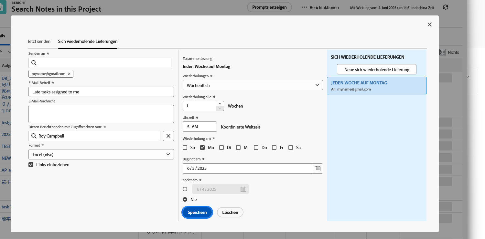

# Berichte senden und freigeben

In diesem Video erfahren Sie:

* Senden von Berichten an Benutzer, Teams oder eine beliebige E-Mail-Adresse
* Berichte für andere freigeben
* Was Empfänger mit einem Workfront-Bericht sehen und tun können

>[!VIDEO](https://video.tv.adobe.com/v/335158/?quality=12&learn=on)

## Aktivität: Bericht senden

Senden Sie sich jeden Montag um 5 Uhr einen Bericht als Excel-Tabelle. Auf diese Weise können Sie wöchentliche Berichte automatisch erfassen, mit denen Sie später Trends sehen können.

## Antwort

1. Zeigen Sie einen von Ihnen erstellten Bericht an und wählen Sie **[!UICONTROL Bericht senden]** von **[!UICONTROL Berichtaktionen]** Menü.
1. Klicken Sie auf **[!UICONTROL Wiederholen von Sendungen]** Registerkarte.
1. Geben Sie Ihre E-Mail-Adresse in das Feld **[!UICONTROL Senden an]** -Feld.
1. Geben Sie einen E-Mail-Betreff an.
1. Ändern Sie das Format in Excel.
1. Satz **[!UICONTROL Wiederholungen]** nach [!UICONTROL Wöchentlich].
1. Legen Sie die [!UICONTROL Zeit] bis 5 Uhr.
1. Satz [!UICONTROL Wiederholt] bis Montag.
1. Klicken Sie auf **[!UICONTROL Speichern]**.

>[!NOTE]
>
>Beachten Sie Ihre neue wiederholte Bereitstellung im [!UICONTROL Wiederholen von Sendungen] auf der rechten Seite. Sie können mehrere Sendungen für einen Bericht einrichten, die hier alle angezeigt werden.

**DELETE EINES VERSANDS**

Wählen Sie den soeben erstellten Versand aus und klicken Sie auf Löschen (neben dem **[!UICONTROL Speichern]** Schaltfläche).
