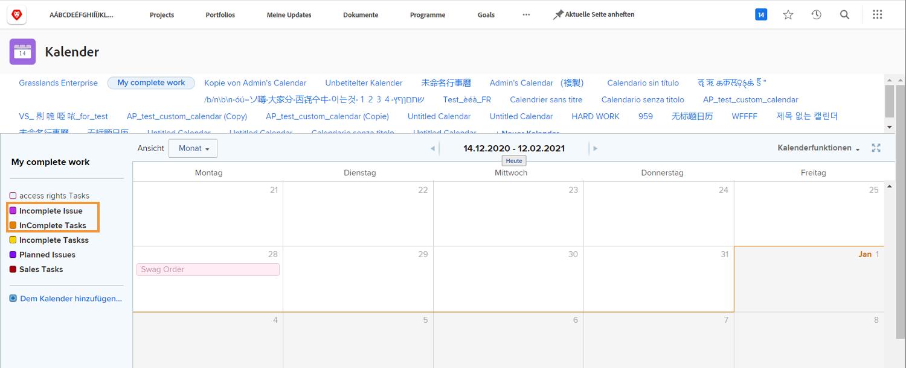
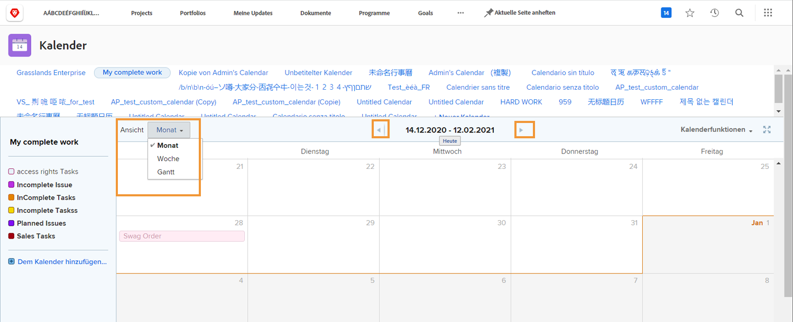
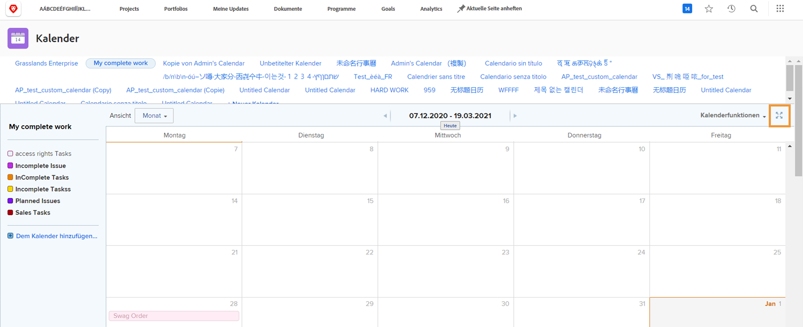
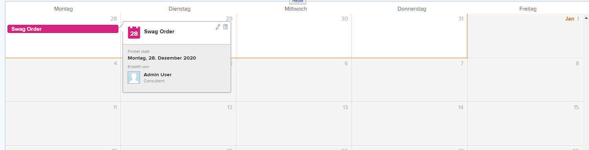
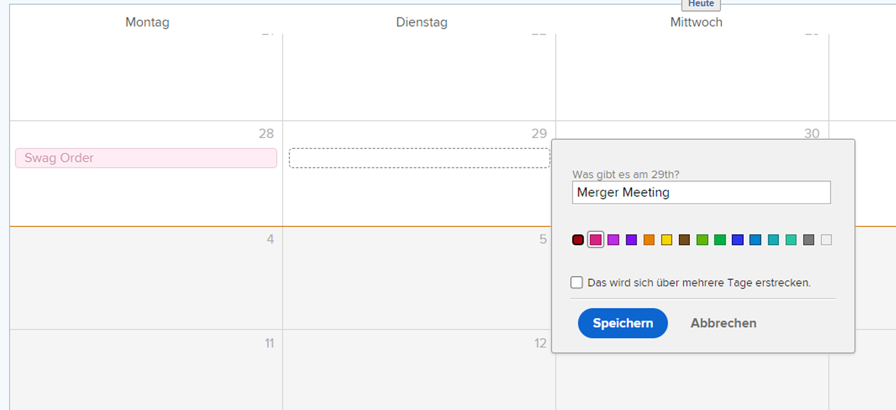

# Grundlegendes zur Kalenderschnittstelle

In diesem Abschnitt erfahren Sie mehr über:

* Kalendergruppierungen
* Kalenderansichten
* Menü &quot;Kalenderaktionen&quot;
* Und wie Sie ein Ad-hoc-Kalenderelement erstellen

Bevor wir Ihre eigenen benutzerdefinierten Kalender erstellen, sollten wir einen Überblick über die grundlegenden Funktionen in benutzerdefinierten Kalendern geben.

## Kalendergruppierungen

Ein einzelner Kalender kann in verschiedene Arbeitselementgruppen unterteilt werden. Jede Gruppierung kann ein- und ausgeschaltet werden, sodass sich Benutzer jederzeit auf die Arbeitselemente konzentrieren können, die am wichtigsten sind.

## Kalenderansichten

Der Kalender kann in Monat, Woche oder [!UICONTROL Gantt] Format. Verwenden Sie die Bildlaufleiste auf der Seite oder die Pfeile oben, um durch den Kalender zu navigieren. Die [!UICONTROL Gantt] -Ansicht ermöglicht es Ihnen, Ihre Arbeit aus einer anderen Perspektive zu sehen. Finden Sie die Ansicht, die für Sie am besten geeignet ist.

![Ein Bild des Kalenderbildschirms im [!UICONTROL Gantt] Ansicht](assets/calendar-1-1bb.png)

## [!UICONTROL Kalenderaktionen] Menü

Wie andere Arbeitselemente haben auch Kalender eine [!UICONTROL Aktionen] Menü, über das Sie die Wochenenden eines Kalenders anzeigen können; einen Kalender löschen oder kopieren; Sie können einen Kalender für einzelne Workfront-Benutzer, systemweit oder für externe Benutzer freigeben. und fügen Sie den Kalender zu Ihrem [!UICONTROL Favoriten] Menü.

![Ein Bild der [!UICONTROL Kalenderaktionen] Bildschirm](assets/calendar-1-1c.png)

## Vollbildmodus

Zeigen Sie den Kalender im Vollbildmodus an, indem Sie auf das Vollbildsymbol klicken. Klicken Sie erneut auf , um zur Originalgröße zurückzukehren.

## Zusammenfassungsinformationen

Wählen Sie ein Element im Kalender aus, um die Zusammenfassungsdetails des Elements anzuzeigen, einschließlich Name, Quellprojekt, Status, Zuweisung, Fortschrittsstatus und Fälligkeitsdatum.

## Ad-hoc-Ereignisse

Doppelklicken Sie auf , um Ad-hoc-Ereignisse in einem Kalender zu erstellen, die Ihren Zeitplan oder andere Arbeitselemente darstellen.

>[!NOTE]
>
>Beim Erstellen eines Ad-hoc-Ereignisses wird KEINE Aufgabe in Workfront erstellt.

