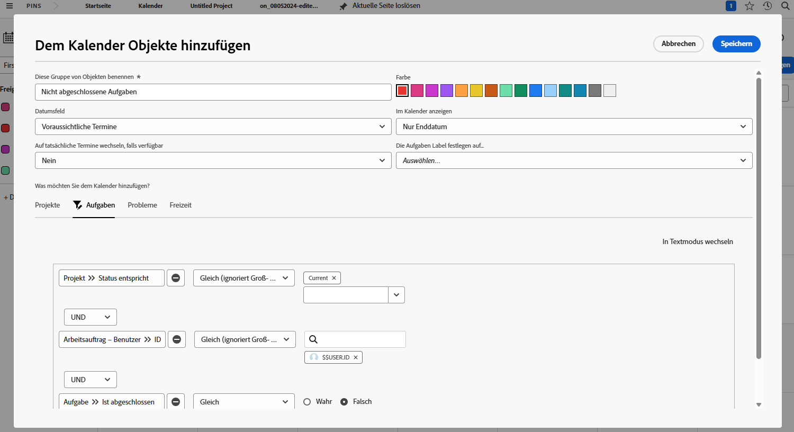
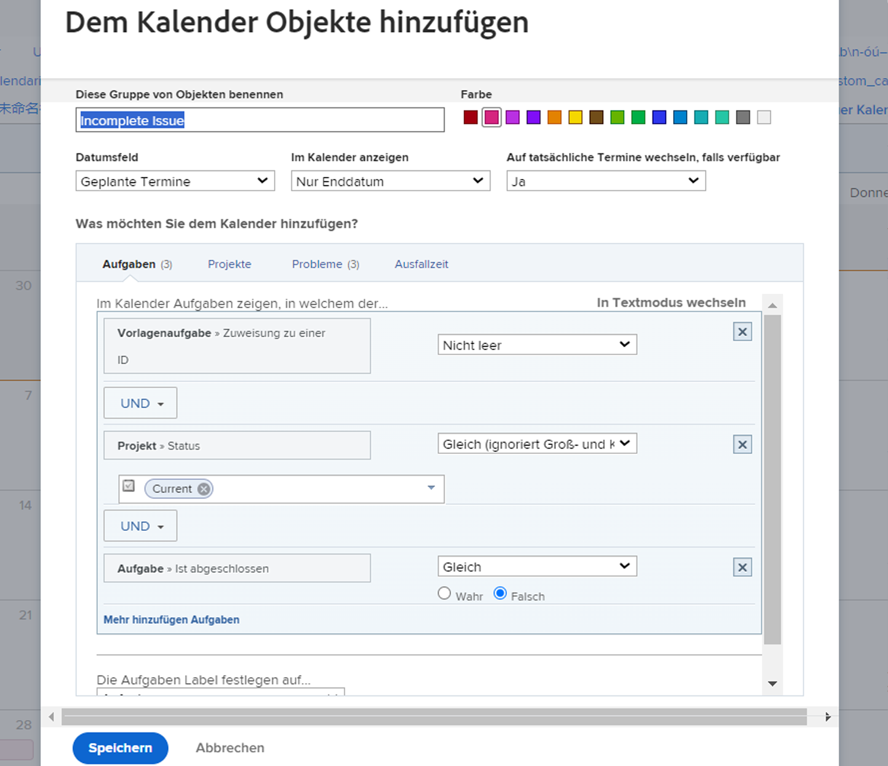
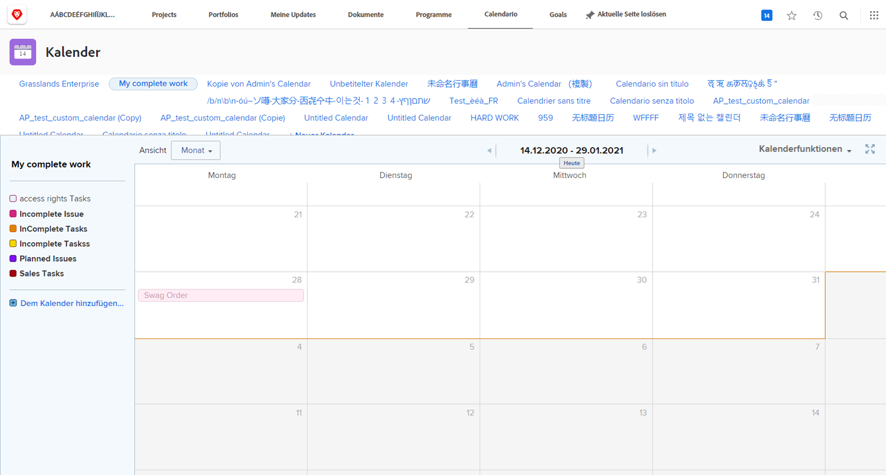

# Erstellen eines Kalenders

In dieser Aktivität erhalten Sie praktische Erfahrungen beim Erstellen Ihres eigenen Kalenders.

## Aktivität: Kalender erstellen

Erstellen Sie einen Kundenkalender mit dem Namen &quot;Meine unvollständige Arbeit&quot;.

Schließen Sie eine Kalendergruppe mit dem Namen &quot;Unvollständige Aufgaben&quot;ein, die alle unvollständigen Aufgaben anzeigt, die Ihnen in aktuellen Projekten zugewiesen sind.

Wählen Sie als Farbe für diese Elemente Rot aus.

Schließen Sie eine weitere Kalendergruppe mit dem Namen &quot;Unvollständige Probleme&quot;ein, die alle unvollständigen Probleme anzeigt, die Ihnen in aktuellen Projekten zugewiesen sind. Wählen Sie blau als Farbe für diese Elemente aus.

## Antwort

1. Navigieren Sie im Hauptmenü zum Bereich Kalender .
1. Klicken Sie auf die Schaltfläche Neuer Kalender und benennen Sie den Kalender &quot;Meine unvollständige Arbeit&quot;.
1. Klicken Sie unter der ersten Gruppierung auf Erweiterte Elemente hinzufügen .
1. Nennen Sie im sich öffnenden Fenster Elemente zum Kalender hinzufügen die Gruppe &quot;Unvollständige Aufgaben&quot;.
1. Wählen Sie als Farbe Rot aus.
1. Ändern Sie das Datumsfeld in &quot;Geplante Datumswerte&quot;.
1. Setzen Sie im Kalender das Feld Anzeigen auf Enddatum .
1. Stellen Sie den Schalter auf das tatsächliche Datum ein, wenn das Feld verfügbar ist, auf &quot;Nein&quot;.

   

1. In der Liste Was möchten Sie zum Kalender hinzufügen? wählen Sie Aufgaben aus.
1. Fügen Sie drei Filterregeln hinzu:

   * Projekt > Status entspricht > Gleich > Aktuell
   * Zuweisen von Benutzern > ID > Gleich > $$USER.ID
   * Aufgabe > Ist abgeschlossen > Gleich > False

1. Klicken Sie auf Speichern.

   

1. Erstellen Sie eine zweite Gruppierung, indem Sie auf Zum Kalender hinzufügen klicken.
1. Klicken Sie unter dieser Gruppierung auf Erweiterte Elemente hinzufügen.
1. Nennen Sie im sich öffnenden Fenster Elemente zum Kalender hinzufügen die Gruppe &quot;Unvollständige Probleme&quot;.
1. Wählen Sie Blau als Farbe aus.
1. Ändern Sie das Datumsfeld in &quot;Geplante Datumswerte&quot;.
1. Setzen Sie im Kalender das Feld Anzeigen auf Enddatum .
1. Stellen Sie den Schalter auf das tatsächliche Datum ein, wenn das Feld verfügbar ist, auf &quot;Nein&quot;.
1. In der Liste Was möchten Sie zum Kalender hinzufügen? wählen Sie Probleme aus.
1. Fügen Sie die folgenden drei Filterregeln hinzu:

   * Projekt > Status entspricht > Gleich > Aktuell
   * Zuweisen von Benutzern > ID > Gleich > $$USER.ID
   * Problem > Ist abgeschlossen > Gleich > Falsch

1. Klicken Sie auf Speichern.

   

Da Sie $$USER.ID in den Filtern verwendet haben, können Sie diesen Kalender für andere freigeben und sie sehen ihre eigenen unvollständigen Aufgaben und Probleme.
