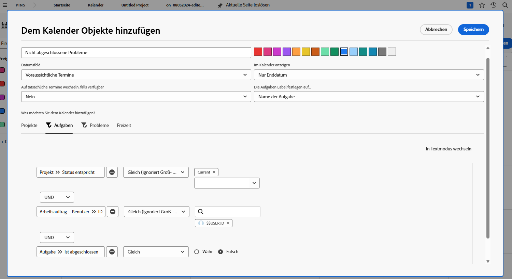

# Sie sind an der Reihe, einen Kalenderbericht zu erstellen

In dieser Aktivität machen Sie praktische Erfahrungen beim Erstellen Ihres eigenen Kalenders.

## Aktivität: Einen Kalender erstellen

Erstellen Sie einen Kundenkalender mit dem Namen „Meine nicht abgeschlossene Arbeit“.

Fügen Sie eine Kalendergruppe mit dem Namen „Nicht abgeschlossene Aufgaben“ ein, in der alle unvollständigen Aufgaben angezeigt werden, die Ihnen unter „Aktuelle Projekte“ zugewiesen sind.

Wählen Sie als Farbe für diese Elemente Rot aus.

Fügen Sie eine weitere Kalendergruppe mit dem Namen „Nicht abgeschlossene Probleme“ hinzu, die alle nicht abgeschlossenen Probleme enthält, die Ihnen unter „Aktuelle Projekte“ zugewiesen sind. Wählen Sie als Farbe für diese Elemente Blau aus.

## Antwort

1. Navigieren Sie im Hauptmenü zum Bereich „Kalender“.
1. Klicken Sie auf die Schaltfläche „Neuer Kalender“ und nennen Sie den Kalender „Meine nicht abgeschlossene Arbeit“.
1. Klicken Sie auf die Schaltfläche „Dem Kalender hinzufügen“ und dann auf „Weitere Objekte hinzufügen“.
1. Nennen Sie im sich öffnenden Fenster „Elemente zum Kalender hinzufügen“ die Gruppe „Nicht abgeschlossene Aufgaben“.
1. Wählen Sie als Farbe Rot aus.
1. Ändern Sie das Datumsfeld zu „Geplante Datumsangaben“.
1. Legen Sie das Feld „Im Kalender dieses Feld anzeigen“ auf „Enddatum“ fest.
1. Setzen Sie das Feld „Wenn verfügbar, zu tatsächlichen Daten wechseln“ auf „Nein“.
1. Wählen Sie im Abschnitt „Was möchten Sie zum Kalender hinzufügen?“ die Option „Aufgaben“ aus. Klicken Sie dann auf die Schaltfläche „Aufgaben hinzufügen“.
1. Fügen Sie drei Filterregeln hinzu:

   * Projekt > Status entspricht > Gleich > Aktuell
   * Arbeitsauftrag – Benutzer > ID > Gleich > $$USER.ID
   * Aufgabe > Ist abgeschlossen > Gleich > Falsch

1. Klicken Sie auf Speichern.

   

1. Erstellen Sie eine zweite Gruppierung, indem Sie auf „Dem Kalender hinzufügen“ und dann auf „Weitere Objekte hinzufügen“ klicken.
1. Nennen Sie in dem sich öffnenden Fenster „Elemente zum Kalender hinzufügen“ die Gruppe „Nicht abgeschlossene Probleme“.
1. Wählen Sie als Farbe Blau aus.
1. Ändern Sie das Datumsfeld zu „Geplante Datumsangaben“.
1. Legen Sie das Feld „Im Kalender dieses Feld anzeigen“ auf „Enddatum“ fest.
1. Setzen Sie das Feld „Wenn verfügbar, zu tatsächlichen Daten wechseln“ auf „Nein“.
1. Wählen Sie im Abschnitt „Was möchten Sie zum Kalender hinzufügen?“ die Option „Probleme“ aus. Klicken Sie dann auf die Schaltfläche „Probleme hinzufügen“.
1. Fügen Sie die folgenden drei Filterregeln hinzu:

   * Projekt > Status entspricht > Gleich > Aktuell
   * Arbeitsauftrag – Benutzer > ID > Gleich > $$USER.ID
   * Problem > Ist abgeschlossen > Gleich > Falsch

1. Klicken Sie auf Speichern.

   

Da Sie „$$USER.ID“ in den Filtern verwendet haben, können Sie diesen Kalender für andere freigeben, sodass sie ihre eigenen unvollständigen Aufgaben und Probleme sehen können.
