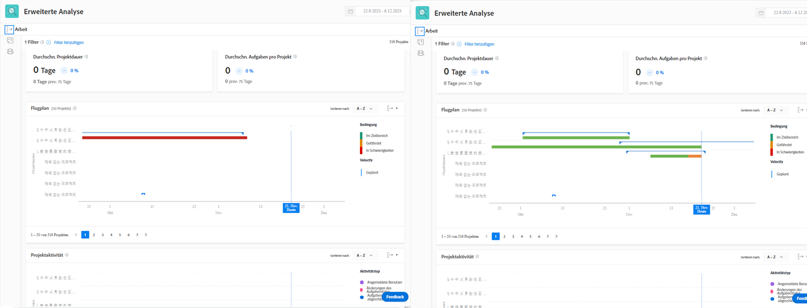

# Grundlegendes zu KPIs

In diesem Video erfahren Sie:

* So erhalten Sie einen Wert aus den KPI-Daten

>[!VIDEO](https://video.tv.adobe.com/v/335046/?quality=12&learn=on)

## KPIs vergleichen

KPIs bieten nicht nur wertvolle Informationen darüber, was in der Gegenwart geschieht, sondern geben Benutzern die Möglichkeit, Aktivitätsänderungen im Laufe der Zeit oder den Unterschied zwischen Portfolios, Programmen, Projekteigentümern oder anderen verwendeten Filtern zu vergleichen.

Sie können beispielsweise Analysen in zwei Browserregisterkarten abrufen, um KPIs zu vergleichen.
