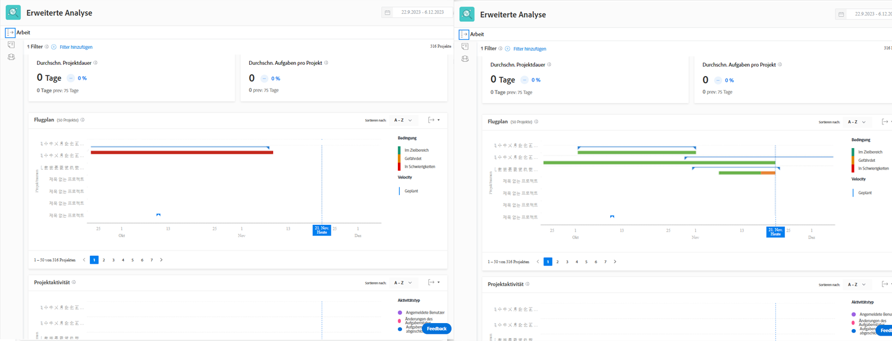

# Grundlegendes zu KPIs

In diesem Video lernen Sie Folgendes:

* So ziehen Sie einen Nutzen aus den KPI-Daten

>[!VIDEO](https://video.tv.adobe.com/v/335046/?quality=12&learn=on&enablevpops=1)

## Vergleichen von KPIs

KPIs bieten nicht nur wertvolle Informationen darüber, was in der Gegenwart geschieht, sondern geben Benutzenden auch die Möglichkeit, Aktivitätsänderungen im Laufe der Zeit oder den Unterschied zwischen Portfolios, Programmen, Projektinhaberinnen und -inhabern oder anderen verwendeten Filtern zu vergleichen.

Sie können beispielsweise Analysen in zwei Browser-Registerkarten abrufen, um KPIs zu vergleichen.
