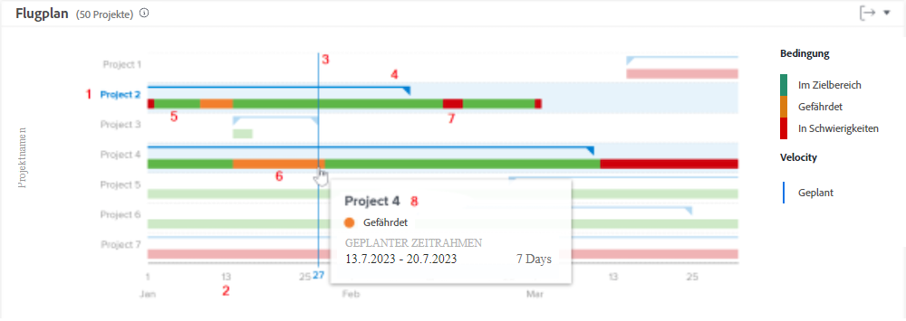
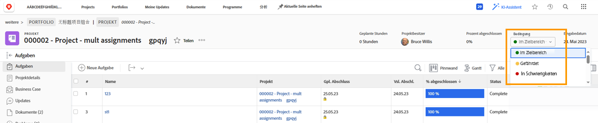
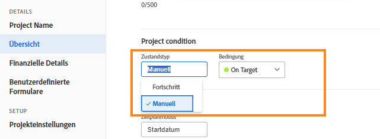

# Grundlegendes zur Navigation und Überprüfung von Projekten

In diesem Video lernen Sie Folgendes:

* Wie man das Flugplandiagramm liest

>[!VIDEO](https://video.tv.adobe.com/v/335047/?quality=12&learn=on)

## Flugplandiagramm

Im Diagramm sehen Sie Folgendes:

1. Die Projektnamen befinden sich auf der linken Seite.
1. Die Datumsangaben werden unten angezeigt.
1. Die vertikale blaue Linie zeigt das Datum an, über dem sich Ihr Mauszeiger befindet.
1. Horizontale blaue Linien zeigen das geplante Start- und Enddatum des Projekts an.
1. Grüne Linien zeigen an, dass das Projekt im Plan liegt.
1. Orangefarbene Linien weisen darauf hin, dass das Projekt gefährdet ist.
1. Rote Linien zeigen an, dass das Projekt in Schwierigkeiten ist.

Diese Informationen über Ihre Projekte helfen Ihnen bei der Bestimmung folgender Punkte:

* Welche Ereignisse ein Projekt über das geplante Abschlussdatum hinaus verlängern.
* Wann ein Projekt anfängt, Probleme zu machen.
* Wie viele Projekte im gleichen Zeitraum offen sind.
* Wie viele Projekte aktiv sind.
* Welche Projekte besondere Aufmerksamkeit oder Unterstützung benötigen.

## Der Zustand basiert auf dem Fortschrittsstatus

Der Projektzustand ist eine visuelle Darstellung des Projektfortschritts. Workfront bestimmt den Zustand anhand der Fortschrittsstatus der Aufgaben im Projekt.

Der Zustand eines Projekts kann wie folgt eingestellt werden:

* **Manuell**, durch Benutzende mit Zugriff auf die Projektverwaltung, wenn der Zustandstyp des Projekts auf manuell eingestellt ist. So können Sie den Zustand des Projekts unabhängig vom kritischen Pfad festlegen.
* **Automatisch**, durch Workfront, wenn der Zustandstyp des Projekts auf „Fortschrittsstatus“ eingestellt ist.

Workfront empfiehlt, den Zustandstyp auf „Fortschrittsstatus“ einzustellen, damit Sie einen klaren Hinweis auf den tatsächlichen Fortschritt des Projekts erhalten, der auf dem Fortschritt Ihrer Aufgaben basiert.

In der Einstellung „Fortschrittsstatus“ kann der Projektzustand wie folgt sein:

* **Im Zeitplan**—Wenn der Fortschrittsstatus der letzten Aufgabe auf dem kritischen Pfad im Zeitplan ist, ist der Zustand des Projekts im Zeitplan. Das Projekt sollte planmäßig abgeschlossen werden.
* **Gefährdet** – Wenn der Fortschrittsstatus der letzten Aufgabe auf dem kritischen Pfad „Rückstand oder „Gefährdet“ ist, dann ist der Zustand des Projekts „Gefährdet“. Das Projekt wird voraussichtlich mit Verspätung abgeschlossen, ist aber noch nicht überfällig.
* **In Schwierigkeiten** – Wenn der Fortschrittsstatus der letzten Aufgabe auf dem kritischen Pfad „Verspätet“ ist, dann ist der Zustand des Projekts „In Schwierigkeiten“. Das Fälligkeitsdatum liegt in der Vergangenheit und das Projekt ist nun verspätet.

>[!NOTE]
>
>Die Zustände können an Ihre Umgebung angepasst werden, sodass Sie möglicherweise mehr als drei Optionen finden oder die Namen anders lauten als die oben genannten. Informationen zum Anpassen von Bedingungen finden Sie in dem Artikel [Erstellen oder Bearbeiten eines benutzerdefinierten Zustands](https://experienceleague.adobe.com/docs/workfront/using/administration-and-setup/customize/custom-conditions/create-edit-custom-conditions.html?lang=de).
