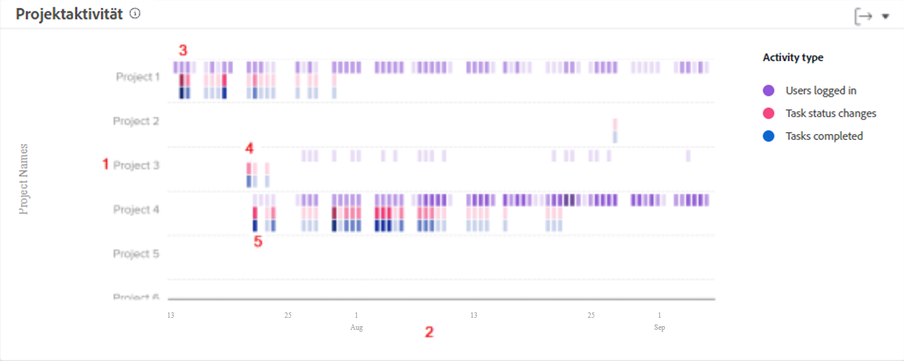

# Grundlegendes zur Navigation und Überprüfung der Projektaktivität

In diesem Video lernen Sie Folgendes:

* Vergleichen von Projekten anhand von angemeldeten Benutzenden, Änderungen des Aufgabenstatus und abgeschlossenen Aufgaben

>[!VIDEO](https://video.tv.adobe.com/v/335049/?quality=12&learn=on)

## Vergleichen von Projektarbeit

Mit dem Projektaktivitätsdiagramm können Sie die Projektaktivitäten – angemeldete Benutzende, Änderungen des Aufgabenstatus und abgeschlossene Aufgaben – im Vergleich zu anderen Projekten in Workfront nachvollziehen und vergleichen. Projektaktivitäten werden in verschiedenen Farben angezeigt, um die Aktivitäten über einen bestimmten Zeitraum hinweg zusammenzufassen.

Anhand dieser Informationen können Sie Folgendes feststellen:

* Die Aktivität für ein bestimmtes Projekt.
* Die Aktivität eines Projekts im Vergleich zu anderen Projekten.
* Welche Benutzende an einem Projekt arbeiten und mit welcher Frequenz.

Im Diagramm sehen Sie Folgendes:

1. Projektnamen auf der linken Seite.
1. Die Datumsangaben werden unten angezeigt.
1. Lila Kästchen zeigen an, dass sich die dem Projekt zugewiesenen Personen an diesem Tag angemeldet haben, wobei ein dunklerer Farbton eine höhere Anzahl von angemeldeten Personen anzeigt.
1. Rosafarbene Kästchen zeigen an, dass Personen den Status einer Aufgabe für das Projekt an diesem Tag geändert haben, wobei ein dunklerer Farbton eine höhere Anzahl von Aufgabenstatusänderungen anzeigt.
1. Blaue Kästchen zeigen an, dass die Personen eine Aufgabe für das Projekt abgeschlossen haben, wobei ein dunklerer Farbton eine höhere Anzahl abgeschlossener Aufgaben anzeigt.
