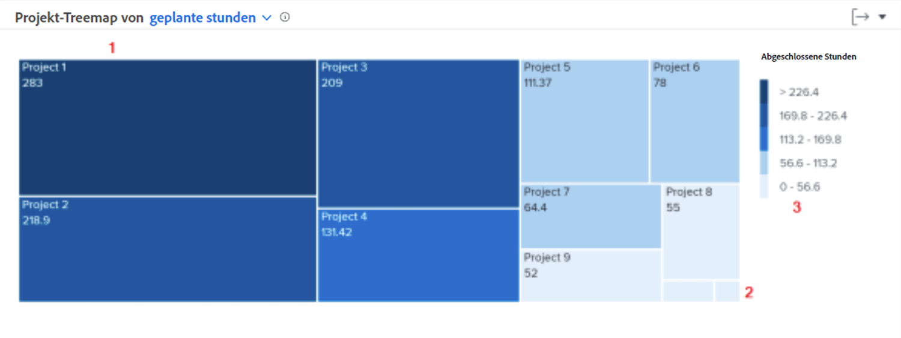

# Tiefere Einblicke in die Navigation

In diesem Video lernen Sie Folgendes:

* Wie Sie schnell erkennen können, wie viel Zeit Mitarbeitende für jedes Projekt aufwenden

>[!VIDEO](https://video.tv.adobe.com/v/335050/?quality=12&learn=on)

## Für Projekte aufgewendete Überprüfungszeit

Mit der Projekt-Treemap können Sie verstehen, wie viel Zeit Benutzende einem Projekt gewidmet haben. Kästchen stellen Projekte dar. Die Größe des Kästchens zeigt an, wie viel Zeit für das Projekt im Vergleich zu anderen Projekten aufgewendet wurde. Je größer das Kästchen, desto mehr Zeit wurde aufgewendet.

Anhand dieser Informationen können Sie Folgendes feststellen:

* Die Priorität der Dinge, an denen im ausgewählten Datumsbereich gearbeitet wird.
* Wofür Benutzende Zeit aufwenden.
* Ob sich Benutzende auf die richtigen Dinge konzentrieren.
* Wie stark sich der Umfang eines Projekts während dieses Zeitraums geändert hat, wenn ein bestimmtes Projekt ausgewählt ist.

Im Diagramm sehen Sie Folgendes:

1. Projekte in der gefilterten Zeit, für die mehr Stunden aufgewendet wurden, werden durch größere Kästchen und eine stärker dunkelblaue Farbe dargestellt.
1. Projekte in der gefilterten Zeit, für die weniger Stunden aufgewendet wurden, werden durch kleinere Kästchen und eine stärker hellblaue Farbe dargestellt.
1. Die Legende rechts neben dem Diagramm zeigt für jeden Blauton den Bereich der aufgewendeten Stunden an.
