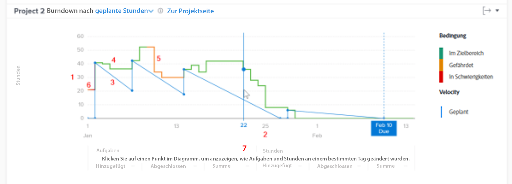

# Grundlegendes zum Zugriff auf und zur Überprüfung des Dropdown-Menüs in [!UICONTROL Verbesserte Analytics]

In diesem Video erfahren Sie:

* Zugriff auf die Detailkarte
* Erläuterungen zur Beziehung zwischen den verbleibenden Stunden, der Projektbedingung und der Geschwindigkeit eines Projekts

>[!VIDEO](https://video.tv.adobe.com/v/335051/?quality=12)

## Projektgeschwindigkeit verfolgen

In der Abbruchgrafik können Sie die Beziehung zwischen den verbleibenden Stunden, dem Projektzustand und der Geschwindigkeit verstehen. Die durchgehende Linie zeigt die im Zeitverlauf für das Projekt verbrachten Stunden sowie den Zustand des Projekts jeden Tag. Die gestrichelte Linie, die die geplante Geschwindigkeit vom Startdatum bis zum geplanten Abschlussdatum anzeigt, passt sich an, wenn Daten zu Aufgaben geändert werden.

Anhand dieser Informationen können Sie Folgendes feststellen:

* Inwiefern die eingetretenen Probleme (ungeplante Arbeiten) die geplante Arbeit beeinflussen.
* Welche Ereignisse haben Ihr Projekt nach dem geplanten Abschlussdatum verlängert.

Im Diagramm sehen Sie Folgendes:

1. Anzahl der Stunden auf der linken Seite.
1. Die Daten werden unten angezeigt, einschließlich des geplanten Abschlussdatums des Projekts, wenn es im ausgewählten Datumsbereich angezeigt wird.
1. Die durchgezogene blaue Linie zeigt die Geschwindigkeit des Projekts (entweder die geplanten Stunden oder die geplante Dauer im Zeitverlauf) und wird in eine gestrichelte vertikale Linie umgewandelt, wenn das Projekt das geplante Abschlussdatum erreicht.
1. Grüne Zeilen geben an, wenn die Projektbedingung In Target ist.
1. Orangefarbene Linien geben an, wenn die Projektbedingung gefährdet ist.
1. Rote Linien zeigen an, wenn die Projektbedingung in Schwierigkeiten ist.
1. Informationen zu Aufgaben und Stunden (Gesamtsummen, hinzugefügter Betrag und abgeschlossener Betrag) an einem bestimmten Tag werden unter der X-Achse angezeigt, wenn Sie auf einen bestimmten Punkt im Diagramm klicken.
