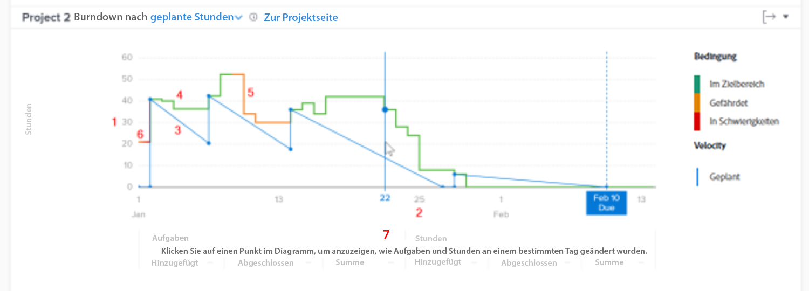

# Grundlegendes zum Zugriff auf und zur Überprüfung des Burndown

In diesem Video lernen Sie Folgendes:

* Zugriff auf das Burndown-Diagramm
* Die Beziehung zwischen den verbleibenden Stunden, der Projektbedingung und der Projektgeschwindigkeit

>[!VIDEO](https://video.tv.adobe.com/v/335051/?quality=12&learn=on&enablevpops=1)

## Projektgeschwindigkeit verfolgen

Das Burndown-Diagramm ermöglicht es Ihnen, die Beziehung zwischen den verbleibenden Stunden, dem Projektzustand und der Geschwindigkeit zu erkennen. Die durchgezogene Linie zeigt die für das Projekt aufgewendeten Stunden sowie den Zustand des Projekts an jedem Tag an. Die gestrichelte Linie, die die geplante Geschwindigkeit vom Startdatum bis zum geplanten Abschlussdatum anzeigt, passt sich an, wenn Aufgabendaten geändert werden.

Anhand dieser Informationen können Sie Folgendes feststellen:

* Auswirkungen auftretender Probleme (ungeplanter Arbeiten) auf die geplante Arbeit.
* Welche Ereignisse haben Ihr Projekt über das geplante Abschlussdatum hinaus verlängert?

Im Diagramm sehen Sie Folgendes:

1. Anzahl der Stunden links.
1. Die Daten werden unten angezeigt, einschließlich des geplanten Abschlussdatums des Projekts, wenn es im ausgewählten Datumsbereich angezeigt wird.
1. Die durchgezogene blaue Linie zeigt die Geschwindigkeit des Projekts an (die geplanten Stunden oder die geplante Dauer im Zeitverlauf) und wandelt sich in eine gestrichelte vertikale Linie um, wenn das geplante Abschlussdatum für das Projekt erreicht ist.
1. Grüne Zeilen geben an, dass der Projektzustand „Im Zeitplan“ lautet.
1. Orangefarbene Linien geben an, wenn der Projektzustand „Gefährdet“ lautet.
1. Rote Linien zeigen an, dass der Projektzustand „In Schwierigkeiten“ lautet.
1. Informationen zu Aufgaben und Stunden (Gesamtsummen, hinzugefügter Betrag und abgeschlossener Betrag) an einem bestimmten Tag werden unter der X-Achse angezeigt, wenn Sie auf einen bestimmten Punkt im Diagramm klicken.
