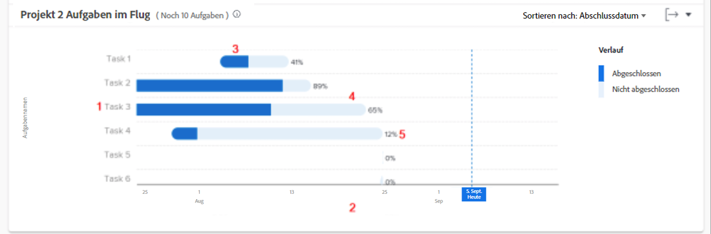

# Überprüfen der Aufgaben während des Fluges

In diesem Video lernen Sie Folgendes:

* Zugriff auf die Aufgaben im Flugdiagramm
* So ermitteln Sie schnell, welche Aufgaben in einem Projekt noch nicht abgeschlossen wurden

>[!VIDEO](https://video.tv.adobe.com/v/335052/?quality=12&learn=on)

## Daten auf Aufgabenebene

Mit dem Diagramm „Aufgaben im Flug“ können Sie die Aufgaben eines bestimmten Projekts aufschlüsseln, um zu sehen, wie viel Arbeit für jede aktive Aufgabe erledigt wurde und wie gut die Aufgaben im Zeitplan liegen. In der Grafik erfahren Sie, welche Aufgaben in einem Projekt abgeschlossen werden müssen und wie hoch der Prozentsatz der Fertigstellung dieser Aufgaben ist.

Anhand dieser Informationen können Sie Folgendes feststellen:

* Woran die Personen arbeiten.
* Welche Aufgaben ein Projekt gefährden könnten.
* Wie nah eine Aufgabe an der Fertigstellung ist.
* Mit wem Sie über eine bestimmte Aufgabe reden müssen.

Im Diagramm sehen Sie Folgendes:

1. Aufgabennamen auf der linken Seite.
1. Daten unten.
1. Die dunkelblaue Farbe in einer Aufgabenleiste gibt an, wie viel Arbeit für eine Aufgabe abgeschlossen wurde.
1. Die hellblaue Farbe in einer Aufgabenleiste gibt an, wie viel Arbeit für eine Aufgabe noch ausgeführt werden muss.
1. Die Zahl auf der rechten Seite der Aufgabenleiste zeigt den Prozentsatz der Fertigstellung der Aufgabe an.
