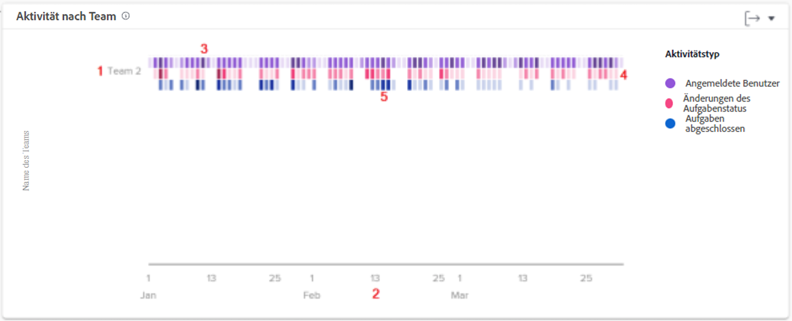

# Grundlegendes zur Aktivität nach Team-Diagramm

Anhand des Diagramms „Aktivität nach Team“ können Sie nachvollziehen, wie die Stamm-Teams in Ihrem Unternehmen ihre Zeit in Workfront verbringen. Workfront-Benutzende können mehreren Teams angehören, aber nur Teil eines einzigen Stamm-Teams sein. Die in den Personendiagrammen verwendeten Teams setzen sich nur aus den Benutzenden zusammen, die dieses Team als ihr Stamm-Team angegeben haben.

Die Aktivitäten – angemeldete Benutzende, Änderungen des Aufgabenstatus und abgeschlossene Aufgaben – werden in verschiedenen Farben angezeigt, um diese Ereignisse über den gefilterten Zeitraum zusammenzufassen.

Anhand dieser Informationen können Sie Folgendes feststellen:

* welche Aktivitäten in einem Stamm-Team stattfinden und zu welchem Anteil.
* welche Stamm-Teams überlastet sind oder das System stärker nutzen.
* ob die Arbeitsteilung für das Stamm-Team angemessen ist.

Im Diagramm sehen Sie Folgendes:

1. Namen der Stamm-Teams auf der linken Seite.
1. Die Datumsangaben unten stammen aus dem ausgewählten Datumsbereich.
1. Lila Kästchen zeigen an, dass sich die dem Projekt zugewiesenen Personen an diesem Tag angemeldet haben, wobei ein dunklerer Farbton eine höhere Anzahl von angemeldeten Personen anzeigt.
1. Rosafarbene Kästchen zeigen an, dass Personen den Status einer Aufgabe für das Projekt an diesem Tag geändert haben, wobei ein dunklerer Farbton eine höhere Anzahl von Aufgabenstatusänderungen anzeigt.
1. Blaue Kästchen zeigen an, dass die Personen eine Aufgabe für das Projekt abgeschlossen haben, wobei ein dunklerer Farbton eine höhere Anzahl abgeschlossener Aufgaben anzeigt.

## Wie Sie zum Diagramm navigieren

1. Klicken Sie auf die Registerkarte [!UICONTROL Personen] im linken Bedienfeld.
1. Verwenden Sie den [!UICONTROL Filter], um ein oder mehrere Stamm-Teams zu untersuchen.
1. Oben in den Personendiagrammen wird das Diagramm der Aktivität nach Teams angezeigt.
